# Data Pipeline Architecture Guidance

| **Attribute** | **Value** |
|---------------|----------|
| **Owner** | BillingAnalyst |
| **Version** | 1.0.0 |
| **Date** | 2026-03-26 |
| **Scope** | Rail Freight Billing data pipeline architecture for charge calculation, discount application, and invoice generation |
| **Out of Scope** | Payment processing, customer notification delivery, external ERP integration |

## Table of Contents

1. [Executive Summary](#1-executive-summary)
2. [Architecture Overview](#2-architecture-overview)
3. [Source & Sink Inventory](#3-source--sink-inventory)
4. [Data Model Overview](#4-data-model-overview)
5. [Dataset Contracts](#5-dataset-contracts)
6. [Transformation Design](#6-transformation-design)
7. [Jobs & Orchestration](#7-jobs--orchestration)
8. [Lineage](#8-lineage)
9. [Governance & Security](#9-governance--security)
10. [SLAs & Observability](#10-slas--observability)
11. [Platform Topology & Tech Stack](#11-platform-topology--tech-stack)
12. [Deployment Plan](#12-deployment-plan)
13. [ADRs](#13-adrs)
14. [Risks & Mitigations, Assumptions, Open Questions](#14-risks--mitigations-assumptions-open-questions)
15. [Appendices](#15-appendices)

---

## 1. Executive Summary

The Rail Freight Billing system modernizes freight charge calculation and invoice generation through a microservices architecture with batch processing and event-driven communication. The vision centers on three pillars: **modular scalability** (independently deployable services with horizontal scaling), **transparent explainability** (complete audit trails with tariff references and discount reason codes), and **operational resilience** (per-customer fault isolation in batch processing with >= 98% success ratio).

The architecture addresses critical problems: inconsistent pricing outcomes from scattered logic, incomplete tariff validation causing incorrect rate application, and fragile batch invoicing where single-customer failures halt entire runs. The recommended approach implements a microservices pattern with batch orchestration for invoice generation, event-driven audit trails, and database-per-service isolation. Core services include ChargeCalculationService (tariff lookup and charge computation), DiscountService (tier and regional discount application), InvoiceService (charge aggregation and invoice generation), and BatchInvoiceOrchestrator (bulk processing with fault isolation).

Key architectural decisions include selecting batch processing over stream processing (periodic billing cycles don't require real-time aggregation), PostgreSQL over NoSQL (ACID transactions for deterministic financial calculations), and RabbitMQ over Kafka (moderate event volumes with simpler operational model). The system targets aggressive SLAs: <200ms p95 charge calculation latency, <2s p95 invoice generation latency, 99.9% charge accuracy, 99.5% invoice success rate, and 100% audit completeness.

---

## 2. Architecture Overview

The architecture follows a **microservices pattern** with **batch processing** for invoice generation and **event-driven communication** for audit trails. The pattern selection aligns with periodic billing cycles (monthly/weekly), deterministic pricing requirements, and the need for per-customer fault isolation during bulk operations.

### High-Level Flow

Shipment data enters via API Gateway → ChargeCalculationService validates tariffs and calculates base charges with 5% surcharge → DiscountService applies tier (A=10%, B=5%) and regional (WST=+2%) discounts → charges persist to ChargeDatabase with component breakdowns → InvoiceService aggregates charges by customer and billing period → invoices persist to InvoiceDatabase → BatchInvoiceOrchestrator coordinates bulk generation across active customers → MessageBroker publishes ChargeCalculated and InvoiceGenerated events → Observability Stack captures traces, metrics, and logs.

### Architectural Patterns

**Batch Processing**: Selected for invoice generation due to periodic billing cycles (not continuous streams), controlled parallelism requirements, and per-customer fault isolation needs. Batch orchestrator processes thousands of customers with >= 98% success ratio, continuing on individual failures.

**Microservices**: Decomposes billing logic into bounded contexts (Tariff, Charge, Discount, Invoice, Batch Orchestration) with database-per-service isolation. Enables independent scaling (ChargeCalculationService scales for peak calculation load, InvoiceService scales for batch cycles) and team autonomy.

**Event-Driven**: Publishes domain events (ChargeCalculated, InvoiceGenerated) via MessageBroker for audit completeness (100% KPI), downstream notifications, and eventual consistency. Outbox pattern ensures reliable event publishing with at-least-once delivery.

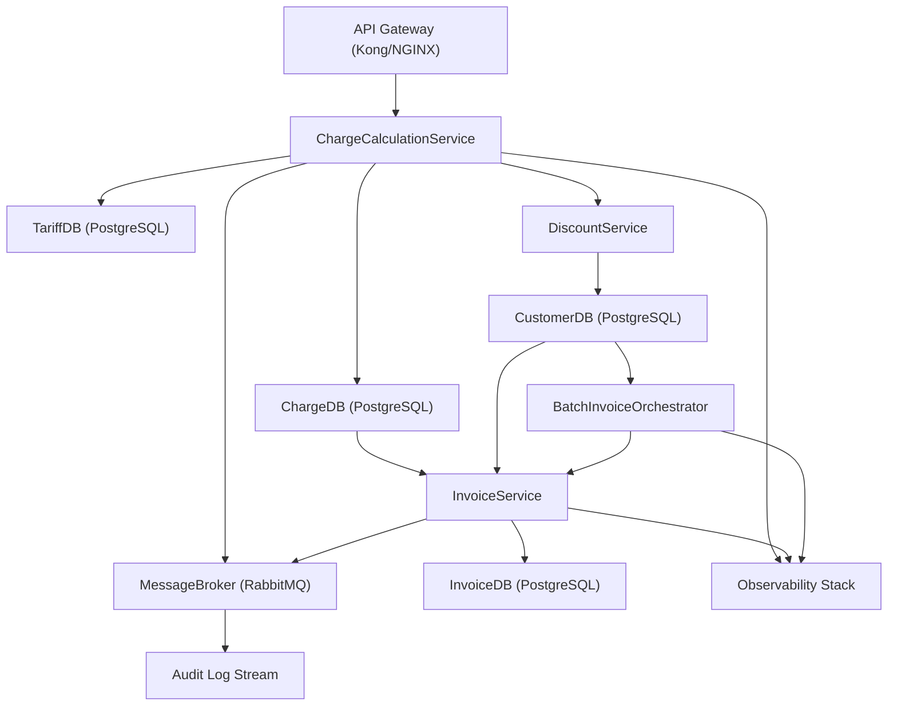

---

## 3. Source & Sink Inventory

### Data Sources

| **Source Name** | **Type** | **Owned By** | **Format** | **Frequency** | **Key Fields** | **PII** |
|-----------------|----------|--------------|------------|---------------|----------------|--------|
| ShipmentRecords | Database | OperationsSystem | Relational | Real-time | shipment_id, origin, destination, wagon_type, distance_km, customer_id | customer_id |
| CustomerRecords | Database | CRM | Relational | Daily sync | customer_id, tier, region, status | customer_id, name |
| TariffRecords | Database | TariffAdmin | Relational | Weekly updates | tariff_id, origin, destination, wagon_type, base_rate, currency, DIST_MIN, DIST_MAX | None |
| ChargeRecords | Database | ChargeCalculationService | Relational | Real-time | charge_id, shipment_id, customer_id, gross_amount, discount_amount, net_amount | customer_id |
| ActiveCustomerList | Database | CustomerDB | Relational | Batch cycle | customer_id, status=ACTIVE | customer_id |

### Data Sinks

| **Sink Name** | **Type** | **Owned By** | **Format** | **Purpose** | **Retention** |
|---------------|----------|--------------|------------|-------------|---------------|
| ChargeDatabase | PostgreSQL | ChargeCalculationService | Relational | Persist calculated charges with tariff references and component breakdowns | 7 years |
| ChargeComponentDataset | PostgreSQL | ChargeCalculationService | Relational | Store BASE, SURCHARGE, DISCOUNT components for transparency | 7 years |
| InvoiceDatabase | PostgreSQL | InvoiceService | Relational | Persist invoices with gross/discount/net amounts and discount reasons | 7 years |
| InvoiceBatchDataset | PostgreSQL | BatchInvoiceOrchestrator | Relational | Track batch execution metadata (start/end time, success ratio) | 7 years |
| AuditLogStream | Event Stream | MessageBroker | JSON events | Capture pricing-affecting changes with tariff references and discount reasons | 10 years |
| EventStream | RabbitMQ/Kafka | MessageBroker | JSON events | Publish ChargeCalculated and InvoiceGenerated events for downstream consumers | Event retention per broker config |
| ErrorLogs | Centralized Logging | ObservabilityStack | Structured JSON | Record tariff lookup failures, invoice generation failures, batch processing errors | 10 years |
| MetricsSink | Prometheus | ObservabilityStack | Time-series | Collect tariff hit/miss ratio, discount applied counts, invoice results, latency metrics | 90 days |

*(from cam.catalog.data_source_inventory: b64cecee-ec56-4491-adba-0189dd82ebc0)*

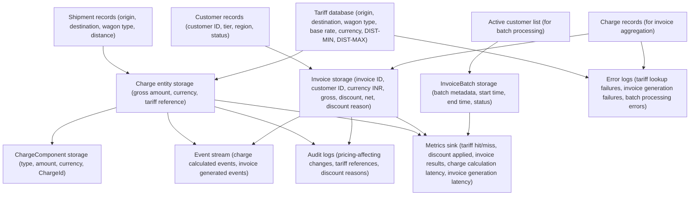

---

## 4. Data Model Overview

**Note**: A logical data model artifact (cam.data.model_logical) was not provided in the workspace. The following overview is derived from dataset contracts, transformation specs, and business flow descriptions.

### Key Entities

**Shipment**: Represents a freight movement with origin, destination, wagon_type, distance_km, and customer_id. Links to Charge via shipment_id.

**Tariff**: Pricing rules with origin, destination, wagon_type, base_rate (INR), currency, DIST_MIN, DIST_MAX. Immutable once applied to charges (tariff_id reference preserved for audit).

**Customer**: Master data with customer_id (PII), tier (A/B), region (e.g., WST), status (ACTIVE/INACTIVE). Drives discount eligibility and batch processing scope.

**Charge**: Calculated freight charge with charge_id (UUID), shipment_id, customer_id, tariff_id, base_amount, surcharge_amount (5% of base), gross_amount, discount_amount, discount_reason, net_amount, currency (INR), idempotency_key (shipment_id-based), calculation_timestamp.

**ChargeComponent**: Granular breakdown with component_id, charge_id (FK), component_type (BASE/SURCHARGE/DISCOUNT), amount, currency. Enables transparent line-item analysis.

**Invoice**: Aggregated billing document with invoice_id (customer_id + timestamp), customer_id, invoice_date, gross_amount (sum of charges), discount_amount, net_amount, discount_reason (aggregated), currency (INR), status (GENERATED).

**InvoiceBatch**: Batch execution metadata with batch_id (UUID), start_time, end_time, status (COMPLETED/PARTIAL/FAILED), total_customers, successful_invoices, failed_invoices.

### Relationships

- Shipment 1:1 Charge (via shipment_id)
- Charge N:1 Tariff (via tariff_id, immutable reference)
- Charge N:1 Customer (via customer_id)
- Charge 1:N ChargeComponent (via charge_id)
- Customer 1:N Charge (via customer_id)
- Customer 1:N Invoice (via customer_id)
- Invoice N:N Charge (via aggregation by customer and billing period)
- InvoiceBatch 1:N Invoice (via batch_id)

### PII Fields

customer_id appears in Shipment, Charge, Invoice, and Customer entities. Data masking policy (cam.security.data_masking_policy: c2fc8ef0-4b60-4005-b3d8-af53c902fc8a) mandates hashing customer_id in FreightChargeDataset for non-production environments and external analytics.

---

## 5. Dataset Contracts

### FreightChargeDataset

| **Dataset Name** | **Producer** | **Consumers** | **Schema (Key Fields)** | **Retention** | **Classification** | **Delivery Guarantee** |
|------------------|--------------|---------------|-------------------------|---------------|--------------------|-----------------------|
| FreightChargeDataset | ChargeCalculationService | InvoiceService, FinanceSystem, BatchInvoiceOrchestrator, Analytics | charge_id (UUID PK), shipment_id, customer_id (PII), tariff_id, origin, destination, wagon_type, distance_km, base_rate, base_amount, surcharge_amount (5% of base), gross_amount, discount_amount, discount_reason, net_amount, currency (INR), idempotency_key (unique), calculation_timestamp, created_at, updated_at | 7 years | Confidential, Financial, PII | Exactly-once (via idempotency_key) |

**Quality Rules** (target >= 99.9% pass rate):
- QR-001 (charge_accuracy): Calculated charges match expected tariff/surcharge outcomes
- QR-002 (discount_accuracy): Discounts match tier/region policy with reason codes stored
- QR-003 (audit_completeness): 100% charges have tariff references and component breakdowns
- QR-004 (currency_validation): 100% records use INR currency
- QR-005 (distance_validation): 100% distances fall within tariff DIST_MIN/DIST_MAX
- QR-006 (surcharge_validation): 100% surcharges equal exactly 5% of base_amount
- QR-007 (net_amount_validation): 100% net_amount = gross_amount - discount_amount
- QR-008 (idempotency_enforcement): 100% idempotency_key values are unique

**Sample Record**:
```json
{
  "charge_id": "CHG-2024-001",
  "shipment_id": "SHP-DEL-MUM-001",
  "customer_id": "CUST-A-001",
  "tariff_id": "TARIFF-DEL-MUM-BOXCAR",
  "origin": "DEL",
  "destination": "MUM",
  "wagon_type": "BOXCAR",
  "distance_km": 1400,
  "base_rate": 2.5,
  "base_amount": 3500.00,
  "surcharge_amount": 175.00,
  "gross_amount": 3675.00,
  "discount_amount": 367.50,
  "discount_reason": "TIER_A_10PCT",
  "net_amount": 3307.50,
  "currency": "INR",
  "idempotency_key": "SHP-DEL-MUM-001-CALC-20240115",
  "calculation_timestamp": "2024-01-15T10:30:00Z",
  "created_at": "2024-01-15T10:30:01Z",
  "updated_at": "2024-01-15T10:30:01Z"
}
```

*(from cam.data.dataset_contract: d99b0fcf-e25c-48fd-91bb-b189dd5b7688)*

```mermaid
flowchart TD
    System["RailFreightBilling System"] --> Dataset["FreightChargeDataset v1.0.0"]

    charge_id["charge_id: Unique charge identifier"] --> Dataset
    shipment_id["shipment_id: Shipment reference"] --> Dataset
    customer_id["customer_id: Customer identifier (PII)"] --> Dataset
    tariff_id["tariff_id: Tariff reference"] --> Dataset
    origin["origin: Origin station code"] --> Dataset
    destination["destination: Destination station code"] --> Dataset
    wagon_type["wagon_type: Wagon type"] --> Dataset
    distance_km["distance_km: Distance in kilometers"] --> Dataset
    base_rate["base_rate: Base rate per km"] --> Dataset
    base_amount["base_amount: Base charge"] --> Dataset
    surcharge_amount["surcharge_amount: 5% surcharge"] --> Dataset
    gross_amount["gross_amount: Total before discounts"] --> Dataset
    discount_amount["discount_amount: Total discount"] --> Dataset
    discount_reason["discount_reason: Discount reason code"] --> Dataset
    net_amount["net_amount: Final charge"] --> Dataset
    currency["currency: Currency code (INR)"] --> Dataset
    calculation_timestamp["calculation_timestamp: Calculation time"] --> Dataset
    idempotency_key["idempotency_key: Idempotency key"] --> Dataset
    created_at["created_at: Record creation time"] --> Dataset
    updated_at["updated_at: Last update time"] --> Dataset

    ShipmentDataset["ShipmentDataset"] --> shipment_id
    CustomerDataset["CustomerDataset"] --> customer_id
    TariffDataset["TariffDataset"] --> tariff_id

    base_rate -->|multiplied by| distance_km
    distance_km -->|calculates| base_amount
    base_amount -->|5% surcharge| surcharge_amount
    base_amount -->|adds to| gross_amount
    surcharge_amount -->|adds to| gross_amount
    gross_amount -->|minus| discount_amount
    discount_amount -->|produces| net_amount
    discount_reason -->|explains| discount_amount

    BillingAnalyst["BillingAnalyst: Product Owner"] --> Dataset
    ChargeCalculationService["ChargeCalculationService: Tech Owner"] --> Dataset
    FinanceSystem["FinanceSystem: Steward"] --> Dataset
    TariffAdmin["TariffAdmin: Steward"] --> Dataset

    QR001["QR-001: charge_accuracy >= 99.9%"] --> Dataset
    QR002["QR-002: discount_accuracy >= 99.9%"] --> Dataset
    QR003["QR-003: audit_completeness 100%"] --> Dataset
    QR004["QR-004: currency_validation 100%"] --> Dataset
    QR005["QR-005: distance_validation 100%"] --> Dataset
    QR006["QR-006: surcharge_validation 100%"] --> Dataset
    QR007["QR-007: net_amount_validation 100%"] --> Dataset
    QR008["QR-008: idempotency_enforcement 100%"] --> Dataset

    Retention["Retention: 7 years"] --> Dataset

    Sample1["CHG-2024-001: DEL to MUM BOXCAR"] --> Dataset
    Sample2["CHG-2024-002: BLR to HYD TANKER"] --> Dataset
```

### Additional Datasets

**ChargeComponentDataset**: Produced by ChargeCalculationService, consumed by FinanceSystem and Analytics. Schema: component_id (UUID PK), charge_id (FK), component_type (BASE/SURCHARGE/DISCOUNT), amount, currency (INR). Retention: 7 years. Classification: Confidential, Financial.

**InvoiceDataset**: Produced by InvoiceService, consumed by FinanceSystem, CustomerPortal, BatchInvoiceOrchestrator. Schema: invoice_id (customer_id + timestamp PK), customer_id (PII), invoice_date, gross_amount, discount_amount, net_amount, discount_reason (aggregated), currency (INR), status (GENERATED), created_at. Retention: 7 years. Classification: Confidential, Financial, PII.

**InvoiceBatchDataset**: Produced by BatchInvoiceOrchestrator, consumed by OperationsUser, BillingAnalyst. Schema: batch_id (UUID PK), start_time, end_time, status (COMPLETED/PARTIAL/FAILED), total_customers, successful_invoices, failed_invoices. Retention: 7 years. Classification: Confidential.

---

## 6. Transformation Design

The pipeline implements 12 transformations organized into a directed acyclic graph (DAG) with conditional routing and idempotency guarantees.

### Major Transforms

**1. extract_shipment_charge_inputs**: Filters ShipmentDataset for status=READY_FOR_BILLING, extracts shipment_id, customer_id, origin, destination, wagon_type, distance_km. Validates distance > 0, station codes valid, wagon_type specified, customer exists. Output: ShipmentChargeInputs.

**2. lookup_and_validate_tariff**: Joins ShipmentChargeInputs with TariffDataset on exact match (origin, destination, wagon_type) and distance within DIST_MIN/DIST_MAX range. Validates base_rate non-null and distance boundaries valid. Emits NO_TARIFF_FOUND error for unmatched shipments (routed to observability). Output: ValidatedTariffMatches.

**3. calculate_base_and_surcharge**: Computes base_amount = base_rate × distance_km, surcharge_amount = base_amount × 0.05, gross_amount = base_amount + surcharge_amount. All amounts in INR. Validates arithmetic precision within 0.01 tolerance. Output: ChargeBaseCalculation.

**4. apply_customer_discounts**: Joins ChargeBaseCalculation with CustomerDataset. Applies tier discount (A=10%, B=5%) and regional discount (WST=+2%). Computes discount_amount = gross_amount × total_discount_pct, net_amount = gross_amount - discount_amount. Generates discount_reason (e.g., "TIER_A_10PCT", "TIER_B_5PCT+REGION_WST_2PCT"). Validates arithmetic within 0.01 tolerance. Output: ChargeWithDiscounts.

**5. persist_freight_charges**: Generates charge_id (UUID), idempotency_key (shipment_id + sequence), calculation_timestamp, created_at, updated_at (ISO 8601). Persists to FreightChargeDataset with referential integrity checks (tariff_id, customer_id, shipment_id valid). Enforces idempotency via unique constraint on idempotency_key. Output: PersistedCharges.

**6. create_charge_components**: Decomposes each charge into BASE (base_amount), SURCHARGE (surcharge_amount), DISCOUNT (discount_amount as negative) components. Generates component_id (UUID) for each, links via charge_id. Persists to ChargeComponentDataset. Output: ChargeComponents.

**7. aggregate_charges_for_invoice**: Groups PersistedCharges by customer_id and invoice_date (derived from calculation_timestamp). Computes total_gross (sum gross_amount), total_discount (sum discount_amount), total_net (sum net_amount), charge_count, aggregated_discount_reason (concatenated unique reasons). Validates total_net = total_gross - total_discount within 0.01 tolerance. Output: InvoiceAggregation.

**8. generate_customer_invoice**: Constructs invoice_id (customer_id + invoice_date + timestamp suffix), invoice_date, gross_amount, discount_amount, net_amount, discount_reason (aggregated), currency (INR), status (GENERATED). Validates amounts match aggregation and customer exists. Output: GeneratedInvoices.

**9. batch_invoice_generation**: Filters CustomerDataset for status=ACTIVE. Iterates customers, invokes generate_customer_invoice per customer with fault isolation (failures logged, batch continues). Captures per-customer results (invoice_id, customer_id, net_amount, error_message). Generates batch_id (UUID), start_time, end_time, status (COMPLETED if 100% success, PARTIAL if >= 98% success, FAILED otherwise), total_customers, successful_invoices, failed_invoices. Output: InvoiceBatchSummary.

**10. validate_charge_accuracy**: Re-calculates base_amount, surcharge_amount, gross_amount, net_amount for each PersistedCharge using original tariff and discount rules. Compares against stored values within 0.01 tolerance. Validates tariff_id valid and distance within tariff range. Generates accuracy report: total_charges, correct_charges, incorrect_charges, accuracy_rate (target >= 99.9%). Output: ChargeAccuracyReport.

**11. validate_discount_accuracy**: Joins PersistedCharges with CustomerDataset, re-calculates expected discount_amount. Verifies stored discount_amount matches expected within 0.01 tolerance and discount_reason non-empty when discount > 0. Generates report: total_charges, correct_discounts, incorrect_discounts, discount_accuracy_rate (target >= 99.9%), reason_code_completeness_rate (target 100%). Output: DiscountAccuracyReport.

**12. validate_audit_completeness**: Verifies each PersistedCharge has tariff_id non-null and ChargeComponentDataset contains BASE, SURCHARGE, DISCOUNT (if applicable) components. Generates report: total_charges, charges_with_tariff_reference, charges_with_complete_components, audit_completeness_rate (target 100%). Output: AuditCompletenessReport.

### DQ Checks

All transformations enforce data quality gates at stage boundaries:
- **Referential integrity**: Foreign keys (tariff_id, customer_id, shipment_id) validated before persistence
- **Arithmetic accuracy**: All monetary calculations validated within 0.01 tolerance
- **Business rules**: Distance > 0, tariff distance ranges valid, discount tiers valid (A/B), currency = INR
- **Completeness**: Required fields non-null (tariff_id, discount_reason when discount > 0)
- **Uniqueness**: idempotency_key unique per shipment, invoice_id unique per customer/date
- **Format validation**: Timestamps ISO 8601, UUIDs valid, monetary amounts 2 decimal places

### Idempotency & Windowing

Idempotency enforced via unique keys:
- **idempotency_key** (shipment_id-based): Prevents duplicate charge calculations during retries
- **invoice_id** (customer_id + timestamp): Ensures deterministic invoice generation
- **charge_id** (UUID): Globally unique charge identifier
- **batch_id** (UUID): Identifies batch runs for resumable processing

Windowing: Batch invoice generation uses tumbling 1-hour windows per customer (from cam.workflow.stream_job_spec: c2b3529b-aabc-42c0-91b1-603fb6295a3a for stream variant; batch variant processes full billing period).

*(from cam.workflow.transform_spec: 1cc93747-5477-4a28-a4df-0144a2101d18)*

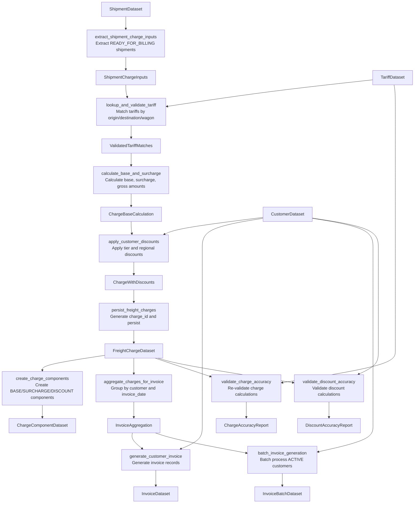

---

## 7. Jobs & Orchestration

### Batch Jobs

| **Job Name** | **Type** | **Schedule/Latency** | **Dependencies** | **Failure Policy** | **Owner** |
|--------------|----------|----------------------|------------------|--------------------|----------|
| RailFreightBillingBatchJob | Batch | Daily 02:00 UTC (cron: 0 2 * * *) | ShipmentDataset, CustomerDataset, TariffDataset | Retry 3x with exponential backoff; per-customer fault isolation in batch orchestration | BillingAnalyst |

**Steps** (14 sequential):
1. extract_active_customers: Filter CustomerDataset for status=ACTIVE
2. extract_pending_shipments: Filter ShipmentDataset for billing_status=PENDING
3. validate_tariff_data: Check TariffDataset for required fields and valid distance ranges
4. calculate_freight_charges: Tariff lookup, base + surcharge calculation, idempotency via shipment_id-based key
5. apply_customer_discounts: Tier (A=10%, B=5%) + regional (WST=+2%) discount application
6. create_charge_components: Decompose charges into BASE/SURCHARGE/DISCOUNT components
7. load_freight_charges: Upsert to FreightChargeDataset with idempotency_key conflict resolution
8. load_charge_components: Insert to ChargeComponentDataset
9. aggregate_customer_charges: Group charges by customer and billing period
10. generate_customer_invoices: Create invoice records with per_customer_isolation=true
11. load_invoices: Upsert to InvoiceDataset with invoice_id conflict resolution
12. create_batch_summary: Generate batch metadata (batch_id, start/end time, success ratio)
13. load_batch_summary: Persist to InvoiceBatchDataset
14. validate_output_quality: Enforce charge_accuracy >= 99.9%, discount_accuracy >= 99.9%, audit_completeness 100%

**Idempotency**: Fully idempotent via unique keys (idempotency_key for charges, invoice_id for invoices, batch_id for batches). Safe to re-execute without duplicates.

**Timeout**: 4 hours. **Retries**: 3 attempts with exponential backoff.

*(from cam.workflow.batch_job_spec: 0593d177-3ea3-4b0d-88a2-1d3c2e6a87a1)*

### Stream Jobs

| **Job Name** | **Type** | **Schedule/Latency** | **Dependencies** | **Failure Policy** | **Owner** |
|--------------|----------|----------------------|------------------|--------------------|----------|
| RailFreightBillingStreamJob | Stream | Continuous (latency budget: 200ms p95 charge calc, 2s p95 invoice gen) | shipment_events_stream, customer_master_stream, tariff_master_stream | Exactly-once processing with idempotency keys; retries with backoff | BillingAnalyst |

**Processing Pipeline** (11 stages):
1. Filter: shipment.status == COMPLETED AND distance_km > 0
2. Inner Join: Match tariff on origin/destination/wagon_type
3. Filter: distance_km within tariff DIST_MIN/DIST_MAX
4. Map: Calculate base_amount, surcharge_amount (5%), gross_amount
5. Inner Join: Enrich with customer tier and region
6. Map: Apply tier discount (A=10%, B=5%) + regional discount (WST=+2%), compute net_amount
7. Map: Create charge record with idempotency_key (shipment_id + hash)
8. Tumbling Window: 1-hour windows keyed by customer_id
9. Aggregate: Sum gross/discount/net per customer per window
10. Filter: customer.status == ACTIVE
11. Map: Generate invoice with invoice_id (INV-{customer_id}-{timestamp})

**Outputs**: FreightChargeDataset, InvoiceDataset, ChargeComponentDataset, audit_log_stream

**Exactly-Once**: Enabled via idempotency keys and transactional outbox pattern.

*(from cam.workflow.stream_job_spec: c2b3529b-aabc-42c0-91b1-603fb6295a3a)*

### Orchestration

**Orchestrator**: Apache Airflow

**Job Dependencies**:
- RailFreightBillingBatchJob → RailFreightBillingStreamJob (batch establishes baseline, stream handles incremental)

**Failure Policy**: Retry with exponential backoff. Batch orchestrator continues on per-customer failures (>= 98% success ratio target).

*(from cam.workflow.orchestration_spec: 2b41335b-fa81-4e89-9db6-11e726206c08)*

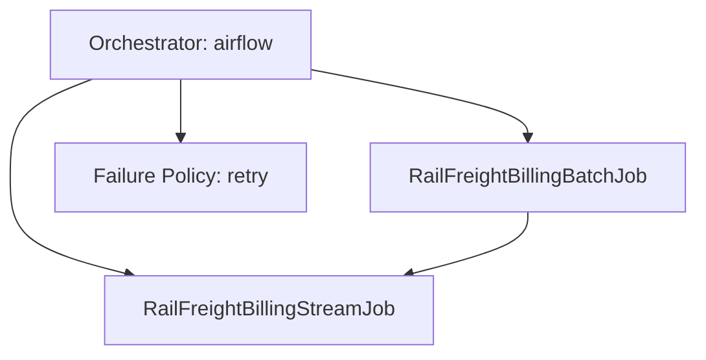

---

## 8. Lineage

The lineage map traces data flows from source systems through transformation jobs to final datasets and audit sinks, ensuring complete traceability for billing operations.

### Critical Paths

| **Source** | **Transform** | **Target** | **Compliance Impact** |
|------------|---------------|------------|----------------------|
| ShipmentDataset | RailFreightBillingBatchJob (calculate_freight_charges) | FreightChargeDataset | Tariff reference (tariff_id) required for audit completeness (QR-003); enables reconstruction of pricing decisions |
| TariffDataset | RailFreightBillingBatchJob (validate_tariff_data, calculate_freight_charges) | FreightChargeDataset | Immutable tariff reference ensures historical charges remain explainable after tariff updates; supports regulatory audits |
| CustomerDataset | RailFreightBillingBatchJob (apply_customer_discounts) | FreightChargeDataset | Discount reason codes (discount_reason) document tier/region policy application; required for explainability (QR-002) |
| FreightChargeDataset | RailFreightBillingBatchJob (create_charge_components) | ChargeComponentDataset | Component breakdown (BASE/SURCHARGE/DISCOUNT) enables transparent invoice line items; supports dispute resolution |
| FreightChargeDataset | RailFreightBillingBatchJob (aggregate_customer_charges, generate_customer_invoices) | InvoiceDataset | Invoice aggregation with gross/discount/net amounts and discount reasons; required for financial reporting and customer billing |
| InvoiceDataset | RailFreightBillingBatchJob (create_batch_summary) | InvoiceBatchDataset | Batch metadata tracks success ratio (>= 98% target); enables operational monitoring and SLA compliance |
| FreightChargeDataset, InvoiceDataset | PublishBillingEvents | audit_log_stream | Event publishing ensures 100% audit completeness KPI; supports regulatory compliance and downstream integrations |

### Derivation Relationships

- **FreightChargeDataset derives ChargeComponentDataset**: Component breakdown extracted from parent charge (BASE = base_amount, SURCHARGE = surcharge_amount, DISCOUNT = discount_amount as negative)
- **FreightChargeDataset derives InvoiceDataset**: Invoices aggregated from charges grouped by customer_id and invoice_date
- **InvoiceDataset derives InvoiceBatchDataset**: Batch metadata derived from invoice generation runs (total_customers, successful_invoices, failed_invoices)

*(from cam.data.lineage_map: bb048267-146a-4ba2-8c66-d97f878f2182)*

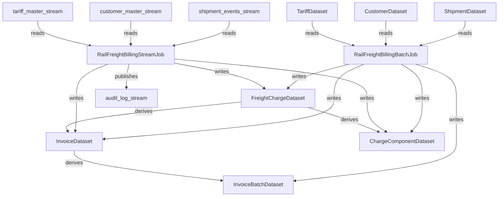

---

## 9. Governance & Security

### Data Classification

All billing datasets classified as **Confidential**, **Financial**, and **PII** (where customer_id present). This triple classification triggers:
- Encryption in transit (TLS) and at rest (database-level encryption)
- Access control via RBAC (see below)
- Audit logging for all pricing-affecting changes
- 7-year retention for financial records, 10-year retention for audit logs and tariffs

### Access Control Policies

| **Role** | **Dataset** | **Access Level** | **Masking Applied** |
|----------|-------------|------------------|---------------------|
| BillingAnalyst | FreightChargeDataset | Read, Write | None (full access for operational corrections) |
| BillingAnalyst | TariffDataset | Read | None |
| BillingAnalyst | CustomerDataset | Read | None |
| BillingAnalyst | ShipmentDataset | Read | None |
| BillingAnalyst | InvoiceDataset | Read, Write | None |
| BillingAnalyst | ChargeComponentDataset | Read | None |
| BillingAnalyst | InvoiceBatchDataset | Read | None |
| BillingAnalyst | DiscountPolicyDataset | Read | None |
| TariffAdmin | TariffDataset | Read, Write | None |
| TariffAdmin | FreightChargeDataset | Read | None (view impact of tariff changes) |
| OperationsUser | FreightChargeDataset | Read | customer_id hashed |
| OperationsUser | InvoiceDataset | Read | customer_id hashed |
| FinanceSystem | FreightChargeDataset | Read | None (requires full data for GL integration) |
| FinanceSystem | TariffDataset | Read | None |
| FinanceSystem | InvoiceDataset | Read | None |
| FinanceSystem | ChargeComponentDataset | Read | None |
| FinanceSystem | DiscountPolicyDataset | Read | None |
| ChargeCalculationService | TariffDataset | Read | None |
| ChargeCalculationService | CustomerDataset | Read | None |
| ChargeCalculationService | ShipmentDataset | Read | None |
| ChargeCalculationService | FreightChargeDataset | Read, Write | None |
| ChargeCalculationService | ChargeComponentDataset | Read, Write | None |
| ChargeCalculationService | DiscountPolicyDataset | Read | None |
| InvoiceService | FreightChargeDataset | Read | None |
| InvoiceService | CustomerDataset | Read | None |
| InvoiceService | InvoiceDataset | Read, Write | None |
| BatchInvoiceOrchestrator | CustomerDataset | Read | None |
| BatchInvoiceOrchestrator | InvoiceDataset | Read | None |
| BatchInvoiceOrchestrator | InvoiceBatchDataset | Read, Write | None |

**Masking Policy**: customer_id in FreightChargeDataset hashed for OperationsUser role (cam.security.data_masking_policy: c2fc8ef0-4b60-4005-b3d8-af53c902fc8a). Hash strategy preserves referential integrity (same customer_id always hashes to same value) while preventing reverse identification.

### Governance Rules

**Retention**:
- Default: 7 years for financial records (FreightChargeDataset, ChargeComponentDataset, InvoiceDataset, InvoiceBatchDataset)
- Extended: 10 years for audit logs and TariffDataset (supports long-term compliance investigations and historical pricing analysis)

**Lineage Requirements**:
- Every charge must reference source shipment, tariff, and customer (enforced via foreign keys)
- Charge components must reference parent charge (charge_id FK)
- Invoices must reference aggregated charges and customer
- Batch records must reference individual invoices
- All pricing-affecting changes captured in audit logs with correlation IDs, change attribution, and timestamps
- Tariff references immutable once applied to charges (ensures historical explainability)
- Discount reason codes mandatory when discount_amount > 0 (supports explainability)

**Calculation Lineage**: All monetary calculations preserve lineage to base_rate, distance_km, surcharge_percentage (5%), discount_policy_version. Enables verification of calculation accuracy, reconstruction from source data, root cause analysis of discrepancies, and regulatory demonstration of fair pricing.

*(from cam.governance.data_governance_policies: b5c899ad-a6f2-4d17-8bef-1064ab9c7a1b, cam.security.data_access_control: 73826c0b-b512-4d00-9c4f-95e8577a9df9, cam.security.data_masking_policy: c2fc8ef0-4b60-4005-b3d8-af53c902fc8a)*

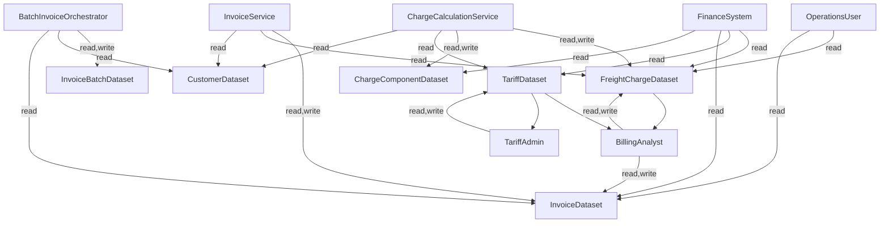

---

## 10. SLAs & Observability

### SLA Targets

| **Dataset/Job** | **Metric** | **Target** | **Alerting Threshold** |
|-----------------|------------|------------|------------------------|
| FreightChargeDataset | Freshness | < 5 minutes from charge calculation | Alert if > 5 min for 2+ consecutive checks |
| ChargeCalculationService | Latency (p95) | < 200ms per shipment | Alert if p95 > 200ms over 5-min window |
| InvoiceService | Latency (p95) | < 2s per invoice | Alert if p95 > 2s over 5-min window |
| ChargeCalculationService | Availability | >= 99.9% | Alert if < 99.9% over 10-min window |
| InvoiceService | Availability | >= 99.5% | Alert if < 99.5% over 10-min window |
| BatchInvoiceOrchestrator | Batch Success Ratio | >= 98% customers invoiced successfully | Alert if < 98% per batch run |
| FreightChargeDataset | Data Quality Pass Rate | >= 99.9% (QR-001 through QR-008) | Alert if < 99.9% |
| FreightChargeDataset | Charge Accuracy (QR-001) | >= 99.9% | Alert if < 99.9% |
| FreightChargeDataset | Discount Accuracy (QR-002) | >= 99.9% | Alert if < 99.9% |
| FreightChargeDataset | Audit Completeness (QR-003) | 100% | Alert if < 100% |
| FreightChargeDataset | Currency Validation (QR-004) | 100% INR | Alert if any non-INR record |
| FreightChargeDataset | Distance Validation (QR-005) | 100% within tariff range | Alert if any violation |
| FreightChargeDataset | Surcharge Validation (QR-006) | 100% surcharge = 5% of base | Alert if any violation |
| FreightChargeDataset | Net Amount Validation (QR-007) | 100% net = gross - discount | Alert if any violation |
| FreightChargeDataset | Idempotency Enforcement (QR-008) | 100% unique idempotency_key | Alert if any duplicate |
| FreightChargeDataset | Daily Volume | Within 20% of 7-day moving average | Alert if deviation > 20% |
| FreightChargeDataset | Schema Compliance | 100% | Alert on any schema violation |

### Monitoring Framework

**Observability Stack**: OpenTelemetry (distributed tracing) + Prometheus (metrics) + Grafana (dashboards)

**Logs**: Structured JSON format with trace_id correlation, PII redaction via hashing

**Metrics** (Golden Signals + Custom):
- **Latency**: p95 charge calculation duration, p95 invoice generation duration
- **Traffic**: Requests per second to ChargeCalculationService, InvoiceService
- **Errors**: Error rate (target < 5%), NO_TARIFF_FOUND count, invoice generation failures
- **Saturation**: CPU utilization (alert at 80%), memory utilization (alert at 85%), queue depth (alert on critical backlog)
- **Custom**: pipeline_throughput (charges/sec), data_quality_score (QR pass rate), transformation_duration, queue_depth, batch_size, data_freshness, tariff_hit_miss_ratio, discount_applied_count

**Traces**: W3C Trace Context propagation, adaptive sampling (10% baseline, 100% on errors), correlation IDs flow across ChargeCalculationService → DiscountService → InvoiceService → BatchInvoiceOrchestrator

**SLOs** (Service-Level Objectives):
- ingestion-service: p95 < 500ms, 99.5% availability
- transformation-service: p95 < 2s, 99.0% availability
- validation-service: p95 < 300ms, 99.5% availability
- storage-service: p99 < 1s, 99.9% availability
- api-gateway: p95 < 200ms, 99.9% availability

**Alerting**:
- error_rate_threshold_5_percent: Triggers when error rate > 5%
- latency_p95_breach: Alerts on SLO violations (charge calc > 200ms, invoice gen > 2s)
- saturation_cpu_80_percent: Warns at 80% CPU to enable proactive scaling
- saturation_memory_85_percent: Alerts at 85% memory to prevent OOM
- queue_depth_critical: Detects backlog indicating system cannot keep pace
- data_quality_degradation: Tracks declining QR pass rates
- slo_budget_burn_rate: Alerts when error budgets consumed too quickly

*(from cam.qa.data_sla: 235b1c87-33a9-4eaf-a6d8-c58203760def, cam.observability.microservices_observability_spec: 363a0fac-3e6b-45a2-88da-0287d40f910f)*

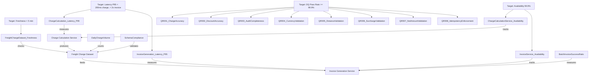

---

## 11. Platform Topology & Tech Stack

### Deployment Topology

The system deploys across three environments (dev, qa, prod) with the following component topology:

**Ingress Layer**: API Gateway (Kong/NGINX) handles routing, authentication, rate limiting, and load balancing for all external requests.

**Compute Services**:
- **ChargeCalculationService**: Calculates charges, queries TariffDB, persists to ChargeDB, coordinates with DiscountService, publishes events to MessageBroker, sends telemetry to ObservabilityStack
- **DiscountService**: Applies tier/regional discounts, queries CustomerDB, updates ChargeDB
- **InvoiceService**: Aggregates charges, generates invoices, queries ChargeDB and CustomerDB, persists to InvoiceDB, publishes events
- **BatchInvoiceOrchestrator**: Coordinates bulk invoice generation, queries CustomerDB, invokes InvoiceService, tracks batch progress in InvoiceDB

**Storage Layer** (PostgreSQL, database-per-service):
- **TariffDB**: Pricing rules, rate tables, distance ranges
- **ChargeDB**: Calculated charges, component breakdowns
- **InvoiceDB**: Invoices, batch metadata
- **CustomerDB**: Customer profiles, tier/region assignments

**Messaging**: MessageBroker (RabbitMQ/Kafka) for asynchronous ChargeCalculated and InvoiceGenerated events

**Observability**: OpenTelemetry + Prometheus + Grafana for traces, metrics, logs

*(from cam.deployment.data_platform_topology: 7d739e46-d365-463e-9b24-22a2c891fdc2)*

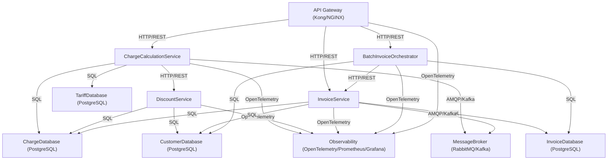

### Tech Stack Rankings

| **Rank** | **Technology** | **Category** | **Rationale** | **Trade-offs** |
|----------|----------------|--------------|---------------|----------------|
| 1 | FastAPI | API | High-performance async request/response for <200ms charge calc latency; native Pydantic validation for complex billing logic; OpenAPI auto-generation | Requires careful async/await management; less mature enterprise tooling vs Spring Boot |
| 2 | Spring Boot | API | Enterprise-grade transaction management; robust PostgreSQL integration; mature idempotency patterns; Resilience4j for circuit breakers | Higher memory footprint; slower cold starts; JVM overhead impacts horizontal scaling |
| 3 | Kong API Gateway | API Gateway | Production-ready routing, auth, rate limiting; distributed tracing propagation; gateway-level idempotency enforcement | Additional infrastructure component; complex configuration for fine-grained routing |
| 1 | RabbitMQ | Messaging | Reliable message delivery for audit events; strong delivery guarantees; outbox/inbox pattern support; dead-letter queues for per-customer fault isolation | Lower throughput vs Kafka; not optimized for event replay |
| 2 | Apache Kafka | Messaging | High-throughput event streaming for audit trails; event replay for reconciliation; handles thousands of invoice events during batch cycles | Higher operational complexity; resource-intensive for moderate event volumes |
| 1 | PostgreSQL | Database | ACID compliance for deterministic financial calculations; exact matching queries for tariff lookup; distance range validation (DIST_MIN/DIST_MAX); JSON columns for charge component breakdowns | Requires careful indexing for high-throughput tariff lookups; horizontal scaling via read replicas or sharding |
| 2 | MongoDB | Database | Document model for charge component storage; horizontal scaling via sharding | Weaker transaction guarantees; complexity in distance range validation queries |
| 1 | Redis | Cache | In-memory caching for tariff records (supports <200ms p95 latency); TTL-based invalidation; idempotency key storage | Cache invalidation complexity when tariffs updated; memory sizing for active tariff dataset |
| 2 | Memcached | Cache | Simpler key-value caching for tariff lookup acceleration | Lacks persistence, advanced data structures, complex caching strategies |
| 1 | Istio | Service Mesh | Automatic retries with exponential backoff; circuit breakers; distributed tracing propagation; mTLS for encryption in transit; traffic management for canary deployments | Significant operational complexity; resource overhead; steep learning curve |
| 2 | Linkerd | Service Mesh | Lightweight alternative with lower resource footprint; automatic retries, circuit breakers, mTLS | Fewer advanced features vs Istio; smaller ecosystem |
| 1 | OpenTelemetry + Prometheus + Grafana | Observability | Vendor-neutral distributed tracing with correlation IDs; service metrics (tariff hit/miss, discount applied, invoice results); SLO dashboards; structured logs for audit completeness | Integration effort across all microservices; storage/query performance tuning for high-cardinality metrics |
| 2 | Elastic Stack (ELK) | Observability | Centralized logging with full-text search for tariff references and discount reason codes; Kibana visualizations for audit trails | Higher resource consumption for log indexing; less native support for metrics and tracing |
| 3 | Jaeger | Observability | Distributed tracing visualization with latency breakdowns; OpenTelemetry compatibility | Focus solely on tracing (requires separate solutions for metrics/logs); complex storage backend config |
| 1 | GitLab CI/CD | CI/CD | Integrated platform with container registry, Kubernetes deployment, pipeline-as-code; automated testing for deterministic pricing logic; environment-specific pipelines with approval gates | Resource-intensive for self-hosted; learning curve for advanced features |
| 2 | GitHub Actions | CI/CD | Native GitHub integration; marketplace for pre-built actions; cost-effective for cloud-hosted | Less integrated than GitLab for self-hosted; limited advanced workflow features |
| 3 | Jenkins | CI/CD | Mature plugin ecosystem; flexible pipeline definitions | Requires significant configuration and maintenance; less cloud-native than GitLab/GitHub Actions |
| 1 | HashiCorp Vault | Secrets | Dynamic secrets generation; encryption as a service; audit logging; multi-cloud support | Operational complexity for HA setup; requires careful access policy management |
| 2 | AWS Secrets Manager | Secrets | Managed service with automatic rotation; native AWS integration | Vendor lock-in; higher cost vs self-hosted Vault |
| 3 | Azure Key Vault | Secrets | Managed secrets for Azure deployments; certificate management; HSM-backed keys | Vendor lock-in to Azure; less feature-rich for multi-cloud |

**Recommended Stack (Rank 1)**: Kong/NGINX API Gateway + FastAPI microservices on Kubernetes + PostgreSQL databases + RabbitMQ with outbox pattern + OpenTelemetry + Prometheus + Grafana + HashiCorp Vault + GitLab CI/CD

**Rationale**: Aligns with microservices paradigm and PSS requirements. PostgreSQL provides ACID transactions for deterministic pricing. RabbitMQ with outbox pattern ensures reliable event publishing for 100% audit completeness. Kubernetes enables horizontal scaling to meet <200ms charge and <2s invoice latency targets. OpenTelemetry provides end-to-end distributed tracing with correlation IDs. Batch orchestrator runs as Kubernetes CronJob with per-customer fault isolation.

*(from cam.catalog.tech_stack_rankings: f1043f13-ca6e-4734-9b0c-5c5b3d339f7e)*

---

## 12. Deployment Plan

The deployment follows a phased rollout strategy across dev, qa, and prod environments with canary deployment and comprehensive backout procedures.

### Rollout Phases

| **Phase** | **Environment** | **Duration** | **Scope** | **Validation** |
|-----------|-----------------|--------------|-----------|----------------|
| Phase 1 | dev | 2 weeks | Deploy all 4 microservices (ChargeCalculationService, DiscountService, InvoiceService, BatchInvoiceOrchestrator) + infrastructure (TariffDB, ChargeDB, InvoiceDB, CustomerDB, MessageBroker, Observability) | Validate core business logic (tariff lookup, charge calc with 5% surcharge, discount rules: A=10%, B=5%, WST=+2%); per-customer fault isolation in batch; p95 latency targets (<200ms charge, <2s invoice); idempotency mechanisms; distributed tracing with correlation IDs; audit logging; data quality rules QR-001 through QR-008 at 99.9%+ |
| Phase 2 | qa | 3 weeks | Replicate production topology; integration tests with thousands of customers | Enforce NFR validation: charge accuracy >= 99.9%, discount accuracy >= 99.9%, invoice success rate >= 99.5%, batch success ratio >= 98%; horizontal scaling tests (ChargeCalculationService, InvoiceService scale out); resilience patterns (retry with backoff, circuit breakers, outbox/inbox); failure injection tests (DB unavailability, message broker delays, per-customer failures); data freshness < 5 min; service availability 99.9%; security scanning (encryption in transit/at rest, access control, audit log completeness) |
| Phase 3 | prod (canary) | 1 week | API Gateway routes 10% traffic to new services, 90% to legacy | Monitor charge calc latency, invoice gen latency, service availability, data quality metrics in real-time; compare outputs vs legacy system for canary cohort; verify batch invoice generation completes within SLA with 98%+ success ratio; alerting thresholds configured for immediate NFR deviation detection |
| Phase 4 | prod (full rollout) | 2 weeks | Gradually increase traffic: 50% week 1, 100% week 2 | Continuous monitoring of all KPIs (charge accuracy, discount accuracy, invoice success rate, batch success ratio, audit completeness 100%); observability stack demonstrates comprehensive coverage (service metrics, distributed traces, structured logs); message broker handles production event volumes without backlogs; database isolation verified (no cross-service writes); rollout completes only after all NFRs stable for 72 consecutive hours |

### Migration Strategy

**Pre-deployment**:
- Seed TariffDatabase with validated tariff records (origin, destination, wagon_type, base_rate in INR, DIST_MIN, DIST_MAX); validate all required fields present and distance ranges don't overlap
- Seed CustomerDatabase with customer records (tier A/B, region codes, status ACTIVE/INACTIVE)

**During Phases 1-2**:
- Dual-write mode: Both legacy system and ChargeCalculationService calculate charges for same shipments; outputs compared and discrepancies logged for reconciliation

**During Phase 3 (canary)**:
- Migrate 10% of customers to new InvoiceService
- Backfill historical charges into ChargeDatabase with complete audit trails (tariff references, component breakdowns: BASE, SURCHARGE, DISCOUNT)

**During Phase 4**:
- Migrate all remaining customers to new system
- Archive legacy billing data with full audit trails preserved
- Batch reconciliation job validates 100% charges have tariff references, component breakdowns, and invoices contain gross/discount/net amounts with discount reasons documented
- Verify idempotency_key unique per shipment

**Post-migration**:
- Legacy system runs in parallel for 30 days
- Decommission legacy billing system only after achieving zero discrepancies during parallel period

### Backout Procedures

**Backout Triggers**:
- Charge accuracy < 99%
- Discount accuracy < 99%
- Invoice success rate < 95%
- Batch success ratio < 90%
- p95 latency > 500ms (charge calc) or > 5s (invoice gen)
- Availability < 99%
- Any detected data corruption

**Backout Procedure** (target: traffic reroute within 15 min, full rollback within 1 hour):
1. API Gateway immediately reroutes 100% traffic to legacy billing system
2. Pause all batch invoice jobs in BatchInvoiceOrchestrator
3. Stop message broker consumers to halt event processing
4. Capture database snapshots for forensic analysis
5. Rollback microservices in reverse dependency order: BatchInvoiceOrchestrator → InvoiceService → DiscountService → ChargeCalculationService
6. Verify legacy system handles full load with KPIs at baseline
7. Root cause analysis: examine logs, traces, database snapshots
8. Implement fixes and validate in dev before retry
9. Preserve all charges and invoices from new system for audit; reconcile with legacy data
10. Notify stakeholders (BillingAnalyst, TariffAdmin, OperationsUser, FinanceSystem) with incident reports and remediation timelines

*(from cam.deployment.pipeline_deployment_plan: eb268829-22cb-4949-ae7a-5486342b0216)*

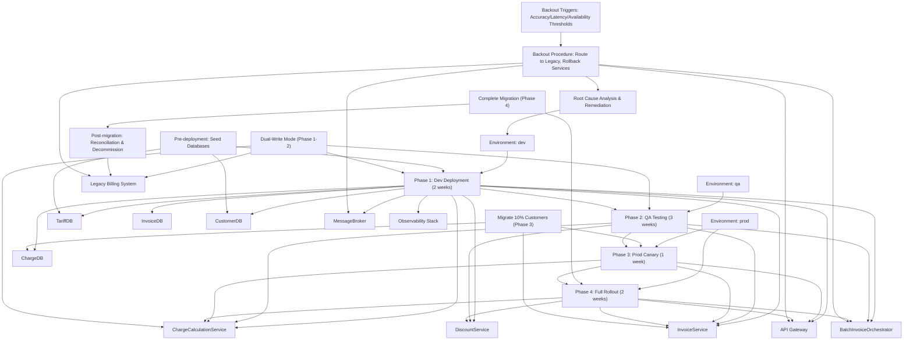

---

## 13. ADRs

### ADR-001: Select Batch Processing Over Stream Processing for Invoice Generation

**Context**: The system must generate invoices for thousands of customers on periodic billing cycles (monthly/weekly). Two architectural patterns were considered: batch processing and stream processing.

**Decision**: Select **batch processing** for invoice generation.

**Consequences**:
- **Positive**: Aligns with discrete billing cycles (not continuous streams); enables controlled parallelism (process 100 customers concurrently, not 10,000); supports per-customer fault isolation (failures don't cascade); simplifies operational model (no stream state stores, windowing, watermarks); meets >= 98% batch success ratio target
- **Negative**: Higher latency for individual invoice generation (seconds vs sub-second); requires batch orchestration infrastructure (Kubernetes CronJob or scheduled service); less suitable for real-time billing scenarios

**Alternatives Considered**:
- **Stream processing (Kafka Streams/Flink)**: Rejected due to workload mismatch (discrete shipment batches, not unbounded event streams); operational complexity (state stores, windowing, watermarks) provides no value for periodic batch workloads; latency requirements (p95 in seconds) don't justify sub-second stream processing overhead
- **Lambda (serverless functions)**: Rejected due to long-running batch orchestration requirements (conflicts with 15-min execution limits); stateful coordination needs (Lambda's stateless model unsuitable); controlled parallelism requirements (Lambda auto-scaling can overwhelm databases); cold-start latency incompatible with <200ms charge calc target

*(from cam.architecture.pipeline_patterns: 33ceecea-39ec-44e6-9e24-a264901ab542)*

### ADR-002: Select PostgreSQL Over MongoDB for Core Billing Data

**Context**: The system requires persistent storage for tariffs, charges, invoices, and customers. Two database technologies were evaluated: PostgreSQL (relational) and MongoDB (document).

**Decision**: Select **PostgreSQL** as the primary database for all core billing datasets (TariffDB, ChargeDB, InvoiceDB, CustomerDB).

**Consequences**:
- **Positive**: ACID compliance ensures transactional integrity for deterministic financial calculations (charge = base + surcharge - discount); exact matching queries for tariff lookup (origin, destination, wagon_type) with indexed performance; distance range validation (DIST_MIN/DIST_MAX) via SQL WHERE clauses; JSON column support for charge component breakdowns (BASE/SURCHARGE/DISCOUNT) while maintaining relational integrity; query performance for batch customer reads (status=ACTIVE filtering) meets throughput requirements
- **Negative**: Requires careful indexing strategies for high-throughput tariff lookups (composite keys on origin, destination, wagon_type); horizontal scaling requires read replicas or sharding for very high transaction volumes; schema migrations require coordination across services (database-per-service pattern)

**Alternatives Considered**:
- **MongoDB**: Rejected due to weaker transaction guarantees across documents (conflicts with deterministic financial calculation requirements); complexity in implementing distance range validation queries (DIST_MIN/DIST_MAX checks less efficient than SQL); relational nature of tariff lookups and invoice calculations favors structured approach; charge accuracy >= 99.9% target requires strict consistency

*(from cam.catalog.tech_stack_rankings: f1043f13-ca6e-4734-9b0c-5c5b3d339f7e)*

### ADR-003: Select RabbitMQ Over Kafka for Event-Driven Communication

**Context**: The system requires asynchronous communication for audit trails (ChargeCalculated, InvoiceGenerated events) and downstream notifications. Two message brokers were evaluated: RabbitMQ and Apache Kafka.

**Decision**: Select **RabbitMQ** with outbox pattern for event-driven communication.

**Consequences**:
- **Positive**: Reliable message delivery with strong delivery guarantees (at-least-once with consumer idempotency); outbox/inbox pattern support ensures reliable event publishing even during service failures; dead-letter queue functionality enables per-customer fault isolation during batch processing (failed customer events routed to DLQ, batch continues); lower operational complexity vs Kafka (simpler setup, monitoring, troubleshooting); sufficient throughput for moderate event volumes (thousands of events per batch cycle)
- **Negative**: Lower throughput ceilings vs Kafka (not optimized for millions of events/sec); lacks native event replay capabilities (requires external tooling for reconciliation scenarios); less suitable for high-volume streaming analytics use cases

**Alternatives Considered**:
- **Apache Kafka**: Rejected due to higher operational complexity (ZooKeeper/KRaft management, partition rebalancing, consumer group coordination) representing over-engineering for moderate event volumes; resource requirements (memory, disk, network) higher than needed for periodic billing cycles; operational simplicity prioritized given batch-oriented workload

*(from cam.catalog.tech_stack_rankings: f1043f13-ca6e-4734-9b0c-5c5b3d339f7e, cam.workflow.data_pipeline_architecture: 2bb2344e-1a30-4ba2-9140-aa2d21106b34)*

### ADR-004: Implement Database-Per-Service Pattern

**Context**: The microservices architecture requires data persistence strategy. Two approaches were considered: shared database and database-per-service.

**Decision**: Implement **database-per-service** pattern with four dedicated PostgreSQL databases (TariffDB, ChargeDB, InvoiceDB, CustomerDB).

**Consequences**:
- **Positive**: Service isolation enables independent scaling (ChargeCalculationService scales for peak calculation load without impacting InvoiceService); prevents tight coupling through shared databases (no cross-service writes); enables independent schema evolution (TariffAdmin can modify tariff schema without coordinating with invoice service); supports team autonomy (each service team owns data model); aligns with bounded context principle (Tariff, Charge, Discount, Invoice, Batch Orchestration contexts)
- **Negative**: Requires API composition for cross-service queries (e.g., invoice generation queries ChargeDB via InvoiceService API, not direct DB access); eventual consistency challenges (events propagate asynchronously); increased operational overhead (four databases to monitor, backup, scale); referential integrity across services enforced at application level (not DB foreign keys)

**Alternatives Considered**:
- **Shared database**: Rejected due to tight coupling (schema changes impact all services); scaling bottleneck (single DB must handle all service load); prevents independent deployment (schema migrations require coordination); violates microservices principle of service autonomy

*(from cam.deployment.data_platform_topology: 7d739e46-d365-463e-9b24-22a2c891fdc2)*

### ADR-005: Enforce Idempotency via Unique Keys

**Context**: The system must prevent duplicate charges and invoices during retries (network failures, timeouts, batch re-runs). Two approaches were considered: application-level deduplication and database-level unique constraints.

**Decision**: Enforce **idempotency via database unique constraints** on idempotency_key (charges) and invoice_id (invoices).

**Consequences**:
- **Positive**: Database-level enforcement guarantees exactly-once semantics (duplicate inserts fail with constraint violation); idempotency_key (shipment_id-based) prevents duplicate charge calculations if shipment reprocessed; invoice_id (customer_id + timestamp) ensures deterministic invoice generation (reprocessing same customer/period produces identical ID); supports safe retries (application can retry failed operations without side effects); aligns with charge_accuracy >= 99.9% and invoice_success_rate >= 99.5% targets
- **Negative**: Requires deterministic key generation (idempotency_key must be reproducible from shipment context); application must handle constraint violation errors gracefully (distinguish duplicate from genuine failure); unique indexes add storage overhead and insert latency (minimal impact given batch-oriented workload)

**Alternatives Considered**:
- **Application-level deduplication**: Rejected due to race condition risks (concurrent requests may both pass deduplication check before insert); requires distributed locking or consensus (adds complexity); database constraint provides stronger guarantee

*(from cam.workflow.data_pipeline_architecture: 2bb2344e-1a30-4ba2-9140-aa2d21106b34)*

### ADR-006: Implement Per-Customer Fault Isolation in Batch Processing

**Context**: Batch invoice generation must process thousands of customers. Two failure handling strategies were considered: fail-fast (halt batch on first error) and fault isolation (continue on individual failures).

**Decision**: Implement **per-customer fault isolation** in BatchInvoiceOrchestrator with >= 98% success ratio target.

**Consequences**:
- **Positive**: Individual customer failures don't cascade to entire batch (e.g., missing customer data for one customer doesn't prevent invoicing remaining 9,999 customers); meets >= 98% batch success ratio target (allows 2% failure rate for data issues, transient errors); enables resumable processing (failed customers logged, can be retried separately); improves operational resilience (batch completes even with partial failures); supports SLA (invoice_success_rate >= 99.5% per cycle)
- **Negative**: Requires comprehensive error logging (capture customer_id, error_message, timestamp for each failure); adds complexity to batch orchestration (must track per-customer results, aggregate success/failure counts); requires operational process for handling failed customers (manual review, data correction, retry)

**Alternatives Considered**:
- **Fail-fast**: Rejected due to fragility (single customer failure halts entire batch, leaving thousands without invoices); conflicts with >= 98% success ratio target (requires 100% success or batch fails); poor operational experience (batch must be debugged and re-run for single-customer issues)

*(from cam.workflow.batch_job_spec: 0593d177-3ea3-4b0d-88a2-1d3c2e6a87a1)*

---

## 14. Risks & Mitigations, Assumptions, Open Questions

### Risks & Mitigations

| **Risk** | **Likelihood** | **Impact** | **Mitigation** |
|----------|----------------|------------|----------------|
| Tariff data incompleteness (missing DIST_MIN/DIST_MAX, invalid base_rate) causes NO_TARIFF_FOUND errors, blocking charge calculation | Medium | High (prevents billing for affected routes) | Implement tariff validation job (validate_tariff_data step) before charge calculation; alert TariffAdmin on validation failures; maintain tariff completeness dashboard; enforce data quality rules at tariff ingestion |
| Database connection pool exhaustion during peak batch processing (thousands of concurrent customer invoice generations) | Medium | High (batch fails, invoices not generated) | Configure connection pooling with appropriate limits (e.g., HikariCP for Spring Boot, asyncpg for FastAPI); implement circuit breakers to prevent cascading failures; horizontal scaling of InvoiceService instances; monitor connection pool metrics (active, idle, waiting) |
| Message broker backlog during batch processing (thousands of ChargeCalculated/InvoiceGenerated events published simultaneously) | Low | Medium (audit events delayed, downstream consumers lag) | Configure RabbitMQ with sufficient queue capacity and consumer parallelism; implement backpressure (slow down event publishing if queue depth exceeds threshold); monitor queue depth metrics; scale message broker if needed |
| Idempotency key collision (two shipments generate same idempotency_key due to timestamp precision or hash collision) | Low | High (duplicate charges created, billing accuracy compromised) | Use UUID for charge_id (globally unique); idempotency_key includes shipment_id + high-precision timestamp + hash of shipment attributes; database unique constraint enforces uniqueness; monitor constraint violation errors |
| Discount policy changes mid-billing cycle (tier percentages or regional discounts modified) cause inconsistent discount application | Low | Medium (some customers billed with old policy, others with new) | Version discount policies (discount_policy_version field); apply policy version consistently within billing cycle; document policy effective dates; reconciliation job detects inconsistencies |
| Batch orchestration service failure (Kubernetes pod crash, node failure) during invoice generation | Medium | Medium (batch incomplete, some customers not invoiced) | Implement batch resumability (track processed customers, resume from last checkpoint); Kubernetes restarts failed pods automatically; monitor batch execution status; alert on batch failures; >= 98% success ratio target allows for partial failures |
| Data freshness SLA violation (charges not available within 5 minutes) due to database write latency or replication lag | Low | Low (downstream consumers receive stale data) | Monitor FreightChargeDataset_Freshness metric; alert if > 5 min for 2+ consecutive checks; optimize database write performance (batch inserts, connection pooling); consider read replicas for query load |
| Canary deployment reveals calculation discrepancies vs legacy system (different tariff interpretation, rounding differences) | Medium | High (blocks full rollout, requires root cause analysis and fix) | Implement comprehensive comparison logic during canary (compare charge amounts, discount amounts, net amounts within tolerance); log all discrepancies with full context (shipment_id, tariff_id, customer_id, amounts); root cause analysis in dev environment; fix and re-deploy before proceeding to full rollout |

### Assumptions

- Shipment distance is available on shipment record or can be resolved deterministically from origin/destination (no real-time distance calculation required)
- Tariff records contain all required fields (base_rate, currency, DIST_MIN, DIST_MAX) and distance bands don't overlap for same origin/destination/wagon_type combination
- Customer records include tier (A/B), region code (e.g., WST), and status (ACTIVE/INACTIVE) maintained by upstream CRM system
- Charge and invoice creation operations are idempotent (safe to retry without duplicates)
- Currency conversion to INR occurs before charge calculation (all tariffs stored in INR)
- Batch invoice generation runs during off-peak hours (2:00 AM UTC) to minimize contention with online transaction processing
- Observability stack (OpenTelemetry, Prometheus, Grafana) has sufficient capacity for production telemetry volumes
- API Gateway (Kong/NGINX) configured with appropriate rate limiting and authentication for production traffic
- Database backups and disaster recovery procedures in place for all four PostgreSQL databases
- Message broker (RabbitMQ) configured with persistence and replication for production reliability

### Open Questions

- **Logical Data Model**: A cam.data.model_logical artifact was not provided. How are Shipment, Tariff, Customer, Charge, Invoice, and ChargeComponent entities formally defined with cardinalities, constraints, and relationships? Recommendation: Create logical data model artifact with entity-relationship diagram.
- **Data Observability Spec**: A cam.observability.data_observability_spec artifact was not provided. How are data quality metrics (QR-001 through QR-008) monitored in production? What are the alerting thresholds and escalation procedures? Recommendation: Create data observability spec with data quality monitoring framework.
- **Tariff Update Process**: How are tariff updates (new rates, distance range changes) propagated to the system? Is there a tariff versioning strategy to ensure historical charges remain explainable? Recommendation: Define tariff lifecycle management process with versioning and effective date handling.
- **Currency Conversion**: If tariffs are stored in multiple currencies, where does currency conversion to INR occur? What exchange rate source is used? How are exchange rates audited? Recommendation: Clarify currency handling strategy and document exchange rate source.
- **Customer Tier Assignment**: How are customer tiers (A/B) assigned and updated? Is there a workflow for tier changes mid-billing cycle? Recommendation: Define customer tier management process with effective date handling.
- **Batch Failure Recovery**: What is the operational process for handling failed customers in batch processing (>= 98% success ratio allows 2% failures)? Is there a manual review and retry workflow? Recommendation: Define batch failure recovery runbook with escalation procedures.
- **Disaster Recovery**: What are the RTO (Recovery Time Objective) and RPO (Recovery Point Objective) targets for the billing system? How are database backups and restores tested? Recommendation: Define disaster recovery plan with RTO/RPO targets and testing schedule.
- **Capacity Planning**: What are the expected growth rates for shipment volumes, customer counts, and tariff complexity? How will the system scale to meet future demand? Recommendation: Conduct capacity planning exercise with 3-year growth projections.

---

## 15. Appendices

### Glossary

- **ACID**: Atomicity, Consistency, Isolation, Durability (database transaction properties)
- **ADR**: Architecture Decision Record
- **API**: Application Programming Interface
- **AVC**: Application Value Chain
- **Batch Processing**: Processing data in discrete groups (batches) rather than continuously
- **Bounded Context**: Domain-driven design concept defining clear boundaries around a model
- **CAM**: Context-Aware Modeling (artifact kind prefix)
- **Canary Deployment**: Gradual rollout strategy routing small percentage of traffic to new version
- **Circuit Breaker**: Resilience pattern preventing cascading failures by stopping requests to failing service
- **DAG**: Directed Acyclic Graph (workflow structure with no cycles)
- **DQ**: Data Quality
- **ELK**: Elasticsearch, Logstash, Kibana (observability stack)
- **Event-Driven Architecture**: System design where components communicate via asynchronous events
- **FSS**: Functional System Structure
- **Idempotency**: Property where operation produces same result when executed multiple times
- **INR**: Indian Rupees (currency)
- **KPI**: Key Performance Indicator
- **Microservices**: Architectural style decomposing application into independently deployable services
- **NFR**: Non-Functional Requirement
- **Outbox Pattern**: Reliable event publishing pattern using transactional outbox table
- **p95**: 95th percentile (metric where 95% of values are below threshold)
- **PII**: Personally Identifiable Information
- **PSS**: Platform System Structure
- **RBAC**: Role-Based Access Control
- **SLA**: Service Level Agreement
- **SLO**: Service Level Objective
- **Stream Processing**: Processing unbounded data streams in real-time
- **Tariff**: Pricing rule defining freight rates based on route and wagon type
- **UUID**: Universally Unique Identifier

### References to Artifact IDs/Kinds

- **cam.asset.raina_input** (5baa41c9-8b99-4a3b-a2df-f2f2265ab2c3): AVC/FSS/PSS inputs defining vision, goals, NFRs, constraints
- **cam.catalog.data_source_inventory** (b64cecee-ec56-4491-adba-0189dd82ebc0): Source and sink inventory
- **cam.workflow.business_flow_catalog** (6df1a6c1-fbf9-45f1-94cf-17404f2244b7): Business flows (RFB-101 through RFB-106)
- **cam.architecture.pipeline_patterns** (33ceecea-39ec-44e6-9e24-a264901ab542): Pattern selection (batch, microservices, event-driven)
- **cam.data.dataset_contract** (d99b0fcf-e25c-48fd-91bb-b189dd5b7688): FreightChargeDataset contract
- **cam.workflow.transform_spec** (1cc93747-5477-4a28-a4df-0144a2101d18): 12 transformation steps
- **cam.workflow.batch_job_spec** (0593d177-3ea3-4b0d-88a2-1d3c2e6a87a1): RailFreightBillingBatchJob
- **cam.workflow.stream_job_spec** (c2b3529b-aabc-42c0-91b1-603fb6295a3a): RailFreightBillingStreamJob
- **cam.workflow.orchestration_spec** (2b41335b-fa81-4e89-9db6-11e726206c08): Airflow orchestration
- **cam.data.lineage_map** (bb048267-146a-4ba2-8c66-d97f878f2182): Data lineage with critical paths
- **cam.governance.data_governance_policies** (b5c899ad-a6f2-4d17-8bef-1064ab9c7a1b): Classification, retention, lineage requirements
- **cam.security.data_access_control** (73826c0b-b512-4d00-9c4f-95e8577a9df9): RBAC policies
- **cam.security.data_masking_policy** (c2fc8ef0-4b60-4005-b3d8-af53c902fc8a): customer_id hashing
- **cam.qa.data_sla** (235b1c87-33a9-4eaf-a6d8-c58203760def): SLA targets and monitoring
- **cam.observability.microservices_observability_spec** (363a0fac-3e6b-45a2-88da-0287d40f910f): Observability stack
- **cam.deployment.data_platform_topology** (7d739e46-d365-463e-9b24-22a2c891fdc2): Component topology
- **cam.catalog.tech_stack_rankings** (f1043f13-ca6e-4734-9b0c-5c5b3d339f7e): Technology rankings
- **cam.catalog.data_products** (c2414f67-994a-4a8d-a980-63cf8d6a779d): FreightChargeDataProduct
- **cam.workflow.data_pipeline_architecture** (2bb2344e-1a30-4ba2-9140-aa2d21106b34): Pipeline architecture
- **cam.deployment.pipeline_deployment_plan** (eb268829-22cb-4949-ae7a-5486342b0216): Deployment plan

### Example Queries

**Tariff Lookup Query** (PostgreSQL):
```sql
SELECT tariff_id, base_rate, currency, DIST_MIN, DIST_MAX
FROM TariffDataset
WHERE origin = 'DEL'
  AND destination = 'MUM'
  AND wagon_type = 'BOXCAR'
  AND 1400 BETWEEN DIST_MIN AND DIST_MAX
  AND effective_date <= CURRENT_DATE
  AND (expiry_date IS NULL OR expiry_date >= CURRENT_DATE)
ORDER BY effective_date DESC
LIMIT 1;
```

**Charge Aggregation Query** (PostgreSQL):
```sql
SELECT 
  customer_id,
  DATE(calculation_timestamp) AS invoice_date,
  SUM(gross_amount) AS total_gross,
  SUM(discount_amount) AS total_discount,
  SUM(net_amount) AS total_net,
  COUNT(*) AS charge_count,
  STRING_AGG(DISTINCT discount_reason, ', ') AS aggregated_discount_reason
FROM FreightChargeDataset
WHERE customer_id = 'CUST-A-001'
  AND DATE(calculation_timestamp) = '2024-01-15'
GROUP BY customer_id, DATE(calculation_timestamp);
```

**Batch Success Ratio Query** (PostgreSQL):
```sql
SELECT 
  batch_id,
  start_time,
  end_time,
  total_customers,
  successful_invoices,
  failed_invoices,
  ROUND(100.0 * successful_invoices / total_customers, 2) AS success_ratio_pct
FROM InvoiceBatchDataset
WHERE batch_id = 'BATCH-2024-01-15-020000'
ORDER BY start_time DESC;
```

### Runbooks

**Runbook: Handle NO_TARIFF_FOUND Errors**
1. Query error logs for NO_TARIFF_FOUND events: `SELECT * FROM ErrorLogs WHERE error_type = 'NO_TARIFF_FOUND' AND timestamp > NOW() - INTERVAL '1 hour'`
2. Identify affected shipments (origin, destination, wagon_type, distance_km)
3. Check TariffDataset for matching tariffs: `SELECT * FROM TariffDataset WHERE origin = ? AND destination = ? AND wagon_type = ?`
4. If tariff missing: Notify TariffAdmin to create tariff record with appropriate DIST_MIN/DIST_MAX
5. If tariff exists but distance out of range: Verify shipment distance accuracy; if correct, notify TariffAdmin to adjust distance range
6. After tariff correction, re-run charge calculation for affected shipments
7. Verify charges created successfully and audit completeness (tariff_id, component breakdown)

**Runbook: Recover Failed Batch Invoice Generation**
1. Query InvoiceBatchDataset for failed batch: `SELECT * FROM InvoiceBatchDataset WHERE status IN ('PARTIAL', 'FAILED') ORDER BY start_time DESC LIMIT 1`
2. Identify failed customers: `SELECT customer_id, error_message FROM BatchInvoiceResults WHERE batch_id = ? AND status = 'FAILED'`
3. For each failed customer, investigate error_message (common causes: missing customer data, charge aggregation failure, database timeout)
4. Correct underlying data issues (e.g., update customer status, fix charge records)
5. Re-run invoice generation for failed customers individually: `CALL generate_customer_invoice(customer_id, invoice_date)`
6. Verify invoices created successfully: `SELECT * FROM InvoiceDataset WHERE customer_id IN (...) AND invoice_date = ?`
7. Update batch summary with corrected success ratio
8. If success ratio still < 98%, escalate to BillingAnalyst for manual review

**Runbook: Investigate Charge Accuracy Degradation**
1. Query ChargeAccuracyReport for recent validation runs: `SELECT * FROM ChargeAccuracyReport WHERE validation_timestamp > NOW() - INTERVAL '24 hours' ORDER BY validation_timestamp DESC`
2. If accuracy_rate < 99.9%, identify incorrect charges: `SELECT charge_id, shipment_id, expected_net_amount, actual_net_amount FROM ChargeAccuracyReport WHERE validation_timestamp = ? AND status = 'INCORRECT'`
3. For each incorrect charge, compare expected vs actual calculations (base_amount, surcharge_amount, discount_amount, net_amount)
4. Common root causes: tariff base_rate changed mid-cycle, discount policy version mismatch, rounding errors, calculation logic bug
5. If tariff/discount policy issue: Verify policy versions applied consistently; reconcile with policy effective dates
6. If calculation logic bug: Review ChargeCalculationService code; check for recent deployments; rollback if needed
7. Correct affected charges: Create adjustment records or re-calculate with correct logic
8. Re-run validation to confirm accuracy_rate >= 99.9%
9. Document root cause and preventive measures in incident report

---

**End of Document**


## Artifact Diagrams

### Pipeline Deployment Plan (timeline)

```mermaid
timeline
flowchart TD
    ENV_DEV["Environment: dev"]
    ENV_QA["Environment: qa"]
    ENV_PROD["Environment: prod"]
    
    PHASE1["Phase 1: Dev Deployment (2 weeks)"]
    PHASE2["Phase 2: QA Testing (3 weeks)"]
    PHASE3["Phase 3: Prod Canary (1 week)"]
    PHASE4["Phase 4: Full Rollout (2 weeks)"]
    
    CCS["ChargeCalculationService"]
    DS["DiscountService"]
    IS["InvoiceService"]
    BIO["BatchInvoiceOrchestrator"]
    
    APIGW["API Gateway"]
    TARIFFDB["TariffDB"]
    CHARGEDB["ChargeDB"]
    INVOICEDB["InvoiceDB"]
    CUSTOMERDB["CustomerDB"]
    MB["MessageBroker"]
    OBS["Observability Stack"]
    
    LEGACY["Legacy Billing System"]
    
    MIG_PRE["Pre-deployment: Seed Databases"]
    MIG_DUAL["Dual-Write Mode (Phase 1-2)"]
    MIG_CANARY["Migrate 10% Customers (Phase 3)"]
    MIG_FULL["Complete Migration (Phase 4)"]
    MIG_POST["Post-migration: Reconciliation & Decommission"]
    
    BO_TRIGGERS["Backout Triggers: Accuracy/Latency/Availability Thresholds"]
    BO_PROC["Backout Procedure: Route to Legacy, Rollback Services"]
    BO_RCA["Root Cause Analysis & Remediation"]
    
    PHASE1 --> ENV_DEV
    PHASE2 --> ENV_QA
    PHASE3 --> ENV_PROD
    PHASE4 --> ENV_PROD
    
    PHASE1 --> CCS
    PHASE1 --> DS
    PHASE1 --> IS
    PHASE1 --> BIO
    PHASE1 --> APIGW
    PHASE1 --> TARIFFDB
    PHASE1 --> CHARGEDB
    PHASE1 --> INVOICEDB
    PHASE1 --> CUSTOMERDB
    PHASE1 --> MB
    PHASE1 --> OBS
    
    PHASE2 --> CCS
    PHASE2 --> DS
    PHASE2 --> IS
    PHASE2 --> BIO
    
    PHASE3 --> APIGW
    PHASE3 --> CCS
    PHASE3 --> IS
    
    PHASE4 --> APIGW
    PHASE4 --> CCS
    PHASE4 --> DS
    PHASE4 --> IS
    PHASE4 --> BIO
    
    CCS --> TARIFFDB
    CCS --> CHARGEDB
    DS --> CHARGEDB
    IS --> INVOICEDB
    IS --> CUSTOMERDB
    BIO --> IS
    BIO --> MB
    
    APIGW --> CCS
    APIGW --> IS
    APIGW --> LEGACY
    
    MIG_PRE --> TARIFFDB
    MIG_PRE --> CUSTOMERDB
    MIG_PRE --> PHASE1
    
    MIG_DUAL --> LEGACY
    MIG_DUAL --> CCS
    MIG_DUAL --> PHASE1
    MIG_DUAL --> PHASE2
    
    MIG_CANARY --> IS
    MIG_CANARY --> CHARGEDB
    MIG_CANARY --> PHASE3
    
    MIG_FULL --> PHASE4
    MIG_FULL --> MIG_POST
    
    MIG_POST --> LEGACY
    
    BO_TRIGGERS --> BO_PROC
    BO_PROC --> APIGW
    BO_PROC --> LEGACY
    BO_PROC --> BIO
    BO_PROC --> MB
    BO_PROC --> TARIFFDB
    BO_PROC --> CHARGEDB
    BO_PROC --> INVOICEDB
    BO_PROC --> CUSTOMERDB
    BO_PROC --> BO_RCA
    
    BO_RCA --> ENV_DEV
    
    PHASE1 --> PHASE2
    PHASE2 --> PHASE3
    PHASE3 --> PHASE4
```

### Data Pipeline Architecture (flowchart)

```mermaid
flowchart TD
    IngestShipmentData["IngestShipmentData<br/>(ingest, batch)"]
    ValidateTariffAndDistance["ValidateTariffAndDistance<br/>(validate, batch, exactly-once)"]
    CalculateBaseAndSurcharge["CalculateBaseAndSurcharge<br/>(transform, batch, exactly-once)"]
    ApplyCustomerDiscounts["ApplyCustomerDiscounts<br/>(enrich, batch, exactly-once)"]
    PersistChargeComponents["PersistChargeComponents<br/>(persist, batch, exactly-once)"]
    AggregateChargesForInvoice["AggregateChargesForInvoice<br/>(transform, batch, exactly-once)"]
    GenerateInvoice["GenerateInvoice<br/>(transform, batch, exactly-once)"]
    PersistInvoice["PersistInvoice<br/>(persist, batch, exactly-once)"]
    BatchInvoiceOrchestration["BatchInvoiceOrchestration<br/>(transform, batch, exactly-once)"]
    PublishBillingEvents["PublishBillingEvents<br/>(serve, stream, exactly-once)"]
    ObservabilityAndAudit["ObservabilityAndAudit<br/>(serve, stream)"]

    ShipmentRecords["ShipmentRecords"]
    CustomerRecords["CustomerRecords"]
    TariffRecords["TariffRecords"]
    ValidatedShipmentEvents["ValidatedShipmentEvents"]
    ValidatedTariffMatches["ValidatedTariffMatches"]
    CalculatedCharges["CalculatedCharges"]
    DiscountedCharges["DiscountedCharges"]
    PersistedCharges["PersistedCharges"]
    ChargeComponents["ChargeComponents"]
    AggregatedInvoiceData["AggregatedInvoiceData"]
    GeneratedInvoices["GeneratedInvoices"]
    PersistedInvoices["PersistedInvoices"]
    ActiveCustomerList["ActiveCustomerList"]
    BatchInvoiceResults["BatchInvoiceResults"]
    InvoiceBatchSummary["InvoiceBatchSummary"]
    ChargeCalculatedEvents["ChargeCalculatedEvents"]
    InvoiceGeneratedEvents["InvoiceGeneratedEvents"]
    ServiceTraces["ServiceTraces"]
    ServiceMetrics["ServiceMetrics"]
    StructuredLogs["StructuredLogs"]
    DistributedTraces["DistributedTraces"]
    MetricsDashboards["MetricsDashboards"]
    AuditLogs["AuditLogs"]

    APIGateway["API Gateway<br/>(Kong/NGINX)"]
    ChargeCalculationService["ChargeCalculationService"]
    TariffDatabase["TariffDatabase<br/>(PostgreSQL)"]
    DiscountService["DiscountService"]
    CustomerDatabase["CustomerDatabase<br/>(PostgreSQL)"]
    ChargeDatabase["ChargeDatabase<br/>(PostgreSQL)"]
    InvoiceService["InvoiceService"]
    InvoiceDatabase["InvoiceDatabase<br/>(PostgreSQL)"]
    BatchInvoiceOrchestrator["BatchInvoiceOrchestrator"]
    MessageBroker["MessageBroker<br/>(RabbitMQ/Kafka)"]
    OpenTelemetry["OpenTelemetry"]
    Prometheus["Prometheus"]
    Grafana["Grafana"]

    ShipmentRecords --> IngestShipmentData
    CustomerRecords --> IngestShipmentData
    TariffRecords --> IngestShipmentData
    IngestShipmentData --> ValidatedShipmentEvents
    APIGateway --> IngestShipmentData

    ValidatedShipmentEvents --> ValidateTariffAndDistance
    TariffRecords --> ValidateTariffAndDistance
    ValidateTariffAndDistance --> ValidatedTariffMatches
    ChargeCalculationService --> ValidateTariffAndDistance
    TariffDatabase --> ValidateTariffAndDistance

    ValidatedTariffMatches --> CalculateBaseAndSurcharge
    CalculateBaseAndSurcharge --> CalculatedCharges
    ChargeCalculationService --> CalculateBaseAndSurcharge

    CalculatedCharges --> ApplyCustomerDiscounts
    CustomerRecords --> ApplyCustomerDiscounts
    ApplyCustomerDiscounts --> DiscountedCharges
    DiscountService --> ApplyCustomerDiscounts
    CustomerDatabase --> ApplyCustomerDiscounts

    DiscountedCharges --> PersistChargeComponents
    PersistChargeComponents --> PersistedCharges
    PersistChargeComponents --> ChargeComponents
    ChargeCalculationService --> PersistChargeComponents
    ChargeDatabase --> PersistChargeComponents

    PersistedCharges --> AggregateChargesForInvoice
    CustomerRecords --> AggregateChargesForInvoice
    AggregateChargesForInvoice --> AggregatedInvoiceData
    InvoiceService --> AggregateChargesForInvoice
    ChargeDatabase --> AggregateChargesForInvoice

    AggregatedInvoiceData --> GenerateInvoice
    GenerateInvoice --> GeneratedInvoices
    InvoiceService --> GenerateInvoice

    GeneratedInvoices --> PersistInvoice
    PersistInvoice --> PersistedInvoices
    InvoiceService --> PersistInvoice
    InvoiceDatabase --> PersistInvoice

    ActiveCustomerList --> BatchInvoiceOrchestration
    BatchInvoiceOrchestration --> BatchInvoiceResults
    BatchInvoiceOrchestration --> InvoiceBatchSummary
    BatchInvoiceOrchestrator --> BatchInvoiceOrchestration
    CustomerDatabase --> BatchInvoiceOrchestration
    InvoiceService --> BatchInvoiceOrchestration

    PersistedCharges --> PublishBillingEvents
    PersistedInvoices --> PublishBillingEvents
    PublishBillingEvents --> ChargeCalculatedEvents
    PublishBillingEvents --> InvoiceGeneratedEvents
    MessageBroker --> PublishBillingEvents

    ServiceTraces --> ObservabilityAndAudit
    ServiceMetrics --> ObservabilityAndAudit
    StructuredLogs --> ObservabilityAndAudit
    ObservabilityAndAudit --> DistributedTraces
    ObservabilityAndAudit --> MetricsDashboards
    ObservabilityAndAudit --> AuditLogs
    OpenTelemetry --> ObservabilityAndAudit
    Prometheus --> ObservabilityAndAudit
    Grafana --> ObservabilityAndAudit

    IngestShipmentData -->|"shipment has origin, destination,<br/>wagon_type, and distance"| ValidateTariffAndDistance
    ValidateTariffAndDistance -->|"valid tariff found with<br/>distance in range"| CalculateBaseAndSurcharge
    ValidateTariffAndDistance -->|"no valid tariff found<br/>(NO_TARIFF_FOUND error)"| ObservabilityAndAudit
    CalculateBaseAndSurcharge -->|"base and surcharge calculated"| ApplyCustomerDiscounts
    ApplyCustomerDiscounts -->|"discount applied with<br/>reason code"| PersistChargeComponents
    PersistChargeComponents -->|"charge and components<br/>persisted"| PublishBillingEvents
    PersistChargeComponents -->|"charges ready for<br/>invoice aggregation"| AggregateChargesForInvoice
    AggregateChargesForInvoice -->|"charges aggregated by<br/>customer and date"| GenerateInvoice
    GenerateInvoice -->|"invoice generated with<br/>gross, discount, net"| PersistInvoice
    PersistInvoice -->|"invoice persisted<br/>successfully"| PublishBillingEvents
    BatchInvoiceOrchestration -->|"active customer identified<br/>for batch processing"| AggregateChargesForInvoice
    BatchInvoiceOrchestration -->|"per-customer invoice<br/>generation failure logged"| ObservabilityAndAudit
    PersistInvoice -->|"invoice result captured<br/>for batch summary"| BatchInvoiceOrchestration
A[Scalability NFRs] --> B[Performance under load]
A --> C[Horizontal scaling capability]
A --> D[Resource efficiency]
E[Reliability NFRs] --> F[Fault tolerance]
E --> G[Data consistency]
E --> H[Disaster recovery]
```

### Data Pipeline Architecture (activity)

```mermaid
flowchart TD
    IngestShipmentData["IngestShipmentData<br/>(ingest, batch)"]
    ValidateTariffAndDistance["ValidateTariffAndDistance<br/>(validate, batch)"]
    CalculateBaseAndSurcharge["CalculateBaseAndSurcharge<br/>(transform, batch)"]
    ApplyCustomerDiscounts["ApplyCustomerDiscounts<br/>(enrich, batch)"]
    PersistChargeComponents["PersistChargeComponents<br/>(persist, batch)"]
    AggregateChargesForInvoice["AggregateChargesForInvoice<br/>(transform, batch)"]
    GenerateInvoice["GenerateInvoice<br/>(transform, batch)"]
    PersistInvoice["PersistInvoice<br/>(persist, batch)"]
    BatchInvoiceOrchestration["BatchInvoiceOrchestration<br/>(transform, batch)"]
    PublishBillingEvents["PublishBillingEvents<br/>(serve, stream)"]
    ObservabilityAndAudit["ObservabilityAndAudit<br/>(serve, stream)"]

    ShipmentRecords["ShipmentRecords"]
    CustomerRecords["CustomerRecords"]
    TariffRecords["TariffRecords"]
    ValidatedShipmentEvents["ValidatedShipmentEvents"]
    ValidatedTariffMatches["ValidatedTariffMatches"]
    CalculatedCharges["CalculatedCharges"]
    DiscountedCharges["DiscountedCharges"]
    PersistedCharges["PersistedCharges"]
    ChargeComponents["ChargeComponents"]
    AggregatedInvoiceData["AggregatedInvoiceData"]
    GeneratedInvoices["GeneratedInvoices"]
    PersistedInvoices["PersistedInvoices"]
    ActiveCustomerList["ActiveCustomerList"]
    BatchInvoiceResults["BatchInvoiceResults"]
    InvoiceBatchSummary["InvoiceBatchSummary"]
    ChargeCalculatedEvents["ChargeCalculatedEvents"]
    InvoiceGeneratedEvents["InvoiceGeneratedEvents"]
    ServiceTraces["ServiceTraces"]
    ServiceMetrics["ServiceMetrics"]
    StructuredLogs["StructuredLogs"]
    DistributedTraces["DistributedTraces"]
    MetricsDashboards["MetricsDashboards"]
    AuditLogs["AuditLogs"]

    APIGateway["API Gateway<br/>(Kong/NGINX)"]
    ChargeCalculationService["ChargeCalculationService"]
    TariffDatabase["TariffDatabase<br/>(PostgreSQL)"]
    DiscountService["DiscountService"]
    CustomerDatabase["CustomerDatabase<br/>(PostgreSQL)"]
    ChargeDatabase["ChargeDatabase<br/>(PostgreSQL)"]
    InvoiceService["InvoiceService"]
    InvoiceDatabase["InvoiceDatabase<br/>(PostgreSQL)"]
    BatchInvoiceOrchestrator["BatchInvoiceOrchestrator"]
    MessageBroker["MessageBroker<br/>(RabbitMQ/Kafka)"]
    OpenTelemetry["OpenTelemetry"]
    Prometheus["Prometheus"]
    Grafana["Grafana"]

    ShipmentRecords --> IngestShipmentData
    CustomerRecords --> IngestShipmentData
    TariffRecords --> IngestShipmentData
    IngestShipmentData --> ValidatedShipmentEvents
    APIGateway --> IngestShipmentData

    ValidatedShipmentEvents --> ValidateTariffAndDistance
    TariffRecords --> ValidateTariffAndDistance
    ValidateTariffAndDistance --> ValidatedTariffMatches
    ChargeCalculationService --> ValidateTariffAndDistance
    TariffDatabase --> ValidateTariffAndDistance

    ValidatedTariffMatches --> CalculateBaseAndSurcharge
    CalculateBaseAndSurcharge --> CalculatedCharges
    ChargeCalculationService --> CalculateBaseAndSurcharge

    CalculatedCharges --> ApplyCustomerDiscounts
    CustomerRecords --> ApplyCustomerDiscounts
    ApplyCustomerDiscounts --> DiscountedCharges
    DiscountService --> ApplyCustomerDiscounts
    CustomerDatabase --> ApplyCustomerDiscounts

    DiscountedCharges --> PersistChargeComponents
    PersistChargeComponents --> PersistedCharges
    PersistChargeComponents --> ChargeComponents
    ChargeCalculationService --> PersistChargeComponents
    ChargeDatabase --> PersistChargeComponents

    PersistedCharges --> AggregateChargesForInvoice
    CustomerRecords --> AggregateChargesForInvoice
    AggregateChargesForInvoice --> AggregatedInvoiceData
    InvoiceService --> AggregateChargesForInvoice
    ChargeDatabase --> AggregateChargesForInvoice

    AggregatedInvoiceData --> GenerateInvoice
    GenerateInvoice --> GeneratedInvoices
    InvoiceService --> GenerateInvoice

    GeneratedInvoices --> PersistInvoice
    PersistInvoice --> PersistedInvoices
    InvoiceService --> PersistInvoice
    InvoiceDatabase --> PersistInvoice

    ActiveCustomerList --> BatchInvoiceOrchestration
    BatchInvoiceOrchestration --> BatchInvoiceResults
    BatchInvoiceOrchestration --> InvoiceBatchSummary
    BatchInvoiceOrchestrator --> BatchInvoiceOrchestration
    CustomerDatabase --> BatchInvoiceOrchestration
    InvoiceService --> BatchInvoiceOrchestration

    PersistedCharges --> PublishBillingEvents
    PersistedInvoices --> PublishBillingEvents
    PublishBillingEvents --> ChargeCalculatedEvents
    PublishBillingEvents --> InvoiceGeneratedEvents
    MessageBroker --> PublishBillingEvents

    ServiceTraces --> ObservabilityAndAudit
    ServiceMetrics --> ObservabilityAndAudit
    StructuredLogs --> ObservabilityAndAudit
    ObservabilityAndAudit --> DistributedTraces
    ObservabilityAndAudit --> MetricsDashboards
    ObservabilityAndAudit --> AuditLogs
    OpenTelemetry --> ObservabilityAndAudit
    Prometheus --> ObservabilityAndAudit
    Grafana --> ObservabilityAndAudit

    IngestShipmentData -->|"shipment has origin, destination,<br/>wagon_type, and distance"| ValidateTariffAndDistance
    ValidateTariffAndDistance -->|"valid tariff found with<br/>distance in range"| CalculateBaseAndSurcharge
    ValidateTariffAndDistance -->|"no valid tariff found<br/>(NO_TARIFF_FOUND error)"| ObservabilityAndAudit
    CalculateBaseAndSurcharge -->|"base and surcharge calculated"| ApplyCustomerDiscounts
    ApplyCustomerDiscounts -->|"discount applied with<br/>reason code"| PersistChargeComponents
    PersistChargeComponents -->|"charge and components persisted"| PublishBillingEvents
    PersistChargeComponents -->|"charges ready for<br/>invoice aggregation"| AggregateChargesForInvoice
    AggregateChargesForInvoice -->|"charges aggregated by<br/>customer and date"| GenerateInvoice
    GenerateInvoice -->|"invoice generated with<br/>gross, discount, net"| PersistInvoice
    PersistInvoice -->|"invoice persisted successfully"| PublishBillingEvents
    BatchInvoiceOrchestration -->|"active customer identified<br/>for batch processing"| AggregateChargesForInvoice
    BatchInvoiceOrchestration -->|"per-customer invoice<br/>generation failure logged"| ObservabilityAndAudit
    PersistInvoice -->|"invoice result captured<br/>for batch summary"| BatchInvoiceOrchestration
A[Scalability NFRs] --> B[Performance under load]
A --> C[Horizontal scaling capability]
A --> D[Resource efficiency]
E[Reliability NFRs] --> F[Fault tolerance]
E --> G[Data consistency]
E --> H[Disaster recovery]
```

### Data Product Catalog (flowchart)

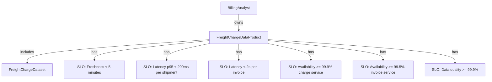

### Tech Stack Rankings (flowchart)

```mermaid
flowchart TD
    Domain["Rail Freight Billing"]

    API_Cat["API Category"]
    FastAPI["FastAPI (Rank 1)"]
    SpringBoot["Spring Boot (Rank 2)"]
    Kong["Kong API Gateway (Rank 3)"]

    Messaging_Cat["Messaging Category"]
    RabbitMQ["RabbitMQ (Rank 1)"]
    Kafka["Apache Kafka (Rank 2)"]

    Database_Cat["Database Category"]
    PostgreSQL["PostgreSQL (Rank 1)"]
    MongoDB["MongoDB (Rank 2)"]

    Cache_Cat["Cache Category"]
    Redis["Redis (Rank 1)"]
    Memcached["Memcached (Rank 2)"]

    ServiceMesh_Cat["Service Mesh Category"]
    Istio["Istio (Rank 1)"]
    Linkerd["Linkerd (Rank 2)"]

    Observability_Cat["Observability Category"]
    OtelPromGraf["OpenTelemetry + Prometheus + Grafana (Rank 1)"]
    ELK["Elastic Stack ELK (Rank 2)"]
    Jaeger["Jaeger (Rank 3)"]

    CICD_Cat["CI/CD Category"]
    GitLabCI["GitLab CI/CD (Rank 1)"]
    GitHubActions["GitHub Actions (Rank 2)"]
    Jenkins["Jenkins (Rank 3)"]

    Secrets_Cat["Secrets Category"]
    Vault["HashiCorp Vault (Rank 1)"]

    ChargeCalc["Charge Calculation"]
    DiscountApp["Discount Application"]
    InvoiceGen["Invoice Generation"]
    TariffLookup["Tariff Lookup"]
    TariffStorage["Tariff Storage"]
    BatchProcessing["Batch Processing"]
    AuditTrail["Audit Trail"]
    DistributedTracing["Distributed Tracing"]
    mTLS["mTLS Encryption"]
    IdempotencyKeys["Idempotency Keys"]

    Domain --> API_Cat
    Domain --> Messaging_Cat
    Domain --> Database_Cat
    Domain --> Cache_Cat
    Domain --> ServiceMesh_Cat
    Domain --> Observability_Cat
    Domain --> CICD_Cat
    Domain --> Secrets_Cat

    API_Cat --> FastAPI
    API_Cat --> SpringBoot
    API_Cat --> Kong

    Messaging_Cat --> RabbitMQ
    Messaging_Cat --> Kafka

    Database_Cat --> PostgreSQL
    Database_Cat --> MongoDB

    Cache_Cat --> Redis
    Cache_Cat --> Memcached

    ServiceMesh_Cat --> Istio
    ServiceMesh_Cat --> Linkerd

    Observability_Cat --> OtelPromGraf
    Observability_Cat --> ELK
    Observability_Cat --> Jaeger

    CICD_Cat --> GitLabCI
    CICD_Cat --> GitHubActions
    CICD_Cat --> Jenkins

    Secrets_Cat --> Vault

    FastAPI --> ChargeCalc
    FastAPI --> DiscountApp
    FastAPI --> InvoiceGen

    SpringBoot --> BatchProcessing
    SpringBoot --> PostgreSQL

    Kong --> DistributedTracing
    Kong --> IdempotencyKeys

    RabbitMQ --> ChargeCalc
    RabbitMQ --> InvoiceGen

    Kafka --> AuditTrail
    Kafka --> BatchProcessing

    PostgreSQL --> TariffStorage
    PostgreSQL --> InvoiceGen

    MongoDB --> ChargeCalc

    Redis --> TariffLookup
    Redis --> IdempotencyKeys
    Redis --> DiscountApp

    Memcached --> TariffLookup

    Istio --> DistributedTracing
    Istio --> mTLS

    Linkerd --> mTLS

    OtelPromGraf --> DistributedTracing
    OtelPromGraf --> AuditTrail
    OtelPromGraf --> ChargeCalc
    OtelPromGraf --> InvoiceGen

    ELK --> AuditTrail
    ELK --> TariffLookup

    Jaeger --> DistributedTracing
    Jaeger --> ChargeCalc
    Jaeger --> InvoiceGen

    GitLabCI --> BatchProcessing
    GitLabCI --> Vault

    GitHubActions --> BatchProcessing

    Jenkins --> BatchProcessing

    Vault --> PostgreSQL
    Vault --> TariffStorage
A[Azure Key Vault]
A_rank[Rank: 3]
A_reasoning[Managed secrets and key management service for Azure deployments. Supports certificate management and hardware security module HSM backed keys. Integration with Azure Active Directory for access control.]
A_tradeoffs[Vendor lock-in to Azure; less feature-rich compared to Vault for multi-cloud scenarios; regional availability considerations.]

A --> A_rank
A --> A_reasoning
A --> A_tradeoffs
```

### Data Platform Topology (component)

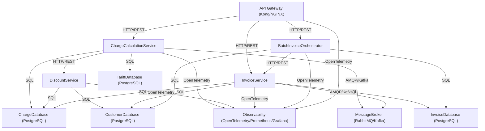

### Microservices Observability Specification (flowchart)

```mermaid
flowchart TD
    DataPipeline["Data Pipeline Domain"]

    Logs["Logs"]
    LogFormat["Format: JSON"]
    LogCorrelation["Correlation: trace_id"]
    LogPII["PII Redaction: hash"]

    Metrics["Metrics"]
    GoldenSignals["Golden Signals"]
    Latency["latency"]
    Traffic["traffic"]
    Errors["errors"]
    Saturation["saturation"]

    CustomMetrics["Custom Metrics"]
    PipelineThroughput["pipeline_throughput"]
    DataQualityScore["data_quality_score"]
    TransformationDuration["transformation_duration"]
    QueueDepth["queue_depth"]
    BatchSize["batch_size"]
    DataFreshness["data_freshness"]

    Traces["Traces"]
    TracePropagation["Propagation: W3C Trace Context"]
    TraceSampling["Sampling: adaptive_10_percent_baseline"]

    SLOs["SLOs"]
    IngestionService["ingestion-service: p95<500ms, 99.5% availability"]
    TransformationService["transformation-service: p95<2s, 99.0% availability"]
    ValidationService["validation-service: p95<300ms, 99.5% availability"]
    StorageService["storage-service: p99<1s, 99.9% availability"]
    APIGateway["api-gateway: p95<200ms, 99.9% availability"]

    Alerting["Alerting"]
    ErrorRateAlert["error_rate_threshold_5_percent"]
    LatencyAlert["latency_p95_breach"]
    CPUAlert["saturation_cpu_80_percent"]
    MemoryAlert["saturation_memory_85_percent"]
    QueueAlert["queue_depth_critical"]
    QualityAlert["data_quality_degradation"]
    BurnRateAlert["slo_budget_burn_rate"]

    DataPipeline --> Logs
    DataPipeline --> Metrics
    DataPipeline --> Traces
    DataPipeline --> SLOs
    DataPipeline --> Alerting

    Logs --> LogFormat
    Logs --> LogCorrelation
    Logs --> LogPII

    Metrics --> GoldenSignals
    Metrics --> CustomMetrics

    GoldenSignals --> Latency
    GoldenSignals --> Traffic
    GoldenSignals --> Errors
    GoldenSignals --> Saturation

    CustomMetrics --> PipelineThroughput
    CustomMetrics --> DataQualityScore
    CustomMetrics --> TransformationDuration
    CustomMetrics --> QueueDepth
    CustomMetrics --> BatchSize
    CustomMetrics --> DataFreshness

    Traces --> TracePropagation
    Traces --> TraceSampling

    SLOs --> IngestionService
    SLOs --> TransformationService
    SLOs --> ValidationService
    SLOs --> StorageService
    SLOs --> APIGateway

    Alerting --> ErrorRateAlert
    Alerting --> LatencyAlert
    Alerting --> CPUAlert
    Alerting --> MemoryAlert
    Alerting --> QueueAlert
    Alerting --> QualityAlert
    Alerting --> BurnRateAlert
```

### Data Quality & SLA (flowchart)

```mermaid
flowchart TD
    T1["Target: Freshness < 5 min"]
    T2["Target: Latency P95 < 200ms charge, < 2s invoice"]
    T3["Target: Availability 99.9%"]
    T4["Target: DQ Pass Rate >= 99.9%"]

    M1["FreightChargeDataset_Freshness"]
    M2["ChargeCalculation_Latency_P95"]
    M3["InvoiceGeneration_Latency_P95"]
    M4["ChargeCalculationService_Availability"]
    M5["InvoiceService_Availability"]
    M6["DailyChargeVolume"]
    M7["SchemaCompliance"]
    M8["QR001_ChargeAccuracy"]
    M9["QR002_DiscountAccuracy"]
    M10["QR003_AuditCompleteness"]
    M11["QR004_CurrencyValidation"]
    M12["QR005_DistanceValidation"]
    M13["QR006_SurchargeValidation"]
    M14["QR007_NetAmountValidation"]
    M15["QR008_IdempotencyEnforcement"]
    M16["BatchInvoiceSuccessRatio"]

    CCS["Charge Calculation Service"]
    IGS["Invoice Generation Service"]
    FCD["Freight Charge Dataset"]

    M1 -->|monitors| T1
    M2 -->|monitors| T2
    M3 -->|monitors| T2
    M4 -->|monitors| T3
    M5 -->|monitors| T3

    M8 -->|validates| T4
    M9 -->|validates| T4
    M10 -->|validates| T4
    M11 -->|validates| T4
    M12 -->|validates| T4
    M13 -->|validates| T4
    M14 -->|validates| T4
    M15 -->|validates| T4

    M1 -->|checks| FCD
    M2 -->|measures| CCS
    M3 -->|measures| IGS
    M4 -->|tracks| CCS
    M5 -->|tracks| IGS
    M6 -->|counts| FCD
    M7 -->|validates| FCD
    M16 -->|measures| IGS

    CCS -->|produces| FCD
    FCD -->|feeds| IGS
```

### Data Masking & Anonymization Policy (flowchart)

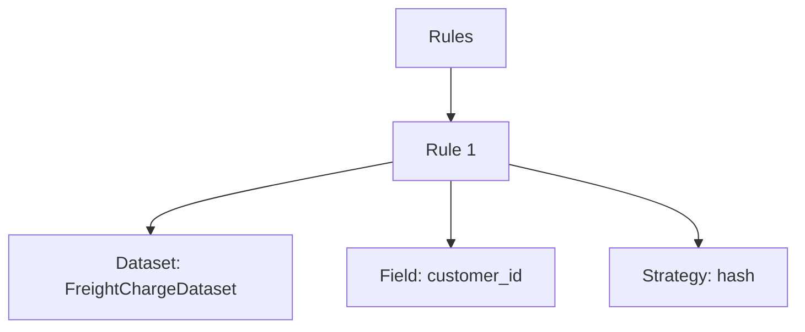

### Data Access Control (flowchart)

```mermaid
flowchart TD
    FreightChargeDataset["FreightChargeDataset"]
    TariffDataset["TariffDataset"]
    CustomerDataset["CustomerDataset"]
    ShipmentDataset["ShipmentDataset"]
    InvoiceDataset["InvoiceDataset"]
    ChargeComponentDataset["ChargeComponentDataset"]
    InvoiceBatchDataset["InvoiceBatchDataset"]
    DiscountPolicyDataset["DiscountPolicyDataset"]

    BillingAnalyst["BillingAnalyst"]
    TariffAdmin["TariffAdmin"]
    OperationsUser["OperationsUser"]
    FinanceSystem["FinanceSystem"]
    ChargeCalculationService["ChargeCalculationService"]
    InvoiceService["InvoiceService"]
    BatchOrchestrationService["BatchOrchestrationService"]

    BillingAnalyst -->|read,write| FreightChargeDataset
    TariffAdmin -->|read| FreightChargeDataset
    OperationsUser -->|read| FreightChargeDataset
    FinanceSystem -->|read| FreightChargeDataset
    ChargeCalculationService -->|read,write| FreightChargeDataset
    InvoiceService -->|read| FreightChargeDataset
    BatchOrchestrationService -->|read| FreightChargeDataset

    BillingAnalyst -->|read| TariffDataset
    TariffAdmin -->|read,write| TariffDataset
    ChargeCalculationService -->|read| TariffDataset
    FinanceSystem -->|read| TariffDataset

    BillingAnalyst -->|read| CustomerDataset
    ChargeCalculationService -->|read| CustomerDataset
    InvoiceService -->|read| CustomerDataset
    BatchOrchestrationService -->|read| CustomerDataset

    BillingAnalyst -->|read| ShipmentDataset
    ChargeCalculationService -->|read| ShipmentDataset

    BillingAnalyst -->|read,write| InvoiceDataset
    OperationsUser -->|read| InvoiceDataset
    FinanceSystem -->|read| InvoiceDataset
    InvoiceService -->|read,write| InvoiceDataset
    BatchOrchestrationService -->|read| InvoiceDataset

    BillingAnalyst -->|read| ChargeComponentDataset
    ChargeCalculationService -->|read,write| ChargeComponentDataset
    FinanceSystem -->|read| ChargeComponentDataset

    BillingAnalyst -->|read| InvoiceBatchDataset
    BatchOrchestrationService -->|read,write| InvoiceBatchDataset

    BillingAnalyst -->|read| DiscountPolicyDataset
    ChargeCalculationService -->|read| DiscountPolicyDataset
    FinanceSystem -->|read| DiscountPolicyDataset
```

### Data Governance Policies (flowchart)

```mermaid
flowchart TD
    DOC["Document"]
    CLASS_CONF["confidential"]
    CLASS_FIN["financial"]
    CLASS_PII["pii"]

    DOC --> CLASS_CONF
    DOC --> CLASS_FIN
    DOC --> CLASS_PII

    BA["BillingAnalyst"]
    TA["TariffAdmin"]
    OU["OperationsUser"]
    FS["FinanceSystem"]
    CCS["ChargeCalculationService"]
    IS["InvoiceService"]
    BOS["BatchOrchestrationService"]

    DOC --> BA
    DOC --> TA
    DOC --> OU
    DOC --> FS
    DOC --> CCS
    DOC --> IS
    DOC --> BOS

    BA --> |read| CHARGES["Charges"]
    BA --> |read| INVOICES["Invoices"]
    BA --> |read| TARIFFS["Tariffs"]
    BA --> |read| DISCOUNTS["Discounts"]
    BA --> |write| CHARGES
    BA --> |write| INVOICES

    TA --> |read| TARIFFS
    TA --> |write| TARIFFS
    TA --> |read| CHARGES

    OU --> |read| CHARGES
    OU --> |read| INVOICES

    FS --> |read| CHARGES
    FS --> |read| INVOICES
    FS --> |read| DISCOUNTS
    FS --> |read| TARIFFS

    CCS --> |read| TARIFFS
    CCS --> |read| CUSTOMERS["Customers"]
    CCS --> |read| SHIPMENTS["Shipments"]
    CCS --> |write| CHARGES
    CCS --> |write| CHARGE_COMP["Charge Components"]

    IS --> |read| CHARGES
    IS --> |read| CUSTOMERS
    IS --> |write| INVOICES

    BOS --> |read| CUSTOMERS
    BOS --> |read| INVOICES
    BOS --> |write| INV_BATCH["Invoice Batches"]

    RET_DEFAULT["Retention: 7 years"]
    RET_AUDIT["Audit Logs: 10 years"]
    RET_COMP["Charge Components: 7 years"]
    RET_INV["Invoices: 7 years"]
    RET_TARIFF["Tariffs: 10 years"]

    DOC --> RET_DEFAULT
    DOC --> RET_AUDIT
    DOC --> RET_COMP
    DOC --> RET_INV
    DOC --> RET_TARIFF

    CHARGES --> |traces to| SHIPMENTS
    CHARGES --> |traces to| TARIFFS
    CHARGES --> |traces to| CUSTOMERS
    CHARGE_COMP --> |references| CHARGES
    INVOICES --> |references| CHARGES
    INVOICES --> |references| CUSTOMERS
    INV_BATCH --> |references| INVOICES
    AUDIT_LOGS["Audit Logs"] --> |captures changes| CHARGES
    TARIFFS --> |immutable reference| CHARGES
    DISCOUNT_CODES["Discount Reason Codes"] --> |stored for| DISCOUNTS
    BASE_RATE["Base Rate"] --> |lineage to| CHARGES
    DISTANCE["Distance"] --> |lineage to| CHARGES
    SURCHARGE["Surcharge Percentage"] --> |lineage to| CHARGES
    DISCOUNT_POLICY["Discount Policy Version"] --> |lineage to| CHARGES
```

### Data Lineage Map (flowchart)

```mermaid
flowchart TD
    source_shipment_dataset["ShipmentDataset"]
    source_customer_dataset["CustomerDataset"]
    source_tariff_dataset["TariffDataset"]
    source_shipment_events_stream["shipment_events_stream"]
    source_customer_master_stream["customer_master_stream"]
    source_tariff_master_stream["tariff_master_stream"]
    dataset_freight_charge["FreightChargeDataset"]
    dataset_invoice["InvoiceDataset"]
    dataset_invoice_batch["InvoiceBatchDataset"]
    dataset_charge_component["ChargeComponentDataset"]
    job_batch_rail_freight_billing["RailFreightBillingBatchJob"]
    job_stream_rail_freight_billing["RailFreightBillingStreamJob"]
    sink_audit_log_stream["audit_log_stream"]

    source_shipment_dataset -->|reads| job_batch_rail_freight_billing
    source_customer_dataset -->|reads| job_batch_rail_freight_billing
    source_tariff_dataset -->|reads| job_batch_rail_freight_billing
    job_batch_rail_freight_billing -->|writes| dataset_freight_charge
    job_batch_rail_freight_billing -->|writes| dataset_invoice
    job_batch_rail_freight_billing -->|writes| dataset_invoice_batch
    job_batch_rail_freight_billing -->|writes| dataset_charge_component
    source_shipment_events_stream -->|reads| job_stream_rail_freight_billing
    source_customer_master_stream -->|reads| job_stream_rail_freight_billing
    source_tariff_master_stream -->|reads| job_stream_rail_freight_billing
    job_stream_rail_freight_billing -->|writes| dataset_freight_charge
    job_stream_rail_freight_billing -->|writes| dataset_invoice
    job_stream_rail_freight_billing -->|writes| dataset_charge_component
    job_stream_rail_freight_billing -->|publishes| sink_audit_log_stream
    dataset_freight_charge -->|derives| dataset_invoice
    dataset_freight_charge -->|derives| dataset_charge_component
    dataset_invoice -->|derives| dataset_invoice_batch
```

### Data Orchestration Spec (flowchart)

```mermaid
flowchart TD
    Orchestrator["Orchestrator: airflow"]
    Job1["RailFreightBillingBatchJob"]
    Job2["RailFreightBillingStreamJob"]
    FailurePolicy["Failure Policy: retry"]

    Orchestrator --> Job1
    Orchestrator --> Job2
    Job1 --> Job2
    Orchestrator --> FailurePolicy
```

### RailFreightBillingStreamJob (sequence)

```mermaid
sequenceDiagram
participant ShipmentEventsStream
participant RailFreightBillingStreamJob
participant TariffMasterStream
participant CustomerMasterStream
participant FreightChargeDataset
participant InvoiceDataset
participant ChargeComponentDataset
participant AuditLogStream
ShipmentEventsStream->>RailFreightBillingStreamJob: stream shipment events
RailFreightBillingStreamJob->>RailFreightBillingStreamJob: filter completed shipments with distance > 0
TariffMasterStream->>RailFreightBillingStreamJob: stream tariff master data
RailFreightBillingStreamJob->>RailFreightBillingStreamJob: join shipment with tariff on origin, destination, wagon_type
RailFreightBillingStreamJob->>RailFreightBillingStreamJob: filter distance within tariff range
RailFreightBillingStreamJob->>RailFreightBillingStreamJob: calculate base amount and surcharge
CustomerMasterStream->>RailFreightBillingStreamJob: stream customer master data
RailFreightBillingStreamJob->>RailFreightBillingStreamJob: join enriched shipment with customer
RailFreightBillingStreamJob->>RailFreightBillingStreamJob: apply tier and region discounts
RailFreightBillingStreamJob->>RailFreightBillingStreamJob: create charge record with UUID and idempotency key
RailFreightBillingStreamJob->>RailFreightBillingStreamJob: apply tumbling window 1 hour by customer_id
RailFreightBillingStreamJob->>RailFreightBillingStreamJob: aggregate charges by customer and window
RailFreightBillingStreamJob->>RailFreightBillingStreamJob: filter active customers only
RailFreightBillingStreamJob->>RailFreightBillingStreamJob: create invoice from aggregated data
RailFreightBillingStreamJob->>FreightChargeDataset: write freight charge records
RailFreightBillingStreamJob->>InvoiceDataset: write invoice records
RailFreightBillingStreamJob->>ChargeComponentDataset: write charge component records
RailFreightBillingStreamJob->>AuditLogStream: write audit log entries
```

### RailFreightBillingBatchJob (gantt)

```mermaid
gantt
flowchart TD
    Job["RailFreightBillingBatchJob<br/>Schedule: 0 2 * * *"]
    
    ShipmentDS["ShipmentDataset"]
    CustomerDS["CustomerDataset"]
    TariffDS["TariffDataset"]
    
    FreightChargeDS["FreightChargeDataset"]
    InvoiceDS["InvoiceDataset"]
    InvoiceBatchDS["InvoiceBatchDataset"]
    ChargeComponentDS["ChargeComponentDataset"]
    
    ExtractCustomers["extract_active_customers<br/>Type: extract<br/>Tool: sql_query"]
    ExtractShipments["extract_pending_shipments<br/>Type: extract<br/>Tool: sql_query"]
    ValidateTariff["validate_tariff_data<br/>Type: validate<br/>Tool: data_quality_check"]
    
    ActiveCustomersStaging["active_customers_staging"]
    PendingShipmentsStaging["pending_shipments_staging"]
    
    CalcCharges["calculate_freight_charges<br/>Type: transform<br/>Tool: charge_calculation_service"]
    CalcChargesStaging["calculated_charges_staging"]
    
    ApplyDiscounts["apply_customer_discounts<br/>Type: transform<br/>Tool: discount_service"]
    ChargesWithDiscountsStaging["charges_with_discounts_staging"]
    
    CreateComponents["create_charge_components<br/>Type: transform<br/>Tool: component_breakdown_service"]
    ChargeComponentsStaging["charge_components_staging"]
    
    LoadFreightCharges["load_freight_charges<br/>Type: load<br/>Tool: database_writer"]
    LoadChargeComponents["load_charge_components<br/>Type: load<br/>Tool: database_writer"]
    
    AggregateCharges["aggregate_customer_charges<br/>Type: transform<br/>Tool: sql_aggregation"]
    CustomerInvoiceAggregates["customer_invoice_aggregates"]
    
    GenerateInvoices["generate_customer_invoices<br/>Type: transform<br/>Tool: invoice_generation_service"]
    GeneratedInvoicesStaging["generated_invoices_staging"]
    
    LoadInvoices["load_invoices<br/>Type: load<br/>Tool: database_writer"]
    
    CreateBatchSummary["create_batch_summary<br/>Type: transform<br/>Tool: batch_orchestrator"]
    BatchSummaryStaging["batch_summary_staging"]
    
    LoadBatchSummary["load_batch_summary<br/>Type: load<br/>Tool: database_writer"]
    
    ValidateOutput["validate_output_quality<br/>Type: validate<br/>Tool: data_quality_check"]
    
    Job --> ExtractCustomers
    Job --> ExtractShipments
    Job --> ValidateTariff
    
    CustomerDS --> ExtractCustomers
    ShipmentDS --> ExtractShipments
    TariffDS --> ValidateTariff
    
    ExtractCustomers --> ActiveCustomersStaging
    ExtractShipments --> PendingShipmentsStaging
    
    PendingShipmentsStaging --> CalcCharges
    TariffDS --> CalcCharges
    CalcCharges --> CalcChargesStaging
    
    CalcChargesStaging --> ApplyDiscounts
    ActiveCustomersStaging --> ApplyDiscounts
    ApplyDiscounts --> ChargesWithDiscountsStaging
    
    ChargesWithDiscountsStaging --> CreateComponents
    CreateComponents --> ChargeComponentsStaging
    
    ChargesWithDiscountsStaging --> LoadFreightCharges
    LoadFreightCharges --> FreightChargeDS
    
    ChargeComponentsStaging --> LoadChargeComponents
    LoadChargeComponents --> ChargeComponentDS
    
    FreightChargeDS --> AggregateCharges
    AggregateCharges --> CustomerInvoiceAggregates
    
    CustomerInvoiceAggregates --> GenerateInvoices
    GenerateInvoices --> GeneratedInvoicesStaging
    
    GeneratedInvoicesStaging --> LoadInvoices
    LoadInvoices --> InvoiceDS
    
    GeneratedInvoicesStaging --> CreateBatchSummary
    CreateBatchSummary --> BatchSummaryStaging
    
    BatchSummaryStaging --> LoadBatchSummary
    LoadBatchSummary --> InvoiceBatchDS
    
    FreightChargeDS --> ValidateOutput
```

### Data Transformations Spec (flowchart)

```mermaid
flowchart TD
    ShipmentDataset["ShipmentDataset"]
    CustomerDataset["CustomerDataset"]
    TariffDataset["TariffDataset"]

    extract_shipment_charge_inputs["extract_shipment_charge_inputs<br/>Extract READY_FOR_BILLING shipments"]
    ShipmentChargeInputs["ShipmentChargeInputs"]

    lookup_and_validate_tariff["lookup_and_validate_tariff<br/>Match tariffs by origin/destination/wagon"]
    ValidatedTariffMatches["ValidatedTariffMatches"]

    calculate_base_and_surcharge["calculate_base_and_surcharge<br/>Calculate base, surcharge, gross amounts"]
    ChargeBaseCalculation["ChargeBaseCalculation"]

    apply_customer_discounts["apply_customer_discounts<br/>Apply tier and regional discounts"]
    ChargeWithDiscounts["ChargeWithDiscounts"]

    persist_freight_charges["persist_freight_charges<br/>Generate charge_id and persist"]
    FreightChargeDataset["FreightChargeDataset"]

    create_charge_components["create_charge_components<br/>Create BASE/SURCHARGE/DISCOUNT components"]
    ChargeComponentDataset["ChargeComponentDataset"]

    aggregate_charges_for_invoice["aggregate_charges_for_invoice<br/>Group by customer and invoice_date"]
    InvoiceAggregation["InvoiceAggregation"]

    generate_customer_invoice["generate_customer_invoice<br/>Generate invoice records"]
    InvoiceDataset["InvoiceDataset"]

    batch_invoice_generation["batch_invoice_generation<br/>Batch process ACTIVE customers"]
    InvoiceBatchDataset["InvoiceBatchDataset"]

    validate_charge_accuracy["validate_charge_accuracy<br/>Re-validate charge calculations"]
    ChargeAccuracyReport["ChargeAccuracyReport"]

    validate_discount_accuracy["validate_discount_accuracy<br/>Validate discount calculations"]
    DiscountAccuracyReport["DiscountAccuracyReport"]

    ShipmentDataset --> extract_shipment_charge_inputs
    extract_shipment_charge_inputs --> ShipmentChargeInputs

    ShipmentChargeInputs --> lookup_and_validate_tariff
    TariffDataset --> lookup_and_validate_tariff
    lookup_and_validate_tariff --> ValidatedTariffMatches

    ValidatedTariffMatches --> calculate_base_and_surcharge
    calculate_base_and_surcharge --> ChargeBaseCalculation

    ChargeBaseCalculation --> apply_customer_discounts
    CustomerDataset --> apply_customer_discounts
    apply_customer_discounts --> ChargeWithDiscounts

    ChargeWithDiscounts --> persist_freight_charges
    persist_freight_charges --> FreightChargeDataset

    FreightChargeDataset --> create_charge_components
    create_charge_components --> ChargeComponentDataset

    FreightChargeDataset --> aggregate_charges_for_invoice
    aggregate_charges_for_invoice --> InvoiceAggregation

    InvoiceAggregation --> generate_customer_invoice
    CustomerDataset --> generate_customer_invoice
    generate_customer_invoice --> InvoiceDataset

    CustomerDataset --> batch_invoice_generation
    InvoiceAggregation --> batch_invoice_generation
    batch_invoice_generation --> InvoiceBatchDataset

    FreightChargeDataset --> validate_charge_accuracy
    TariffDataset --> validate_charge_accuracy
    validate_charge_accuracy --> ChargeAccuracyReport

    FreightChargeDataset --> validate_discount_accuracy
    CustomerDataset --> validate_discount_accuracy
    validate_discount_accuracy --> DiscountAccuracyReport
FreightChargeDataset -->|join on customer_id| CustomerDataset
FreightChargeDataset -->|re-calculate expected discount| DiscountCalc[Calculate Expected Discount]
CustomerDataset -->|tier A=10%, tier B=5%| DiscountCalc
FreightChargeDataset -->|region WST=+2%| DiscountCalc
DiscountCalc -->|verify discount_amount within 0.01 tolerance| DiscountVerify[Verify Discount Amount]
DiscountVerify -->|verify discount_reason non-empty when discount_amount > 0| ReasonVerify[Verify Discount Reason]
ReasonVerify -->|calculate discount_accuracy_rate| AccuracyCalc[Calculate Accuracy Rate]
AccuracyCalc -->|correct_discounts / total_charges × 100| DiscountReport[Discount Validation Report]
DiscountReport -->|total_charges, correct_discounts, incorrect_discounts| ReportOut1[Report Output]
ReportOut1 -->|discount_accuracy_rate, reason_code_completeness_rate, validation_timestamp| DQCheck1[DQ Check: discount_accuracy_rate >= 99.9%]
DQCheck1 --> DQCheck2[DQ Check: reason_code_completeness_rate = 100%]
DQCheck2 --> DQCheck3[DQ Check: total_charges = FreightChargeDataset count]
DQCheck3 --> DQCheck4[DQ Check: correct + incorrect = total_charges]
DQCheck4 --> DQCheck5[DQ Check: validation_timestamp ISO 8601]

FreightChargeDataset -->|verify tariff_id non-null| TariffVerify[Verify Tariff ID]
FreightChargeDataset -->|join on charge_id| ChargeComponentDataset
ChargeComponentDataset -->|verify BASE, SURCHARGE, DISCOUNT components| ComponentVerify[Verify Components]
TariffVerify -->|calculate audit_completeness_rate| AuditCalc[Calculate Audit Completeness]
ComponentVerify -->|charges_with_complete_audit / total_charges × 100| AuditCalc
AuditCalc -->|emit report| AuditReport[Audit Completeness Report]
AuditReport -->|total_charges, charges_with_tariff_reference| ReportOut2[Report Output]
ReportOut2 -->|charges_with_complete_components, audit_completeness_rate, validation_timestamp| DQCheck6[DQ Check: audit_completeness_rate = 100%]
DQCheck6 --> DQCheck7[DQ Check: charges_with_tariff_reference = total_charges]
DQCheck7 --> DQCheck8[DQ Check: charges_with_complete_components = total_charges]
DQCheck8 --> DQCheck9[DQ Check: validation_timestamp ISO 8601]
```

### FreightChargeDataset (flowchart)

```mermaid
flowchart TD
    System["RailFreightBilling System"]
    Dataset["FreightChargeDataset v1.0.0"]

    System --> Dataset

    charge_id["charge_id: Unique charge identifier"]
    shipment_id["shipment_id: Shipment reference"]
    customer_id["customer_id: Customer identifier (PII)"]
    tariff_id["tariff_id: Tariff reference"]
    origin["origin: Origin station code"]
    destination["destination: Destination station code"]
    wagon_type["wagon_type: Wagon type"]
    distance_km["distance_km: Distance in kilometers"]
    base_rate["base_rate: Base rate per km"]
    base_amount["base_amount: Base charge"]
    surcharge_amount["surcharge_amount: 5% surcharge"]
    gross_amount["gross_amount: Total before discounts"]
    discount_amount["discount_amount: Total discount"]
    discount_reason["discount_reason: Discount reason code"]
    net_amount["net_amount: Final charge"]
    currency["currency: Currency code (INR)"]
    calculation_timestamp["calculation_timestamp: Calculation time"]
    idempotency_key["idempotency_key: Idempotency key"]
    created_at["created_at: Record creation time"]
    updated_at["updated_at: Last update time"]

    Dataset --> charge_id
    Dataset --> shipment_id
    Dataset --> customer_id
    Dataset --> tariff_id
    Dataset --> origin
    Dataset --> destination
    Dataset --> wagon_type
    Dataset --> distance_km
    Dataset --> base_rate
    Dataset --> base_amount
    Dataset --> surcharge_amount
    Dataset --> gross_amount
    Dataset --> discount_amount
    Dataset --> discount_reason
    Dataset --> net_amount
    Dataset --> currency
    Dataset --> calculation_timestamp
    Dataset --> idempotency_key
    Dataset --> created_at
    Dataset --> updated_at

    ShipmentDataset["ShipmentDataset"]
    CustomerDataset["CustomerDataset"]
    TariffDataset["TariffDataset"]

    shipment_id -->|references| ShipmentDataset
    customer_id -->|references| CustomerDataset
    tariff_id -->|references| TariffDataset

    base_rate -->|multiplied by| distance_km
    distance_km -->|calculates| base_amount
    base_amount -->|5% surcharge| surcharge_amount
    base_amount -->|adds to| gross_amount
    surcharge_amount -->|adds to| gross_amount
    gross_amount -->|minus| discount_amount
    discount_amount -->|produces| net_amount
    discount_reason -->|explains| discount_amount

    BillingAnalyst["BillingAnalyst: Product Owner"]
    ChargeCalculationService["ChargeCalculationService: Tech Owner"]
    FinanceSystem["FinanceSystem: Steward"]
    TariffAdmin["TariffAdmin: Steward"]

    Dataset -->|owned by| BillingAnalyst
    Dataset -->|owned by| ChargeCalculationService
    Dataset -->|stewarded by| FinanceSystem
    Dataset -->|stewarded by| TariffAdmin

    QR001["QR-001: charge_accuracy >= 99.9%"]
    QR002["QR-002: discount_accuracy >= 99.9%"]
    QR003["QR-003: audit_completeness 100%"]
    QR004["QR-004: currency_validation 100%"]
    QR005["QR-005: distance_validation 100%"]
    QR006["QR-006: surcharge_validation 100%"]
    QR007["QR-007: net_amount_validation 100%"]
    QR008["QR-008: idempotency_enforcement 100%"]

    Dataset -->|enforces| QR001
    Dataset -->|enforces| QR002
    Dataset -->|enforces| QR003
    Dataset -->|enforces| QR004
    Dataset -->|enforces| QR005
    Dataset -->|enforces| QR006
    Dataset -->|enforces| QR007
    Dataset -->|enforces| QR008

    Retention["Retention: 7 years"]
    Dataset -->|retention policy| Retention

    Sample1["CHG-2024-001: DEL to MUM BOXCAR"]
    Sample2["CHG-2024-002: BLR to HYD TANKER"]

    Dataset -->|sample| Sample1
    Dataset -->|sample| Sample2
```

### Pipeline Architecture Patterns (mindmap)

```mermaid
mindmap
  root((Architecture Patterns))
    Selected
      batch
        RFB-104 batch invoice generation
        ACTIVE customers processing
        Per-customer fault isolation
        Controlled parallelism
        Resumable runs
        Periodic billing cycles
        Thousands of customers
      microservices
        PSS paradigm mandates
        Bounded contexts
          Tariff
          Charge
          Discount/Policy
          Invoice
          Batch Orchestration
        Database-per-service
        Synchronous APIs for commands
        Horizontal scalability
        NFR targets
          Charge calculation <200ms p95
          Invoice generation <2s p95
          Scale horizontally
      event_driven
        PSS requires event-driven communication
        Downstream notifications
        Audit trails
        Events
          Charge calculated
          Invoice generated
        Outbox/inbox pattern
        Reliable event publishing
        Asynchronous decoupling
        Observability support
        Auditability goals
          G5
          Audit_completeness KPI 100%
    Rejected
      stream
        Not continuous real-time ingestion
        Discrete shipment records
        Periodic invoice cycles
        Not unbounded event streams
        No sub-second latency requirement
      lambda
        Conflicts with long-running batch orchestration
        Stateful coordination needed
        Service-owned datastores required
        Persistent connections needed
        Controlled parallelism required
        Ephemeral execution model unsuitable
        Stateless execution conflicts
        Cold-start latency issues
        Deterministic operations required
        Idempotent operations required
        Traceable operations required
        Consistency NFRs conflict
        Reliability NFRs conflict
```

### Business Flow Catalog (activity)

```mermaid
flowchart TD
    BillingAnalyst["BillingAnalyst"]
    ChargeCalculationService["ChargeCalculationService"]
    DiscountService["DiscountService"]
    InvoiceGenerationService["InvoiceGenerationService"]
    BatchInvoiceOrchestrator["BatchInvoiceOrchestrator"]
    TariffValidationService["TariffValidationService"]

    Tariff["Tariff"]
    Shipment["Shipment"]
    Charge["Charge"]
    Customer["Customer"]
    Invoice["Invoice"]
    InvoiceBatch["InvoiceBatch"]
    ChargeComponent["ChargeComponent"]

    Flow1["Calculate Rail Freight Charges with Tariff Lookup"]
    Flow2["Apply Customer Discounts to Charges"]
    Flow3["Generate Individual Customer Invoice"]
    Flow4["Process Batch Invoice Generation for Active Customers"]
    Flow5["Calculate and Store Charge Components"]
    Flow6["Validate Tariff Data and Distance Ranges"]

    BillingAnalyst -->|initiates| Flow1
    ChargeCalculationService -->|performs| Flow1
    Flow1 -->|queries| Tariff
    Flow1 -->|validates against| Shipment
    Flow1 -->|creates| Charge

    BillingAnalyst -->|initiates| Flow2
    DiscountService -->|performs| Flow2
    Flow2 -->|reads| Customer
    Flow2 -->|updates| Charge

    BillingAnalyst -->|requests| Flow3
    InvoiceGenerationService -->|performs| Flow3
    Flow3 -->|retrieves| Charge
    Flow3 -->|reads| Customer
    Flow3 -->|creates| Invoice

    BillingAnalyst -->|initiates| Flow4
    BatchInvoiceOrchestrator -->|performs| Flow4
    Flow4 -->|reads| Customer
    Flow4 -->|generates| Invoice
    Flow4 -->|creates| InvoiceBatch

    ChargeCalculationService -->|performs| Flow5
    Flow5 -->|reads| Charge
    Flow5 -->|creates| ChargeComponent

    BillingAnalyst -->|initiates| Flow6
    TariffValidationService -->|performs| Flow6
    Flow6 -->|validates| Tariff
    Flow6 -->|checks| Shipment
```

### Business Flow Catalog (sequence)

```mermaid
sequenceDiagram
participant BA
participant CCS
participant TariffDB
participant ChargeDB
participant DS
participant CustomerDB
participant IGS
participant InvoiceDB
participant BIO
participant InvoiceBatchDB
participant ChargeComponentDB
participant TVS
BA->>CCS: initiate charge calculation for shipment
CCS->>TariffDB: query tariff using origin, destination, wagon type
TariffDB-->>CCS: return tariff data
CCS->>CCS: validate tariff distance range against shipment distance
CCS->>CCS: calculate base amount as baseRate × distance
CCS->>CCS: apply fixed 5% surcharge to base amount
CCS->>CCS: create Charge entity with gross amount, currency, tariff reference
CCS->>ChargeDB: persist Charge to database
ChargeDB-->>CCS: confirm persistence
CCS-->>BA: return charge calculation result or NO_TARIFF_FOUND error
BA->>DS: request discount application
DS->>CustomerDB: retrieve customer tier and region
CustomerDB-->>DS: return customer data
DS->>DS: determine tier discount (10% for tier A, 5% for tier B)
DS->>DS: check for regional discount (2% additional for WST region)
DS->>DS: combine tier and regional discounts when both apply
DS->>DS: calculate total discount amount from gross charge
DS->>DS: generate discount reason code for explainability
DS->>ChargeDB: update Charge with discount amount and reason code
ChargeDB-->>DS: confirm update
DS-->>BA: return discount application result
BA->>IGS: request invoice generation for customer and date
IGS->>ChargeDB: retrieve all charges for customer and invoice date
ChargeDB-->>IGS: return charges
IGS->>IGS: aggregate charges to calculate gross amount
IGS->>CustomerDB: retrieve customer discount information
CustomerDB-->>IGS: return discount information
IGS->>IGS: apply customer discounts to gross amount
IGS->>IGS: calculate net amount (gross minus discount)
IGS->>IGS: generate unique invoice ID using customer ID and timestamp
IGS->>IGS: create Invoice entity with currency INR, gross, discount, net, discount reason
IGS->>InvoiceDB: persist Invoice to database
InvoiceDB-->>IGS: confirm persistence
IGS-->>BA: return invoice ID and net amount
BA->>BIO: initiate batch invoice generation process
BIO->>CustomerDB: read all customers with ACTIVE status
CustomerDB-->>BIO: return active customers
BIO->>BIO: iterate through active customers with fault isolation
BIO->>IGS: call invoice generation service
IGS-->>BIO: return invoice result
BIO->>BIO: capture invoice results (invoice number, customer ID, net amount)
BIO->>BIO: log errors for failed customers without stopping batch
BIO->>BIO: record batch start time and end time
BIO->>BIO: create InvoiceBatch entity with batch metadata and status
BIO->>InvoiceBatchDB: persist InvoiceBatch summary to database
InvoiceBatchDB-->>BIO: confirm persistence
BIO-->>BA: return batch completion report with success ratio
BA->>CCS: request charge component calculation
CCS->>CCS: calculate base rate component (baseRate × distance)
CCS->>CCS: create ChargeComponent record with type BASE, amount, currency
CCS->>CCS: calculate surcharge component (5% of base)
CCS->>CCS: create ChargeComponent record with type SURCHARGE, amount, currency
CCS->>CCS: calculate discount component if discount is applied
CCS->>CCS: create ChargeComponent record with type DISCOUNT, negative amount, currency
CCS->>CCS: link all ChargeComponent records to parent Charge via ChargeId
CCS->>ChargeComponentDB: persist all ChargeComponent records to database
ChargeComponentDB-->>CCS: confirm persistence
CCS-->>BA: return charge components result
BA->>TVS: send tariff lookup request with origin, destination, wagon type, distance
TVS->>TariffDB: query tariff database for exact match on origin, destination, wagon type
TariffDB-->>TVS: return matching tariffs
TVS->>TVS: validate each matching tariff has required fields (base rate, DIST-MIN, DIST-MAX)
TVS->>TVS: filter tariffs where shipment distance falls within DIST-MIN and DIST-MAX range
TVS->>TVS: reject tariffs missing required fields or invalid distance ranges
TVS-->>BA: return tariff record for charge calculation
TVS-->>BA: return validation error with details
    loop For each customer
    end
    alt valid tariff found
    else no valid tariff found
    end
```

### Data Source & Sink Inventory (flowchart)

```mermaid
flowchart TD
    SRC_SHIPMENT["Shipment records (origin, destination, wagon type, distance)"]
    SRC_TARIFF["Tariff database (origin, destination, wagon type, base rate, currency, DIST-MIN, DIST-MAX)"]
    SRC_CUSTOMER["Customer records (customer ID, tier, region, status)"]
    SRC_CHARGE["Charge records (for invoice aggregation)"]
    SRC_ACTIVE["Active customer list (for batch processing)"]

    SINK_CHARGE_ENTITY["Charge entity storage (gross amount, currency, tariff reference)"]
    SINK_CHARGE_COMP["ChargeComponent storage (type, amount, currency, ChargeId)"]
    SINK_INVOICE["Invoice storage (invoice ID, customer ID, currency INR, gross, discount, net, discount reason)"]
    SINK_BATCH["InvoiceBatch storage (batch metadata, start time, end time, status)"]
    SINK_AUDIT["Audit logs (pricing-affecting changes, tariff references, discount reasons)"]
    SINK_EVENT["Event stream (charge calculated events, invoice generated events)"]
    SINK_ERROR["Error logs (tariff lookup failures, invoice generation failures, batch processing errors)"]
    SINK_METRICS["Metrics sink (tariff hit/miss, discount applied, invoice results, charge calculation latency, invoice generation latency)"]

    SRC_SHIPMENT --> SINK_CHARGE_ENTITY
    SRC_TARIFF --> SINK_CHARGE_ENTITY
    SRC_CUSTOMER --> SINK_INVOICE
    SRC_CHARGE --> SINK_INVOICE
    SRC_ACTIVE --> SINK_BATCH

    SINK_CHARGE_ENTITY --> SINK_CHARGE_COMP
    SINK_CHARGE_ENTITY --> SINK_EVENT
    SINK_CHARGE_ENTITY --> SINK_AUDIT
    SINK_CHARGE_ENTITY --> SINK_METRICS

    SINK_INVOICE --> SINK_EVENT
    SINK_INVOICE --> SINK_AUDIT
    SINK_INVOICE --> SINK_METRICS

    SINK_BATCH --> SINK_METRICS

    SRC_TARIFF --> SINK_ERROR
    SRC_CHARGE --> SINK_ERROR
```

### Raina Input (AVC/FSS/PSS) (flowchart)

```mermaid
flowchart TD
    BA["BillingAnalyst"]
    TA["TariffAdmin"]
    OU["OperationsUser"]
    FS["FinanceSystem"]

    G1["G1: Calculate freight charges using validated tariffs"]
    G2["G2: Apply customer tier and regional discounts consistently"]
    G3["G3: Generate invoices that aggregate charges"]
    G4["G4: Run batch invoice generation for ACTIVE customers"]
    G5["G5: Persist charge components for transparency"]

    RFB101["RFB-101: Calculate Rail Freight Charges with Tariff Lookup"]
    RFB102["RFB-102: Apply Customer Discounts to Charges"]
    RFB103["RFB-103: Generate Individual Customer Invoice"]
    RFB104["RFB-104: Process Batch Invoice Generation for Active Customers"]

    CCS["ChargeCalculationService"]
    TariffDB["Tariff Database"]
    Shipment["Shipment"]
    Charge["Charge Entity"]
    Customer["Customer"]
    Invoice["Invoice"]

    P1["Problem: Inconsistent pricing outcomes"]
    P2["Problem: Incomplete tariff distance bands"]
    P3["Problem: Fragile batch invoicing"]

    V1["Vision: Modular scalable billing architecture"]
    V2["Vision: Transparent explainable billing"]
    V3["Vision: High-throughput resilient billing cycles"]

    NF_Perf["Performance: Charge calc under 200ms p95"]
    NF_Scale["Scalability: Horizontal scaling support"]
    NF_Rel["Reliability: Idempotent operations with retries"]
    NF_Cons["Consistency: Deterministic pricing rules"]
    NF_Sec["Security: Encryption and access control"]
    NF_Obs["Observability: Distributed tracing and metrics"]

    C1["Constraint: Exact tariff match on origin/destination/wagon"]
    C2["Constraint: Fixed 5% surcharge"]
    C3["Constraint: Tier A=10%, Tier B=5%, WST=+2%"]
    C4["Constraint: Currency INR with gross/discount/net"]
    C5["Constraint: Batch continues on individual failures"]

    KPI1["KPI: >= 99.9% charge accuracy"]
    KPI2["KPI: >= 99.9% discount accuracy"]
    KPI3["KPI: >= 99.5% invoice success rate"]
    KPI4["KPI: >= 98% batch success ratio"]
    KPI5["KPI: 100% audit completeness"]

    BA -->|performs| RFB101
    BA -->|performs| RFB102
    BA -->|performs| RFB103
    BA -->|performs| RFB104

    RFB101 -->|implements| G1
    RFB102 -->|implements| G2
    RFB103 -->|implements| G3
    RFB104 -->|implements| G4
    RFB101 -->|implements| G5

    RFB101 -->|uses| CCS
    CCS -->|queries| TariffDB
    CCS -->|validates| Shipment
    CCS -->|creates| Charge

    RFB102 -->|applies_to| Charge
    RFB102 -->|reads| Customer

    RFB103 -->|aggregates| Charge
    RFB103 -->|generates| Invoice
    RFB103 -->|reads| Customer

    RFB104 -->|generates_multiple| Invoice
    RFB104 -->|processes| Customer

    P1 -->|addressed_by| V1
    P2 -->|addressed_by| V2
    P3 -->|addressed_by| V3

    G1 -->|measured_by| KPI1
    G2 -->|measured_by| KPI2
    G3 -->|measured_by| KPI3
    G4 -->|measured_by| KPI4
    G5 -->|measured_by| KPI5

    C1 -->|enforced_in| RFB101
    C2 -->|enforced_in| RFB101
    C3 -->|enforced_in| RFB102
    C4 -->|enforced_in| RFB103
    C5 -->|enforced_in| RFB104

    NF_Perf -->|applies_to| CCS
    NF_Scale -->|applies_to| RFB104
    NF_Rel -->|applies_to| RFB103
    NF_Cons -->|applies_to| RFB101
    NF_Sec -->|applies_to| TariffDB
    NF_Obs -->|applies_to| CCS
    BA[Billing Analyst]

    BA -->|initiates| BatchInvoiceProcess[Batch Invoice Process]
    BA -->|reviews| InvoiceLineItems[Invoice Line Items with Charge Breakdown]
    BA -->|validates| TariffData[Tariff Data and Distance Ranges]

    BatchInvoiceProcess -->|reads| ActiveCustomers[(Active Customers DB)]
    BatchInvoiceProcess -->|calls| InvoiceGenService[Invoice Generation Service]
    BatchInvoiceProcess -->|captures| InvoiceResults[Invoice Results: Number, Customer ID, Amount]
    BatchInvoiceProcess -->|creates| InvoiceBatchEntity[InvoiceBatch Entity with Metadata]
    BatchInvoiceProcess -->|logs| ErrorLog[Error Log for Failed Customers]

    InvoiceGenService -->|generates| Invoice[Invoice]

    ChargeCalc[Charge Calculation Service] -->|creates| ChargeComponents[Charge Components]
    ChargeComponents -->|includes| BaseComponent[BASE Component]
    ChargeComponents -->|includes| SurchargeComponent[SURCHARGE Component]
    ChargeComponents -->|includes| DiscountComponent[DISCOUNT Component with Negative Amount]
    ChargeComponents -->|references| ParentCharge[Parent Charge via ChargeId]

    TariffValidation[Tariff Validation Service] -->|matches| RouteCriteria[Origin, Destination, Wagon Type]
    TariffValidation -->|validates| DistanceRange[Distance within DIST-MIN and DIST-MAX]
    TariffValidation -->|rejects| IncompleteTariffs[Tariffs Missing Required Fields]
    TariffValidation -->|returns| ValidationError[Validation Error with Details]
    TariffValidation -->|selects| ValidTariff[Valid Tariff with Base Rate]

    ValidTariff -->|used by| ChargeCalc

    APIGateway[API Gateway: Kong/NGINX] -->|routes| Microservices[Microservices: FastAPI/Spring Boot/.NET]

    Microservices -->|includes| TariffService[Tariff Service]
    Microservices -->|includes| ChargeService[Charge Service]
    Microservices -->|includes| DiscountService[Discount/Policy Service]
    Microservices -->|includes| InvoiceService[Invoice Service]
    Microservices -->|includes| BatchOrchestration[Batch Orchestration Service]

    TariffService -->|owns| TariffDB[(Tariff DB: PostgreSQL)]
    ChargeService -->|owns| ChargeDB[(Charge DB: PostgreSQL/MongoDB)]
    DiscountService -->|owns| DiscountDB[(Discount DB: PostgreSQL/MongoDB)]
    InvoiceService -->|owns| InvoiceDB[(Invoice DB: PostgreSQL)]
    BatchOrchestration -->|owns| BatchDB[(Batch DB: PostgreSQL/MongoDB)]

    Microservices -->|publishes| MessageBroker[Message Broker: RabbitMQ/Kafka]
    MessageBroker -->|events| ChargeCalculatedEvent[Charge Calculated Event]
    MessageBroker -->|events| InvoiceGeneratedEvent[Invoice Generated Event]

    Microservices -->|traced by| OpenTelemetry[OpenTelemetry Tracing]
    Microservices -->|logs to| CentralizedLogs[Centralized Logs]
    Microservices -->|metrics to| PrometheusGrafana[Prometheus/Grafana]

    Microservices -->|retrieves config| ConfigMgmt[Config & Secrets: Vault/AWS SSM/Azure Key Vault]

    BatchOrchestration -->|parallel workers| ParallelWorkers[Parallel Workers with Fault Isolation]
    BatchOrchestration -->|supports| ResumableRuns[Resumable Runs]

    Microservices -->|implements| IdempotencyKeys[Idempotency Keys for Commands]
    Microservices -->|implements| CircuitBreakers[Circuit Breakers]
    Microservices -->|implements| RetriesWithBackoff[Retries with Backoff]
    Microservices -->|implements| OutboxInbox[Outbox/Inbox Pattern for Reliable Events]

    Microservices -->|containerized| Docker[Docker Containers]
    Docker -->|orchestrated by| Kubernetes[Kubernetes]

    Microservices -->|deployed via| CICD[CI/CD Pipelines]
```