# Microservices Architecture Guidance

| **Metadata** | **Value** |
|--------------|----------|
| **Owner** | Architecture Team |
| **Version** | 1.0 |
| **Date** | 2026-03-26 |
| **Scope** | Rail Freight Billing microservices architecture |
| **Out of Scope** | Legacy system internals, non-billing domains |

## Table of Contents

1. [Executive Summary](#1-executive-summary)
2. [Domain Decomposition](#2-domain-decomposition)
3. [Target Architecture Overview](#3-target-architecture-overview)
4. [Service Inventory & Ownership](#4-service-inventory--ownership)
5. [API Design Guidance](#5-api-design-guidance)
6. [Eventing & Messaging Guidance](#6-eventing--messaging-guidance)
7. [Service Interaction Model](#7-service-interaction-model)
8. [Data Ownership & Consistency](#8-data-ownership--consistency)
9. [Integration Patterns & Resilience](#9-integration-patterns--resilience)
10. [Security Architecture](#10-security-architecture)
11. [Observability & SLOs](#11-observability--slos)
12. [Deployment Topology & Environments](#12-deployment-topology--environments)
13. [Tech Stack Recommendations](#13-tech-stack-recommendations)
14. [Delivery & Migration Plan](#14-delivery--migration-plan)
15. [Architecture Decision Records (ADRs)](#15-architecture-decision-records-adrs)
16. [Risks, Mitigations, Assumptions & Open Questions](#16-risks-mitigations-assumptions--open-questions)
17. [Appendices](#17-appendices)

---

## 1. Executive Summary

This document provides comprehensive architectural guidance for implementing a **Rail Freight Billing** system using microservices architecture aligned with Domain-Driven Design principles. The system modernizes freight billing operations by decomposing a complex billing domain into five cohesive, independently deployable services that calculate charges, apply discounts, and generate invoices with complete auditability and deterministic pricing guarantees.

### Business Context

The Rail Freight Billing domain manages end-to-end billing for rail freight operations: tariff management, charge calculation (base rate × distance + 5% surcharge), customer-specific discount application (tier-based and regional), invoice generation, and batch processing for billing cycles. The system must achieve:

- **Charge accuracy**: ≥99.9% charges match expected tariff/surcharge outcomes
- **Discount accuracy**: ≥99.9% discounts match tier/region policy with reason codes
- **Invoice success rate**: ≥99.5% invoices generated successfully per cycle
- **Batch success ratio**: ≥98% customers invoiced per batch with per-customer fault isolation
- **Audit completeness**: 100% charges store tariff reference and component breakdown

### Architectural Vision

The target architecture implements an **event-driven microservices** pattern with:

- **Five bounded contexts**: Tariff, Charge, Discount/Policy, Invoice, Batch Orchestration
- **Synchronous APIs** for commands (calculate charge, apply discount, generate invoice) with idempotency keys
- **Asynchronous events** for downstream notifications and audit trails (ChargeCalculated, DiscountApplied, InvoiceGenerated)
- **Database-per-service** with PostgreSQL for strong consistency in financial operations
- **Resilient patterns**: Outbox for reliable event publishing, idempotent consumers, retry with backoff, circuit breakers, bulkheads, saga orchestration for batch processing

### Recommended Target Style

The architecture favors **hybrid synchronous-asynchronous** communication:

- **Synchronous (request/response)** for critical path operations requiring immediate feedback (tariff lookup, charge calculation, invoice generation)
- **Asynchronous (event-driven)** for notifications, audit trails, and workflow progression where eventual consistency is acceptable

This hybrid approach balances strong consistency for financial transactions with loose coupling and scalability for downstream processing.

### Key Principles

**Deterministic Pricing**: Identical inputs always produce identical outputs. Tariff references, charge components, and discount reasons are stored for reproducibility.

**Fault Isolation**: Batch processing continues despite individual customer failures. Per-customer errors are logged but don't halt the entire billing cycle.

**Auditability**: Every pricing-affecting operation is captured with full context (tariff ID, discount reason, component breakdown) supporting compliance and dispute resolution.

**Idempotency**: All write operations (charge creation, invoice generation) are idempotent, enabling safe retries without duplicate billing.

**Zero-Trust Security**: mTLS for service-to-service communication, OAuth2/API keys at the edge, secrets externalized to Vault, encryption everywhere.

---

## 2. Domain Decomposition

### Ubiquitous Language

The following terms form the shared vocabulary across all teams and services:

| **Term** | **Definition** | **Bounded Context** | **Example** |
|----------|----------------|---------------------|-------------|
| **Tariff** | Pricing rule defining base rates for origin-destination pairs, constrained by wagon type and distance bands | Tariff | Tariff ID T-001 for Mumbai-Delhi, BOXCAR, 500-1000km, base rate ₹5000 |
| **Distance Band** | Valid distance range (DIST-MIN to DIST-MAX) for tariff applicability | Tariff | DIST-MIN=500km, DIST-MAX=1000km |
| **Wagon Type** | Freight car classification (BOXCAR, FLATCAR) determining applicable tariffs | Tariff | BOXCAR for containerized goods |
| **Shipment** | Freight transport order with origin, destination, wagon type, distance | Charge | Shipment S-12345: Mumbai→Delhi, BOXCAR, 750km |
| **Charge** | Calculated freight cost with gross amount, currency, tariff reference | Charge | Charge C-67890: ₹3937.50 gross (₹3750 base + ₹187.50 surcharge) |
| **Base Amount** | Tariff base rate × shipment distance | Charge | ₹5000/1000km × 750km = ₹3750 |
| **Surcharge** | Fixed 5% of base amount | Charge | ₹3750 × 5% = ₹187.50 |
| **Charge Component** | Itemized breakdown (BASE, SURCHARGE, DISCOUNT) | Charge | BASE: ₹3750, SURCHARGE: ₹187.50, DISCOUNT: -₹393.75 |
| **Discount** | Price reduction based on customer tier and region | Discount/Policy | Tier A (10%) + Region WST (2%) = 12% total |
| **Discount Reason** | Explanation code for discount application | Discount/Policy | "TIER_A+REGION_WST" |
| **Customer Tier** | Customer classification (A=10%, B=5%) | Discount/Policy | Tier A for high-volume customers |
| **Region** | Geographic zone with discount policy | Discount/Policy | WST region receives additional 2% |
| **Invoice** | Billing document aggregating charges for customer and date | Invoice | Invoice INV-2024-03-001: ₹50,000 gross, ₹5,000 discount, ₹45,000 net |
| **Gross Amount** | Sum of charges before discounts | Invoice | ₹50,000 |
| **Net Amount** | Final payable amount after discounts | Invoice | ₹45,000 |
| **Invoice Batch** | Batch processing metadata (start/end time, success/failure counts) | Batch Orchestration | Batch B-2024-03: 10,000 customers, 9,850 success, 150 failures |
| **Active Customer** | Customer with status='ACTIVE' eligible for batch processing | Batch Orchestration | Customer C-5678 with ACTIVE status |
| **Idempotency** | Repeated operations with identical inputs produce same results without duplicates | Cross-cutting | Idempotency-Key header prevents duplicate invoices |
| **Audit Trail** | Complete record of pricing-affecting operations | Cross-cutting | Tariff T-001 used for Charge C-67890 on 2024-03-15 |
| **Deterministic Pricing** | Same inputs always produce same outputs | Cross-cutting | Shipment S-12345 always calculates to ₹3543.75 net |

*(from cam.domain.ubiquitous_language: f4a56fd8-da75-464a-98af-e1d2a79f0bfd)*

### Bounded Contexts

The domain is decomposed into five bounded contexts, each with clear responsibilities and boundaries:

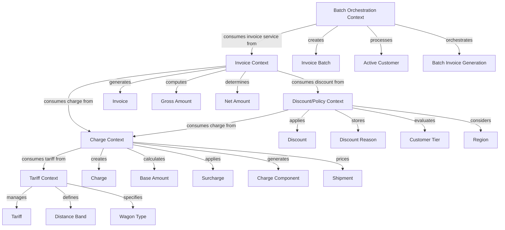

#### 1. Tariff Context (Core Domain)

**Responsibilities**:
- Store tariff records with base rates, origin/destination, wagon type, distance bands (DIST-MIN/DIST-MAX)
- Validate tariff applicability through exact matching (origin, destination, wagon type) and distance range verification
- Reject incomplete/invalid tariffs (missing base rate or distance ranges)
- Expose tariff lookup API for downstream charge calculation

**Key Entities**: Tariff, Distance Band, Wagon Type

**Relationships**: Upstream supplier to Charge context (customer-supplier relationship)

**Anti-Goals**: Does NOT calculate charges, apply discounts, or generate invoices. Purely manages pricing rules.

#### 2. Charge Context (Core Domain)

**Responsibilities**:
- Calculate base amount (tariff base rate × shipment distance)
- Apply fixed 5% surcharge to base amount
- Create Charge entities with gross amount (INR), tariff reference
- Generate transparent charge components (BASE, SURCHARGE, DISCOUNT) for itemized breakdown
- Maintain idempotency for charge creation (prevent duplicate billing)

**Key Entities**: Charge, Base Amount, Surcharge, Charge Component, Shipment

**Relationships**: 
- Downstream customer of Tariff context (consumes tariff lookup API)
- Upstream supplier to Discount/Policy and Invoice contexts

**Anti-Goals**: Does NOT manage tariffs, determine discount policies, or aggregate into invoices.

#### 3. Discount/Policy Context (Core Domain)

**Responsibilities**:
- Apply tier-based discounts (Tier A: 10%, Tier B: 5%)
- Apply regional discounts (WST region: additional 2%)
- Combine multiple applicable discounts (tier + regional)
- Generate discount reason codes for explainability (e.g., "TIER_A+REGION_WST")
- Create DISCOUNT charge components with negative amounts
- Ensure deterministic discount calculations

**Key Entities**: Discount, Discount Reason, Customer Tier, Region

**Relationships**:
- Downstream customer of Charge context (consumes gross charge amounts)
- Upstream supplier to Invoice context (provides discount data)

**Anti-Goals**: Does NOT calculate base charges, manage tariffs, or generate invoices.

#### 4. Invoice Context (Core Domain)

**Responsibilities**:
- Aggregate charges for specific customer and billing date
- Calculate gross amount (sum of charge gross amounts)
- Apply customer discounts to compute net amount
- Generate unique invoice IDs (customer ID + timestamp)
- Persist invoices with INR currency, gross/discount/net amounts, discount reasons
- Support idempotent invoice generation (prevent duplicate billing)
- Provide invoice data for downstream systems (FinanceSystem)

**Key Entities**: Invoice, Gross Amount, Net Amount

**Relationships**:
- Downstream customer of Charge and Discount/Policy contexts
- Upstream supplier to Batch Orchestration context

**Anti-Goals**: Does NOT calculate individual charges, determine discount policies, or manage batch orchestration.

#### 5. Batch Orchestration Context (Supporting Domain)

**Responsibilities**:
- Read all customers with ACTIVE status for batch processing
- Orchestrate parallel invoice generation with controlled concurrency (50 workers)
- Implement per-customer fault isolation (individual failures don't halt batch)
- Capture invoice generation results (invoice number, customer ID, net amount)
- Log individual customer failures with detailed error information
- Create InvoiceBatch summary entities (timing metadata, status, aggregated outcomes)
- Support resumable batch runs and retry mechanisms
- Provide batch completion reporting and monitoring

**Key Entities**: Invoice Batch, Active Customer, Batch Invoice Generation

**Relationships**: Downstream customer of Invoice context (consumes invoice generation services)

**Anti-Goals**: Does NOT generate individual invoices, calculate charges, or manage tariffs. Purely orchestrates bulk operations.

### Context Boundaries and Anti-Goals

**Boundary Enforcement**:
- Each context owns its data exclusively (database-per-service pattern)
- Cross-context communication occurs ONLY through published APIs or events
- No direct database access across context boundaries
- Shared kernel is minimized to ubiquitous language definitions

**Anti-Goals Summary**:
- Tariff context does NOT calculate charges
- Charge context does NOT manage tariffs or generate invoices
- Discount/Policy context does NOT calculate base charges
- Invoice context does NOT calculate individual charges or orchestrate batches
- Batch Orchestration context does NOT generate individual invoices

*(from cam.domain.bounded_context_map: 3a8c1d99-073b-4eb0-abd1-1c6c350e92b1)*

---

## 3. Target Architecture Overview

The Rail Freight Billing system implements a **microservices architecture** with five core services aligned to bounded contexts, communicating through synchronous HTTP APIs and asynchronous RabbitMQ events.

### High-Level Architecture Principles

**Domain-Driven Design**: Services map 1:1 to bounded contexts, ensuring clear ownership and cohesive business logic.

**Database-per-Service**: Each service owns its PostgreSQL database, preventing tight coupling and enabling independent evolution.

**Event-Driven Communication**: Asynchronous events (ChargeCalculated, DiscountApplied, InvoiceGenerated) enable loose coupling and audit trails.

**Strong Consistency for Financial Operations**: PostgreSQL ACID transactions ensure deterministic pricing and prevent billing discrepancies.

**Resilient Integration Patterns**: Outbox pattern, idempotent consumers, retry with backoff, circuit breakers, bulkheads, saga orchestration.

**Zero-Trust Security**: mTLS via Istio service mesh for east-west traffic, OAuth2/API keys at API Gateway for north-south traffic.

### Architecture Diagram

```mermaid
flowchart TD
    TariffService["TariffService"]
    ChargeCalculationService["ChargeCalculationService"]
    DiscountService["DiscountService"]
    InvoiceService["InvoiceService"]
    BatchInvoiceOrchestrator["BatchInvoiceOrchestrator"]

    TariffBC["Tariff Context"]
    ChargeBC["Charge Context"]
    DiscountBC["Discount/Policy Context"]
    InvoiceBC["Invoice Context"]
    BatchBC["Batch Orchestration Context"]

    Tariff["Tariff"]
    DistanceBand["Distance Band"]
    WagonType["Wagon Type"]
    Charge["Charge"]
    BaseAmount["Base Amount"]
    Surcharge["Surcharge"]
    ChargeComponent["Charge Component"]
    Shipment["Shipment"]
    Discount["Discount"]
    DiscountReason["Discount Reason"]
    CustomerTier["Customer Tier"]
    Region["Region"]
    Invoice["Invoice"]
    GrossAmount["Gross Amount"]
    NetAmount["Net Amount"]
    InvoiceBatch["Invoice Batch"]
    ActiveCustomer["Active Customer"]
    BatchInvoiceGeneration["Batch Invoice Generation"]

    TariffCreated["TariffCreated"]
    TariffUpdated["TariffUpdated"]
    TariffDeleted["TariffDeleted"]
    ChargeCalculated["ChargeCalculated"]
    ChargeComponentsCreated["ChargeComponentsCreated"]
    DiscountApplied["DiscountApplied"]
    InvoiceGenerated["InvoiceGenerated"]
    InvoiceFailed["InvoiceFailed"]
    BatchInvoiceStarted["BatchInvoiceStarted"]
    BatchInvoiceCompleted["BatchInvoiceCompleted"]
    BatchInvoiceFailed["BatchInvoiceFailed"]
    CustomerInvoiceSucceeded["CustomerInvoiceSucceeded"]
    CustomerInvoiceFailed["CustomerInvoiceFailed"]

    TariffService --> TariffBC
    ChargeCalculationService --> ChargeBC
    DiscountService --> DiscountBC
    InvoiceService --> InvoiceBC
    BatchInvoiceOrchestrator --> BatchBC

    TariffService --> Tariff
    TariffService --> DistanceBand
    TariffService --> WagonType
    ChargeCalculationService --> Charge
    ChargeCalculationService --> BaseAmount
    ChargeCalculationService --> Surcharge
    ChargeCalculationService --> ChargeComponent
    ChargeCalculationService --> Shipment
    DiscountService --> Discount
    DiscountService --> DiscountReason
    DiscountService --> CustomerTier
    DiscountService --> Region
    InvoiceService --> Invoice
    InvoiceService --> GrossAmount
    InvoiceService --> NetAmount
    BatchInvoiceOrchestrator --> InvoiceBatch
    BatchInvoiceOrchestrator --> ActiveCustomer
    BatchInvoiceOrchestrator --> BatchInvoiceGeneration

    TariffService --> TariffCreated
    TariffService --> TariffUpdated
    TariffService --> TariffDeleted
    ChargeCalculationService --> ChargeCalculated
    ChargeCalculationService --> ChargeComponentsCreated
    DiscountService --> DiscountApplied
    InvoiceService --> InvoiceGenerated
    InvoiceService --> InvoiceFailed
    BatchInvoiceOrchestrator --> BatchInvoiceStarted
    BatchInvoiceOrchestrator --> BatchInvoiceCompleted
    BatchInvoiceOrchestrator --> BatchInvoiceFailed
    BatchInvoiceOrchestrator --> CustomerInvoiceSucceeded
    BatchInvoiceOrchestrator --> CustomerInvoiceFailed

    ChargeCalculationService --> TariffService
    DiscountService --> ChargeCalculationService
    InvoiceService --> ChargeCalculationService
    InvoiceService --> DiscountService
    BatchInvoiceOrchestrator --> InvoiceService

    ChargeCalculated --> DiscountService
    DiscountApplied --> InvoiceService
    ChargeCalculated --> InvoiceService
    InvoiceGenerated --> BatchInvoiceOrchestrator
    InvoiceFailed --> BatchInvoiceOrchestrator
```

### Core Services Summary

| **Service** | **Bounded Context** | **Key Responsibilities** | **Dependencies** |
|-------------|---------------------|--------------------------|------------------|
| **TariffService** | Tariff | Tariff CRUD, distance validation, cache-aside pattern, tariff lookup API | None (upstream supplier) |
| **ChargeCalculationService** | Charge | Base rate × distance, 5% surcharge, charge components, idempotent charge creation | TariffService (sync API) |
| **DiscountService** | Discount/Policy | Tier (A=10%, B=5%) and regional (WST=2%) discounts, reason codes, deterministic logic | ChargeCalculationService (sync API) |
| **InvoiceService** | Invoice | Charge aggregation, gross/discount/net calculation, unique invoice IDs, CQRS read model | ChargeCalculationService, DiscountService (sync APIs) |
| **BatchInvoiceOrchestrator** | Batch Orchestration | Saga orchestration, per-customer fault isolation, resumable batch runs, 50 concurrent workers | InvoiceService (sync API) |

### Key Architectural Decisions

**PostgreSQL over MongoDB**: Strong consistency requirements for deterministic pricing mandated ACID transactions. PostgreSQL's robust multi-document transaction support and range types for distance validation outweighed MongoDB's schema flexibility.

**RabbitMQ over Kafka**: Moderate event volumes (~10k events/hour during batch runs) and need for reliable message ordering in saga orchestration made RabbitMQ's lower operational complexity preferable to Kafka's higher throughput capabilities.

**FastAPI over Spring Boot**: Python's async/await patterns, lower memory footprint, and team expertise made FastAPI more suitable than Spring Boot's JVM overhead and slower startup times impacting auto-scaling.

**Istio over Linkerd**: Despite Linkerd's lower resource overhead, Istio's mature ecosystem and advanced traffic management features better support complex batch orchestration routing and canary deployments.

**CQRS in InvoiceService**: Separating write operations (invoice generation) from read operations (invoice queries) optimizes for both batch write throughput and interactive read performance.

*(from cam.architecture.microservices_architecture: 86a51bba-16a0-429d-928f-9ab223634ddc)*

---

## 4. Service Inventory & Ownership

### Service Catalog

| **Service** | **Bounded Context** | **Responsibilities** | **Owned Data** | **Key Dependencies** | **Team Alignment** |
|-------------|---------------------|----------------------|----------------|----------------------|--------------------|
| **TariffService** | Tariff | Tariff CRUD, distance band validation, tariff lookup API, cache-aside pattern | Tariff, Distance Band, Wagon Type | None | Pricing Team |
| **ChargeCalculationService** | Charge | Base rate × distance, 5% surcharge, charge components (BASE/SURCHARGE/DISCOUNT), idempotent charge creation | Charge, Base Amount, Surcharge, Charge Component, Shipment | TariffService (sync) | Billing Core Team |
| **DiscountService** | Discount/Policy | Tier discounts (A=10%, B=5%), regional discounts (WST=2%), reason codes, deterministic logic | Discount, Discount Reason, Customer Tier, Region | ChargeCalculationService (sync) | Pricing Policy Team |
| **InvoiceService** | Invoice | Charge aggregation, gross/discount/net calculation, unique invoice IDs, CQRS read model | Invoice, Gross Amount, Net Amount | ChargeCalculationService (sync), DiscountService (sync) | Billing Operations Team |
| **BatchInvoiceOrchestrator** | Batch Orchestration | Saga orchestration, per-customer fault isolation, resumable batch runs, 50 concurrent workers | Invoice Batch, Active Customer, Batch Invoice Generation | InvoiceService (sync) | Billing Operations Team |

### Service Details

#### TariffService

**Purpose**: Authoritative source for pricing rules, providing validated tariff data for charge calculations.

**Core Capabilities**:
- Store tariff records with base rates, origin/destination, wagon type, distance bands (DIST-MIN/DIST-MAX)
- Validate tariff applicability through exact matching and distance range verification
- Reject incomplete/invalid tariffs (missing base rate or distance ranges)
- Expose tariff lookup API with sub-100ms p95 latency (cache-backed)
- Publish TariffCreated/Updated/Deleted events for cache invalidation

**Data Ownership**: Tariff, Distance Band, Wagon Type (PostgreSQL)

**API Endpoints**: `GET /tariffs/lookup`, `POST /tariffs`, `GET /tariffs/{tariffId}`, `PUT /tariffs/{tariffId}`, `DELETE /tariffs/{tariffId}`

**Events Published**: TariffCreated, TariffUpdated, TariffDeleted

**Events Consumed**: None

**Scaling**: 2-10 replicas (production), auto-scale at 70% CPU

**Team**: Pricing Team (owns tariff configuration and pricing rules)

#### ChargeCalculationService

**Purpose**: Core billing logic, transforming tariffs and shipment data into auditable freight charges.

**Core Capabilities**:
- Calculate base amount (tariff base rate × shipment distance)
- Apply fixed 5% surcharge to base amount
- Create Charge entities with gross amount (INR), tariff reference
- Generate transparent charge components (BASE, SURCHARGE, DISCOUNT)
- Maintain idempotency for charge creation (Redis distributed locks)
- Implement circuit breaker for TariffService calls (50% error rate, 30s open)

**Data Ownership**: Charge, Base Amount, Surcharge, Charge Component, Shipment (PostgreSQL)

**API Endpoints**: `POST /charges/calculate`, `GET /charges/{chargeId}`, `GET /charges?shipmentId={id}`, `GET /charges/{chargeId}/components`

**Events Published**: ChargeCalculated, ChargeComponentsCreated

**Events Consumed**: None

**Scaling**: 5-20 replicas (production), auto-scale at 70% CPU

**Team**: Billing Core Team (owns charge calculation logic and component breakdown)

#### DiscountService

**Purpose**: Policy-driven discount application with full traceability and explainability.

**Core Capabilities**:
- Apply tier-based discounts (Tier A: 10%, Tier B: 5%)
- Apply regional discounts (WST region: additional 2%)
- Combine multiple applicable discounts (tier + regional)
- Generate discount reason codes (e.g., "TIER_A+REGION_WST")
- Create DISCOUNT charge components with negative amounts
- Ensure deterministic discount calculations

**Data Ownership**: Discount, Discount Reason, Customer Tier, Region (PostgreSQL)

**API Endpoints**: `POST /discounts/apply`, `GET /discounts/policy?customerId={id}`, `GET /discounts/{discountId}`

**Events Published**: DiscountApplied

**Events Consumed**: ChargeCalculated (triggers automatic discount application)

**Scaling**: 3-10 replicas (production), auto-scale at 70% CPU

**Team**: Pricing Policy Team (owns discount rules and customer tier management)

#### InvoiceService

**Purpose**: Aggregates charges and discounts into customer-facing billing documents with CQRS optimization.

**Core Capabilities**:
- Aggregate charges for specific customer and billing date
- Calculate gross amount (sum of charge gross amounts)
- Apply customer discounts to compute net amount
- Generate unique invoice IDs (customer ID + timestamp)
- Persist invoices with INR currency, gross/discount/net amounts, discount reasons
- Support idempotent invoice generation (Redis distributed locks)
- Implement CQRS: separate write model (invoice generation) and read model (invoice queries)
- Populate read model asynchronously via InvoiceGenerated events (sub-5s p95 lag)

**Data Ownership**: Invoice, Gross Amount, Net Amount (PostgreSQL for write model, separate read-optimized store)

**API Endpoints**: `POST /invoices/generate`, `GET /invoices/{invoiceId}`, `GET /invoices?customerId={id}&billingDate={date}`, `GET /invoices/{invoiceId}/charges`

**Events Published**: InvoiceGenerated, InvoiceFailed

**Events Consumed**: ChargeCalculated, DiscountApplied (for read model updates)

**Scaling**: 5-25 replicas (production), auto-scale at 70% CPU

**Team**: Billing Operations Team (owns invoice generation and customer billing)

#### BatchInvoiceOrchestrator

**Purpose**: Coordinates bulk invoice generation with fault isolation and resumable runs.

**Core Capabilities**:
- Query all customers with ACTIVE status
- Orchestrate parallel invoice generation (50 concurrent workers)
- Implement per-customer fault isolation (individual failures don't halt batch)
- Capture invoice generation results (invoice number, customer ID, net amount)
- Log individual customer failures with detailed error information
- Create InvoiceBatch summary entities (timing metadata, status, aggregated outcomes)
- Support resumable batch runs via `POST /batch/invoices/{batchId}/resume`
- Implement bulkhead pattern (isolate batch processing from real-time operations)

**Data Ownership**: Invoice Batch, Active Customer, Batch Invoice Generation (PostgreSQL)

**API Endpoints**: `POST /batch/invoices/start`, `GET /batch/invoices/{batchId}`, `GET /batch/invoices/{batchId}/results`, `POST /batch/invoices/{batchId}/resume`

**Events Published**: BatchInvoiceStarted, BatchInvoiceCompleted, BatchInvoiceFailed, CustomerInvoiceSucceeded, CustomerInvoiceFailed

**Events Consumed**: InvoiceGenerated, InvoiceFailed (for batch progress tracking)

**Scaling**: 3-8 replicas (production), auto-scale at 80% CPU

**Team**: Billing Operations Team (owns batch processing and billing cycle management)

*(from cam.catalog.microservice_inventory: 5263d4d4-cb23-4637-8205-abfbce33c263)*

---

## 5. API Design Guidance

### API Contracts

All services expose RESTful HTTP APIs following OpenAPI 3.0 specifications. FastAPI automatically generates OpenAPI documentation, ensuring service contracts remain synchronized with implementation.

### API Endpoint Inventory

#### TariffService APIs

| **Method** | **Path** | **Description** | **Auth** | **Key Request Fields** | **Key Response Fields** | **Error Codes** |
|------------|----------|-----------------|----------|------------------------|-------------------------|------------------|
| GET | `/tariffs/lookup` | Lookup applicable tariff for route and wagon type | api-key | origin, destination, wagonType, distance (query params) | tariffId, baseRate, currency, distMin, distMax | 404 (NO_TARIFF_FOUND) |
| POST | `/tariffs` | Create new tariff record | oauth2 | origin, destination, wagonType, baseRate, currency, distMin, distMax (body) | tariffId, createdAt | 400 (VALIDATION_ERROR) |
| GET | `/tariffs/{tariffId}` | Retrieve specific tariff by ID | api-key | tariffId (path) | tariffId, origin, destination, wagonType, baseRate, currency, distMin, distMax, createdAt, updatedAt | 404 (TARIFF_NOT_FOUND) |
| PUT | `/tariffs/{tariffId}` | Update existing tariff (base rate, distance ranges) | oauth2 | tariffId (path), baseRate, distMin, distMax (body) | tariffId, updatedAt | 404 (TARIFF_NOT_FOUND), 400 (VALIDATION_ERROR) |
| DELETE | `/tariffs/{tariffId}` | Delete tariff record | oauth2 | tariffId (path) | None (204 No Content) | 404 (TARIFF_NOT_FOUND) |

#### ChargeCalculationService APIs

| **Method** | **Path** | **Description** | **Auth** | **Key Request Fields** | **Key Response Fields** | **Error Codes** |
|------------|----------|-----------------|----------|------------------------|-------------------------|------------------|
| POST | `/charges/calculate` | Calculate freight charge for shipment | api-key | shipmentId, origin, destination, wagonType, distance, customerId (body), Idempotency-Key (header) | chargeId, shipmentId, baseAmount, surchargeAmount, grossAmount, tariffId, currency | 404 (NO_TARIFF_FOUND), 409 (DUPLICATE_CHARGE with existing chargeId) |
| GET | `/charges/{chargeId}` | Retrieve charge details | api-key | chargeId (path) | chargeId, shipmentId, baseAmount, surchargeAmount, grossAmount, discountAmount, netAmount, tariffId, currency | 404 (CHARGE_NOT_FOUND) |
| GET | `/charges` | List charges for shipment | api-key | shipmentId (query param) | charges[] (array of charge objects) | None |
| GET | `/charges/{chargeId}/components` | Retrieve charge component breakdown | api-key | chargeId (path) | components[] (type: BASE/SURCHARGE/DISCOUNT, amount, currency, description) | 404 (CHARGE_NOT_FOUND) |

#### DiscountService APIs

| **Method** | **Path** | **Description** | **Auth** | **Key Request Fields** | **Key Response Fields** | **Error Codes** |
|------------|----------|-----------------|----------|------------------------|-------------------------|------------------|
| POST | `/discounts/apply` | Apply discount to charge based on customer tier and region | api-key | chargeId, customerId, customerTier, region (body) | discountId, chargeId, discountAmount, discountReason, netAmount, currency | 404 (CHARGE_NOT_FOUND, CUSTOMER_NOT_FOUND) |
| GET | `/discounts/policy` | Retrieve discount policy for customer | api-key | customerId (query param) | customerId, customerTier, tierDiscountPct, region, regionalDiscountPct, combinedDiscountPct | 404 (CUSTOMER_NOT_FOUND) |
| GET | `/discounts/{discountId}` | Retrieve discount details | api-key | discountId (path) | discountId, chargeId, customerId, discountAmount, discountReason, appliedAt | 404 (DISCOUNT_NOT_FOUND) |

#### InvoiceService APIs

| **Method** | **Path** | **Description** | **Auth** | **Key Request Fields** | **Key Response Fields** | **Error Codes** |
|------------|----------|-----------------|----------|------------------------|-------------------------|------------------|
| POST | `/invoices/generate` | Generate invoice for customer and billing date | oauth2 | customerId, billingDate (body), Idempotency-Key (header) | invoiceId, customerId, billingDate, grossAmount, discountAmount, netAmount, currency, discountReason | 404 (CUSTOMER_NOT_FOUND), 409 (DUPLICATE_INVOICE with existing invoiceId) |
| GET | `/invoices/{invoiceId}` | Retrieve invoice details | api-key | invoiceId (path) | invoiceId, customerId, billingDate, grossAmount, discountAmount, netAmount, currency, discountReason, generatedAt | 404 (INVOICE_NOT_FOUND) |
| GET | `/invoices` | List invoices for customer and/or date | api-key | customerId, billingDate (query params) | invoices[] (array of invoice objects) | None |
| GET | `/invoices/{invoiceId}/charges` | Retrieve charges included in invoice | api-key | invoiceId (path) | charges[] (array of charge objects with components) | 404 (INVOICE_NOT_FOUND) |

#### BatchInvoiceOrchestrator APIs

| **Method** | **Path** | **Description** | **Auth** | **Key Request Fields** | **Key Response Fields** | **Error Codes** |
|------------|----------|-----------------|----------|------------------------|-------------------------|------------------|
| POST | `/batch/invoices/start` | Initiate batch invoice generation for billing date | oauth2 | billingDate (body) | batchId, billingDate, status, startedAt | 400 (INVALID_STATE if batch already running) |
| GET | `/batch/invoices/{batchId}` | Retrieve batch status and summary | api-key | batchId (path) | batchId, status, billingDate, startedAt, completedAt, totalCustomers, successCount, failureCount | 404 (BATCH_NOT_FOUND) |
| GET | `/batch/invoices/{batchId}/results` | Retrieve detailed results for batch | api-key | batchId (path) | batchId, results[] (customerId, status, invoiceId, netAmount, errorMessage) | 404 (BATCH_NOT_FOUND) |
| POST | `/batch/invoices/{batchId}/resume` | Resume failed or incomplete batch | oauth2 | batchId (path) | batchId, status, resumedAt | 400 (INVALID_STATE), 404 (BATCH_NOT_FOUND) |

### API Design Principles

**Versioning**: All APIs use `/api/v1` prefix. Breaking changes require new version (`/api/v2`). Non-breaking changes (new optional fields) can be added to existing versions.

**Idempotency**: All write operations (POST for charge calculation, invoice generation, batch start) require `Idempotency-Key` header. Services store keys with 24-hour TTL. Duplicate requests return existing resource with 409 Conflict status and original resource ID.

**Error Model**: Structured error responses with machine-readable error codes and human-readable messages:
```json
{
  "error": {
    "code": "NO_TARIFF_FOUND",
    "message": "No applicable tariff found for origin=Mumbai, destination=Delhi, wagonType=BOXCAR, distance=750km",
    "timestamp": "2024-03-15T10:30:00Z",
    "traceId": "abc123"
  }
}
```

**Pagination**: List endpoints support `limit` and `offset` query parameters. Default limit=100, max limit=1000. Response includes `total` count and `next` link for pagination.

**Authentication**: 
- **API keys** for service-to-service calls and read operations (GET endpoints)
- **OAuth2 bearer tokens** for administrative operations (POST/PUT/DELETE on tariffs, batch control)

**Rate Limiting**: 
- Service accounts: 1000 requests/minute
- User accounts: 100 requests/minute
- Batch start endpoint: 1 concurrent batch per billing date

*(from cam.contract.service_api: cc7cf96e-1152-4b04-b79c-dc3f35c68e4f)*

---

## 6. Eventing & Messaging Guidance

### Event Catalog

| **Event Name** | **Producer** | **Consumers** | **Key Payload Fields** | **Delivery Guarantee** |
|----------------|--------------|---------------|------------------------|------------------------|
| **TariffCreated** | TariffService | None (future: cache invalidation) | tariffId, origin, destination, wagonType, baseRate, currency, distMin, distMax, createdAt | At-least-once, retry + DLQ |
| **TariffUpdated** | TariffService | None (future: cache invalidation) | tariffId, baseRate, distMin, distMax, updatedAt | At-least-once, retry + DLQ |
| **TariffDeleted** | TariffService | None (future: cache invalidation) | tariffId, deletedAt | At-least-once, retry + DLQ |
| **ChargeCalculated** | ChargeCalculationService | DiscountService, InvoiceService | chargeId, shipmentId, baseAmount, surchargeAmount, grossAmount, tariffId, distance, currency, calculatedAt | At-least-once, retry + DLQ |
| **ChargeComponentsCreated** | ChargeCalculationService | None (audit trail) | chargeId, components[] (type, amount, currency) | At-least-once, retry + DLQ |
| **DiscountApplied** | DiscountService | InvoiceService | discountId, chargeId, customerId, customerTier, region, tierDiscountPct, regionalDiscountPct, discountAmount, discountReason, currency, appliedAt | At-least-once, retry + DLQ |
| **InvoiceGenerated** | InvoiceService | BatchInvoiceOrchestrator | invoiceId, customerId, billingDate, grossAmount, discountAmount, netAmount, currency, discountReason, chargeCount, generatedAt | At-least-once, retry + DLQ |
| **InvoiceFailed** | InvoiceService | BatchInvoiceOrchestrator | customerId, billingDate, errorCode, errorMessage, failedAt | At-least-once, retry + DLQ |
| **BatchInvoiceStarted** | BatchInvoiceOrchestrator | None (monitoring) | batchId, billingDate, totalCustomers, startedAt | At-least-once, retry + DLQ |
| **BatchInvoiceCompleted** | BatchInvoiceOrchestrator | None (monitoring) | batchId, billingDate, totalCustomers, successCount, failureCount, totalGrossAmount, totalNetAmount, startedAt, completedAt | At-least-once, retry + DLQ |
| **BatchInvoiceFailed** | BatchInvoiceOrchestrator | None (monitoring) | batchId, billingDate, errorCode, errorMessage, failedAt | At-least-once, retry + DLQ |
| **CustomerInvoiceSucceeded** | BatchInvoiceOrchestrator | None (audit trail) | batchId, customerId, invoiceId, netAmount, succeededAt | At-least-once, retry + DLQ |
| **CustomerInvoiceFailed** | BatchInvoiceOrchestrator | None (audit trail) | batchId, customerId, errorCode, errorMessage, failedAt | At-least-once, retry + DLQ |

### Event Schema Standards

**Naming Convention**: PascalCase, past tense verb (ChargeCalculated, DiscountApplied, InvoiceGenerated)

**Schema Structure**:
```json
{
  "eventId": "uuid",
  "eventType": "ChargeCalculated",
  "eventVersion": "1.0",
  "timestamp": "2024-03-15T10:30:00Z",
  "source": "ChargeCalculationService",
  "traceId": "abc123",
  "payload": {
    "chargeId": "C-67890",
    "shipmentId": "S-12345",
    "baseAmount": 3750.00,
    "surchargeAmount": 187.50,
    "grossAmount": 3937.50,
    "tariffId": "T-001",
    "distance": 750,
    "currency": "INR",
    "calculatedAt": "2024-03-15T10:30:00Z"
  }
}
```

**Required Fields**: eventId, eventType, eventVersion, timestamp, source, traceId, payload

**Versioning**: eventVersion field enables schema evolution. Breaking changes require new version (e.g., "2.0"). Consumers must handle multiple versions gracefully.

### Delivery Semantics

**At-Least-Once Delivery**: All events use at-least-once delivery with retry policies and Dead Letter Queues (DLQ). This ensures no events are lost due to transient failures, though consumers must implement idempotent processing.

**Retry Policy**: 
- Initial retry after 1 second
- Exponential backoff: 1s, 2s, 4s, 8s, 16s
- Maximum 5 retry attempts
- After exhausting retries, route to DLQ

**Dead Letter Queue (DLQ)**: Failed events are moved to DLQ for manual investigation and recovery. DLQ messages include original event, error details, and retry history.

### Event-Driven Patterns

**Outbox Pattern**: All services use the outbox pattern to ensure atomic database writes and event publishing. Events are written to an outbox table within the same transaction as business data. A separate process reliably reads from the outbox and publishes to RabbitMQ.

**Idempotent Consumers**: All event consumers implement idempotency using event IDs. Duplicate events (due to at-least-once delivery) are detected and skipped without side effects.

**Event Chaining**: ChargeCalculated → DiscountApplied → InvoiceGenerated represents a sequential processing pipeline where each service enriches data before passing downstream.

**Fan-out**: ChargeCalculated events are consumed by both DiscountService and InvoiceService, enabling parallel processing paths.

### Messaging Infrastructure (RabbitMQ)

**Queues**: Each consumer has a dedicated queue (e.g., `discount-service.charge-calculated`, `invoice-service.charge-calculated`)

**Exchanges**: Topic exchanges route events to multiple queues based on routing keys (e.g., `billing.charge.calculated`, `billing.invoice.generated`)

**Persistence**: All queues are durable with persistent messages, ensuring events survive broker restarts

**Message TTL**: Messages expire after 7 days if not consumed (prevents unbounded queue growth)

**Priority Queues**: Batch orchestration events use priority queues to ensure critical events (BatchInvoiceFailed) are processed before routine progress updates

*(from cam.catalog.events: 39fd3b74-1543-48c2-9878-17622d9b1bee)*

### Event Diagram

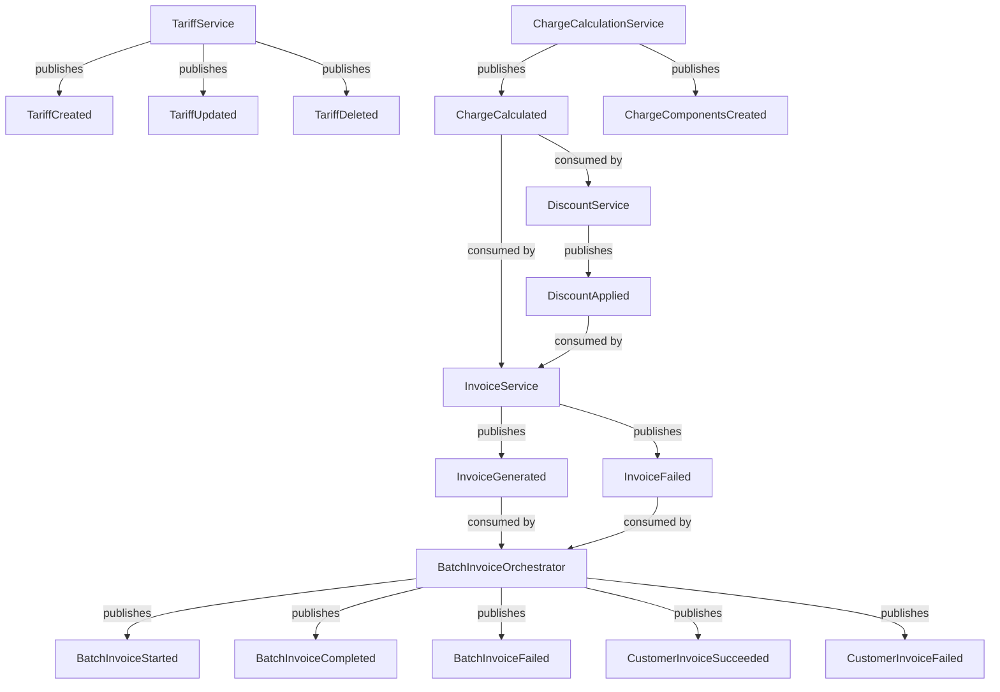

---

## 7. Service Interaction Model

### Interaction Matrix

| **From Service** | **To Service** | **Interaction Type** | **Protocol** | **Purpose** | **Reliability Pattern** |
|------------------|----------------|----------------------|--------------|-------------|-------------------------|
| ChargeCalculationService | TariffService | Synchronous | HTTP GET | Lookup tariff for charge calculation | Retry with backoff, circuit breaker |
| ChargeCalculationService | DiscountService | Asynchronous | RabbitMQ event | Notify charge calculated | At-least-once delivery, idempotent consumer |
| ChargeCalculationService | InvoiceService | Asynchronous | RabbitMQ event | Notify charge calculated | At-least-once delivery, idempotent consumer |
| DiscountService | ChargeCalculationService | Synchronous | HTTP GET | Retrieve charge details | Retry with backoff, circuit breaker |
| DiscountService | InvoiceService | Asynchronous | RabbitMQ event | Notify discount applied | At-least-once delivery, idempotent consumer |
| InvoiceService | ChargeCalculationService | Synchronous | HTTP GET | Retrieve charges for aggregation | Retry with backoff, circuit breaker |
| InvoiceService | DiscountService | Synchronous | HTTP GET | Retrieve discount policy | Retry with backoff, circuit breaker |
| InvoiceService | BatchInvoiceOrchestrator | Asynchronous | RabbitMQ event | Notify invoice success/failure | At-least-once delivery, idempotent consumer |
| BatchInvoiceOrchestrator | InvoiceService | Synchronous | HTTP POST | Trigger invoice generation | Retry with backoff, circuit breaker, idempotency key |

### Interaction Patterns

**Synchronous Request/Response**: Used for critical path operations requiring immediate feedback (tariff lookup, charge calculation, invoice generation). All synchronous calls implement:
- **Idempotent operations**: GET requests are naturally idempotent; POST requests use Idempotency-Key headers
- **Retry with exponential backoff**: 1s, 2s, 4s, 8s, 16s (max 5 retries)
- **Circuit breaker**: Opens after 50% error rate, remains open for 30 seconds
- **Timeout**: 5 seconds for read operations, 10 seconds for write operations

**Asynchronous Event-Driven**: Used for notifications and workflow progression where immediate response isn't required. All asynchronous interactions implement:
- **At-least-once delivery**: RabbitMQ persistent queues with retry policies
- **Idempotent consumers**: Event IDs prevent duplicate processing
- **Dead Letter Queue**: Failed events after 5 retries route to DLQ for manual intervention

### Workflow Examples

#### Standard Charge-to-Invoice Flow

1. **ChargeCalculationService** receives shipment and calls **TariffService** synchronously (GET /tariffs/lookup) to get applicable rates
2. **ChargeCalculationService** calculates charge (base + surcharge) and publishes **ChargeCalculated** event
3. **DiscountService** receives event, calls **ChargeCalculationService** (GET /charges/{chargeId}) to get charge details, applies discounts, and publishes **DiscountApplied** event
4. **InvoiceService** receives both **ChargeCalculated** and **DiscountApplied** events, calls **ChargeCalculationService** and **DiscountService** to aggregate data, and generates invoice
5. **InvoiceService** publishes **InvoiceGenerated** event to **BatchInvoiceOrchestrator** for tracking

#### Batch Invoice Processing

1. **BatchInvoiceOrchestrator** initiates batch run for monthly billing (POST /batch/invoices/start)
2. For each ACTIVE customer, orchestrator calls **InvoiceService** synchronously (POST /invoices/generate) with Idempotency-Key
3. **InvoiceService** processes each request, publishing **InvoiceGenerated** or **InvoiceFailed** events
4. **BatchInvoiceOrchestrator** tracks progress via events and continues processing even if individual invoices fail
5. Failed invoices in DLQ can be investigated and reprocessed without rerunning entire batch

### Interaction Diagram

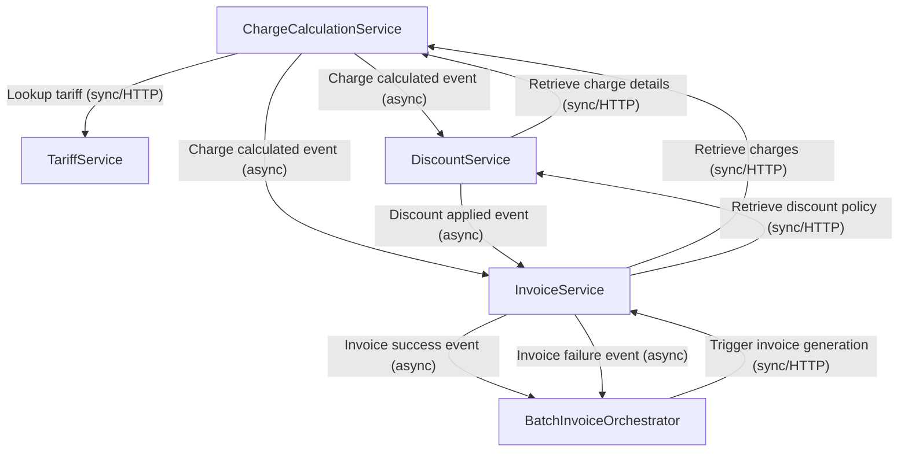

*(from cam.architecture.service_interaction_matrix: 030fcdcb-c9ee-4bcf-8195-d868860d1355)*

---

## 8. Data Ownership & Consistency

### Data Ownership Map

| **Service** | **Owned Entities** | **Storage** | **Consistency Model** | **Sharing Strategy** |
|-------------|--------------------|-----------|-----------------------|----------------------|
| **TariffService** | Tariff, Distance Band, Wagon Type | PostgreSQL (dedicated DB) | Strong consistency (ACID) | API-only access (GET /tariffs/lookup), events for cache invalidation |
| **ChargeCalculationService** | Charge, Base Amount, Surcharge, Charge Component, Shipment | PostgreSQL (dedicated DB) | Strong consistency (ACID) | API-only access (GET /charges/{chargeId}), events for downstream processing |
| **DiscountService** | Discount, Discount Reason, Customer Tier, Region | PostgreSQL (dedicated DB) | Strong consistency (ACID) | API-only access (GET /discounts/policy), events for invoice updates |
| **InvoiceService** | Invoice, Gross Amount, Net Amount | PostgreSQL (write model), separate read-optimized store (read model) | Strong consistency for writes, eventual consistency for reads (CQRS) | API-only access (GET /invoices/{invoiceId}), events for batch tracking |
| **BatchInvoiceOrchestrator** | Invoice Batch, Active Customer, Batch Invoice Generation | PostgreSQL (dedicated DB) | Eventual consistency (batch metadata) | API-only access (GET /batch/invoices/{batchId}), events for monitoring |

### Database-per-Service Pattern

Each service maintains exclusive ownership of its data entities and stores them in dedicated PostgreSQL databases. This architectural choice provides:

- **Service Autonomy**: Services evolve data models independently without coordinating schema changes
- **Fault Isolation**: Database failures or performance issues remain contained within service boundaries
- **Clear Ownership**: Unambiguous responsibility for data quality, consistency, and lifecycle management
- **Independent Scaling**: Each database can be scaled (read replicas, connection pooling) based on service-specific load patterns

### Consistency Strategy

**Strong Consistency for Financial Operations**: TariffService, ChargeCalculationService, DiscountService, and InvoiceService (write model) use PostgreSQL ACID transactions to ensure deterministic pricing. Identical inputs always produce identical outputs, critical for billing accuracy and audit compliance.

**Eventual Consistency for Read Models**: InvoiceService implements CQRS with eventual consistency for read operations. The read model is populated asynchronously via InvoiceGenerated events, achieving sub-5-second p95 lag. This separation eliminates read/write contention during high-volume batch processing.

**Eventual Consistency for Orchestration Metadata**: BatchInvoiceOrchestrator manages workflow state that can tolerate temporary inconsistencies. Individual invoice generation still uses strong consistency through InvoiceService APIs, but batch-level metadata (progress indicators, counts) can be eventually consistent.

### Data Sharing Patterns

**API-Only Access**: No service directly accesses another service's database. All cross-service data needs are satisfied through published APIs:
- ChargeCalculationService calls TariffService API for tariff lookup
- DiscountService calls ChargeCalculationService API for charge details
- InvoiceService calls ChargeCalculationService and DiscountService APIs for aggregation
- BatchInvoiceOrchestrator calls InvoiceService API for invoice generation

**Event-Driven Notifications**: Services publish domain events to notify downstream systems of state changes without tight coupling:
- TariffUpdated events enable cache invalidation in ChargeCalculationService
- ChargeCalculated events trigger discount application in DiscountService
- DiscountApplied events trigger invoice updates in InvoiceService
- InvoiceGenerated events enable batch progress tracking in BatchInvoiceOrchestrator

**No Shared Databases**: Services never share databases or access each other's tables directly. This prevents tight coupling and maintains encapsulation.

### Data Consistency Patterns

**Outbox Pattern**: All services use the outbox pattern to ensure atomic database writes and event publishing. Events are written to an outbox table within the same transaction as business data. A separate process reliably reads from the outbox and publishes to RabbitMQ, guaranteeing at-least-once delivery.

**Idempotency**: All write operations (charge creation, invoice generation) are idempotent. Services use Redis distributed locks with idempotency keys to ensure each operation is performed exactly once, even under high concurrency or retry scenarios.

**Saga Orchestration**: BatchInvoiceOrchestrator uses saga orchestration to coordinate invoice generation across multiple customers. Each customer's invoice generation is an independent saga step. Failures are isolated and logged, but don't roll back the entire batch.

*(from cam.data.service_data_ownership: 8846b700-1908-4aa9-aef9-66260ff69634)*

---

## 9. Integration Patterns & Resilience

### Integration Pattern Catalog

| **Pattern** | **Applied To** | **Purpose** | **Implementation** |
|-------------|----------------|-------------|--------------------|
| **Outbox Pattern** | ChargeCalculationService, DiscountService, InvoiceService | Atomic database writes and event publishing | Write events to outbox table in same transaction as business data; separate process publishes to RabbitMQ |
| **Idempotent Consumer** | DiscountService, InvoiceService, BatchInvoiceOrchestrator | Handle duplicate events safely | Use event IDs to detect and skip duplicate processing; store processed event IDs with TTL |
| **Retry with Backoff** | All synchronous HTTP calls | Resilience against transient failures | Exponential backoff: 1s, 2s, 4s, 8s, 16s (max 5 retries) |
| **Circuit Breaker** | ChargeCalculationService→TariffService, DiscountService→ChargeCalculationService, InvoiceService→ChargeCalculationService/DiscountService, BatchInvoiceOrchestrator→InvoiceService | Prevent cascading failures | Open after 50% error rate, remain open for 30 seconds, half-open for test requests |
| **Bulkhead** | BatchInvoiceOrchestrator, InvoiceService | Isolate resources to prevent failures from spreading | Dedicated thread pools for batch processing vs real-time operations |
| **Saga Orchestration** | BatchInvoiceOrchestrator | Coordinate long-running distributed transactions | Orchestrator maintains state, invokes services sequentially, handles per-customer failures independently |
| **CQRS** | InvoiceService | Optimize for write-heavy batch processing and read-heavy queries | Separate write model (invoice generation) and read model (invoice queries); populate read model asynchronously |

### Pattern Details

#### Outbox Pattern

**Problem**: Services must both persist state changes and publish events. If the database write succeeds but event publishing fails, downstream services have an incomplete view of system state.

**Solution**: Write events to an outbox table within the same database transaction as business data. A separate process reliably reads from the outbox and publishes events to RabbitMQ.

**Implementation**:
1. ChargeCalculationService writes Charge record and ChargeCalculated event to outbox table in single transaction
2. Outbox processor polls outbox table every 100ms
3. Processor publishes events to RabbitMQ and marks them as published
4. Ensures at-least-once delivery semantics

**Benefits**: Guarantees consistency between database state and event stream; prevents lost events; supports audit trails.

#### Idempotent Consumer

**Problem**: At-least-once delivery semantics mean consumers may receive duplicate events. Processing duplicates could cause incorrect business operations (duplicate discounts, duplicate invoices).

**Solution**: Consumers use event IDs to detect and skip duplicate processing. Processed event IDs are stored with 24-hour TTL.

**Implementation**:
1. DiscountService receives ChargeCalculated event with eventId="abc123"
2. Check if eventId exists in processed_events table
3. If exists, skip processing and acknowledge event
4. If not exists, process event, store eventId, acknowledge event

**Benefits**: Prevents duplicate business operations; enables safe retries; maintains data integrity.

#### Retry with Backoff

**Problem**: Synchronous HTTP calls are vulnerable to transient network failures, temporary service unavailability, and resource contention.

**Solution**: Retry failed requests with exponential backoff, giving downstream services time to recover while avoiding thundering herd.

**Implementation**:
1. ChargeCalculationService calls TariffService (GET /tariffs/lookup)
2. If call fails (timeout, 5xx error), retry after 1 second
3. If retry fails, wait 2 seconds, then 4s, 8s, 16s (max 5 retries)
4. If all retries exhausted, return error to caller

**Benefits**: Handles transient failures gracefully; prevents overwhelming downstream services; improves overall system reliability.

#### Circuit Breaker

**Problem**: When downstream services experience sustained failures, continued retry attempts exhaust resources (thread pools, connections) and cause cascading failures.

**Solution**: Circuit breaker detects failure patterns and "opens" the circuit, causing requests to fail immediately rather than waiting for timeouts. After a timeout, circuit enters "half-open" state for test requests.

**Implementation**:
1. ChargeCalculationService calls TariffService
2. Circuit breaker tracks success/failure rates
3. If error rate exceeds 50%, circuit opens
4. While open (30 seconds), all requests fail immediately with CircuitBreakerOpenException
5. After 30 seconds, circuit enters half-open state
6. If test requests succeed, circuit closes; if they fail, circuit reopens

**Benefits**: Prevents cascading failures; preserves resources; enables graceful degradation; provides fail-fast behavior.

#### Bulkhead

**Problem**: Batch processing workloads can consume all available resources (threads, connections), starving real-time operations and degrading user experience.

**Solution**: Isolate resources into dedicated pools (bulkheads) for different workload types. If one bulkhead fails, others remain operational.

**Implementation**:
1. BatchInvoiceOrchestrator uses dedicated thread pool (50 workers) for batch processing
2. InvoiceService uses separate thread pool (20 workers) for real-time invoice queries
3. If batch processing encounters issues, real-time queries continue unaffected

**Benefits**: Fault isolation; prevents resource exhaustion; maintains real-time responsiveness during batch operations.

#### Saga Orchestration

**Problem**: Batch invoice generation represents a long-running distributed transaction spanning multiple customers and services. Traditional ACID transactions don't scale to this scope.

**Solution**: Saga orchestration pattern coordinates the workflow, maintaining state and handling failures. Each customer's invoice generation is an independent saga step.

**Implementation**:
1. BatchInvoiceOrchestrator reads all ACTIVE customers
2. For each customer, orchestrator invokes InvoiceService (POST /invoices/generate)
3. Orchestrator tracks result (success/failure) for each customer
4. If invoice generation fails for one customer, orchestrator logs failure and continues with remaining customers
5. Orchestrator publishes CustomerInvoiceSucceeded/Failed events for monitoring
6. At batch completion, orchestrator publishes BatchInvoiceCompleted with aggregated results

**Benefits**: Maximizes throughput; prevents one failure from blocking entire batch; provides operational visibility; supports resumable runs.

#### CQRS (Command Query Responsibility Segregation)

**Problem**: InvoiceService must handle both high-throughput batch invoice generation (writes) and flexible invoice queries (reads). These patterns have fundamentally different performance characteristics.

**Solution**: Separate write model (optimized for invoice generation) and read model (optimized for queries). Populate read model asynchronously via InvoiceGenerated events.

**Implementation**:
1. Write model: Normalized PostgreSQL schema optimized for write throughput and data integrity
2. Read model: Denormalized schema (or separate database) optimized for query patterns
3. InvoiceService publishes InvoiceGenerated events after successful writes
4. Read model consumer processes events and updates read-optimized store
5. Query APIs (GET /invoices/{invoiceId}) read from read model

**Benefits**: Eliminates read/write contention; optimizes each model for its workload; scales reads and writes independently; achieves sub-5-second p95 lag.

*(from cam.architecture.integration_patterns: 9a61337f-400c-4752-93b8-eaf059e0b550)*

---

## 10. Security Architecture

### Security Principles

1. **Zero-trust architecture**: Verify every request at both edge and service boundaries
2. **Defense in depth**: Multiple security layers (edge, mesh, database)
3. **Least privilege access**: Services and users access only required resources
4. **Encryption everywhere**: TLS 1.3 in transit, AES-256 at rest
5. **Externalized secrets**: Credentials stored in Vault with 90-day rotation
6. **Comprehensive auditing**: All pricing-affecting operations logged with full context
7. **Idempotency protection**: Prevent duplicate financial transactions
8. **Layered authentication**: API keys for service-to-service, OAuth2 for admin operations
9. **Rate limiting and throttling**: Protect against abuse and ensure fair resource allocation
10. **Network segmentation**: Services in private subnets, only API Gateway exposed publicly

### Identity and Access Management

**Identity Provider**: OAuth2/OpenID Connect (Keycloak, Auth0, or Azure AD) for centralized user authentication and authorization.

**Role-Based Access Control (RBAC)**:

| **Role** | **Permissions** | **Use Case** |
|----------|-----------------|-------------|
| **BillingAnalyst** | Read-only access to charges and invoices | Operational monitoring, customer inquiries |
| **TariffAdmin** | Full CRUD on tariffs (create, update, delete) | Tariff configuration, pricing rule management |
| **OperationsUser** | Trigger and manage batch invoice processing | Billing cycle execution, batch monitoring |
| **FinanceSystem** | Read access to generated invoices | Downstream accounting integration |

### Edge Security (API Gateway)

**TLS Termination**: TLS 1.3 with strong cipher suites (AES-256-GCM, ChaCha20-Poly1305)

**Authentication**:
- **OAuth2 bearer tokens** for administrative operations (POST/PUT/DELETE on tariffs, batch control)
- **API keys** for service-to-service calls and read operations (GET endpoints)

**Authorization**: Gateway validates JWT claims or API key scopes before routing requests. TariffAdmin role required to modify tariffs; BillingAnalyst can only read charge/invoice data.

**Rate Limiting**:
- Service accounts: 1000 requests/minute with burst allowance
- User accounts: 100 requests/minute
- Batch start endpoint: 1 concurrent batch per billing date

**Request Validation**: Gateway validates request schemas, rejects malformed requests before they reach backend services.

### Service-to-Service Security (East-West Traffic)

**Mutual TLS (mTLS)**: Istio service mesh enforces mTLS for all inter-service communication. Both parties verify each other's identity through certificates.

**Workload Identity**: SPIFFE/SPIRE provides cryptographic workload identities. Each service receives a unique SPIFFE ID that rotates automatically.

**Network Policies**: Kubernetes NetworkPolicies enforce explicit allow-lists:
- TariffService accepts connections only from ChargeCalculationService
- ChargeCalculationService accepts connections from DiscountService and InvoiceService
- InvoiceService accepts connections from BatchInvoiceOrchestrator
- All other traffic denied by default

**Secrets Management**: HashiCorp Vault (or AWS Secrets Manager, Azure Key Vault) centralizes secret storage:
- Database credentials retrieved at startup, rotated every 90 days
- API keys stored in Vault, never in code or configuration files
- Encryption keys managed with 12-month rotation cycles

### Data Protection

**Encryption at Rest**: All PostgreSQL databases use AES-256 transparent data encryption. Backups encrypted separately.

**Encryption in Transit**: TLS 1.3 for all API communication (edge and service-to-service). No plaintext protocols permitted.

**PII Handling**: Customer tier, region, and contact data classified as PII. Access logged and audited. Data minimization practiced (store only required fields). Retention policies automatically delete data after regulatory periods expire. Pseudonymization for analytics.

### Threat Model and Mitigations

| **Threat** | **Mitigation** |
|------------|----------------|
| **Unauthorized tariff modification** | OAuth2 authentication + RBAC (TariffAdmin role required) + comprehensive audit logs + TariffUpdated events |
| **Replay attacks** | Idempotency-Key header required for charge/invoice creation; keys stored with 24-hour TTL; duplicate requests return 409 Conflict |
| **Man-in-the-middle attacks** | TLS 1.3 for external communication + mTLS for service-to-service + certificate pinning for critical integrations |
| **SQL injection** | Parameterized queries + ORM frameworks (SQLAlchemy) + input validation at API gateway and service layers |
| **Privilege escalation** | Dedicated database user per service with table-level permissions + service mesh network policies + automatic secret rotation |
| **Denial of service** | Rate limiting on batch start endpoint (1 concurrent batch per billing date) + controlled parallelism (50 workers) + circuit breakers + resource quotas |
| **Data exfiltration** | Scoped API keys (read-only vs write) + short token lifespans (1-hour TTL) + audit logging + anomaly detection + IP range restrictions |
| **Insider threats** | RBAC separation of duties (BillingAnalyst can't modify tariffs) + audit logs with user identity + database row-level security + query pattern anomaly detection |
| **Supply chain attacks** | Dependency scanning (Snyk, Dependabot) + container image scanning (Trivy, Clair) + image signing and verification + private artifact registry |
| **Credential stuffing** | Rate limiting + MFA for administrative accounts + account lockout after failed attempts |
| **Insufficient audit trail** | Structured logging with trace_id + 7-year retention in S3 with object lock + PII redaction via OpenTelemetry processors |
| **Unencrypted backups** | AES-256 backup encryption + separate encryption keys + Vault key management |

*(from cam.security.microservices_security_architecture: 90d5a59f-a73a-425b-8f34-90a660c941f7)*

---

## 11. Observability & SLOs

### Logging Strategy

**Format**: Structured JSON logs with standardized fields:
```json
{
  "timestamp": "2024-03-15T10:30:00Z",
  "level": "INFO",
  "service": "ChargeCalculationService",
  "message": "Charge calculated successfully",
  "trace_id": "abc123",
  "charge_id": "C-67890",
  "shipment_id": "S-12345",
  "tariff_id": "T-001",
  "gross_amount": 3937.50,
  "currency": "INR"
}
```

**Correlation**: All logs include `trace_id` field that correlates log entries across service boundaries. When a billing request flows through multiple services, the trace identifier remains constant.

**PII Redaction**: Customer identifiers, names, and contact details are automatically masked in log output before data leaves the service boundary, ensuring compliance with data protection regulations.

### Metrics Collection

**Golden Signals**: Latency, Traffic, Errors, Saturation tracked for all services.

**Custom Business Metrics**:

| **Metric** | **Service** | **Purpose** |
|------------|-------------|-------------|
| `tariff_lookup_cache_hit_rate` | TariffService | Measures cache effectiveness; high hit rates reduce database load |
| `charge_calculation_duration_ms` | ChargeCalculationService | Tracks time to compute charges; identifies performance regressions |
| `discount_application_rate` | DiscountService | Measures discount program utilization; validates discount logic execution |
| `invoice_generation_success_rate` | InvoiceService | Tracks invoice creation reliability; critical for revenue recognition |
| `batch_invoice_customer_throughput` | BatchInvoiceOrchestrator | Measures customers processed per second; monitors batch performance |
| `batch_invoice_failure_count` | BatchInvoiceOrchestrator | Counts individual customer failures; identifies problematic customers |
| `event_delivery_retry_count` | All services | Monitors asynchronous event processing reliability |
| `dlq_message_count` | All services | Tracks failed event deliveries requiring manual intervention |
| `idempotency_key_collision_rate` | ChargeCalculationService, InvoiceService | Detects duplicate request processing attempts |

### Distributed Tracing

**Standard**: W3C Trace Context with `traceparent` and `tracestate` headers propagated across service boundaries.

**Sampling Strategy**:
- **Critical paths** (charge calculation, invoice generation): 100% sampling
- **Batch orchestration reads**: 10% sampling

**Implementation**: OpenTelemetry instrumentation in all services, traces exported to Jaeger.

### Service Level Objectives (SLOs)

| **Service** | **Metric** | **Target** | **Alerting Threshold** |
|-------------|------------|------------|------------------------|
| **TariffService** | p95 latency | < 100ms | > 150ms for 5 minutes |
| **TariffService** | Availability | 99.9% | < 99.9% over 1 hour |
| **ChargeCalculationService** | p95 latency | < 200ms | > 300ms for 3 minutes |
| **ChargeCalculationService** | Success rate | 99.95% | Error rate > 0.1% for 3 minutes |
| **DiscountService** | p95 latency | < 150ms | > 225ms for 5 minutes |
| **DiscountService** | Success rate | 99.9% | Failure rate > 0.5% for 5 minutes |
| **InvoiceService** | p95 latency | < 500ms | > 750ms for 3 minutes |
| **InvoiceService** | Success rate | 99.95% | Failure rate > 0.1% for 3 minutes |
| **InvoiceService** | Read model lag | < 5 seconds (p95) | > 10 seconds for 5 minutes |
| **BatchInvoiceOrchestrator** | Batch completion time | < 30 minutes for 10,000 customers | > 45 minutes |
| **BatchInvoiceOrchestrator** | Fault isolation | 100% (individual failures don't halt batch) | Batch halted due to single customer failure |
| **BatchInvoiceOrchestrator** | Throughput | >= 5 customers/second | < 3 customers/second for 10 minutes |

### Alerting Rules

| **Alert** | **Condition** | **Severity** | **Action** |
|-----------|---------------|--------------|------------|
| TariffService latency high | p95 > 150ms for 5 minutes | Warning | Investigate cache degradation or database performance |
| ChargeCalculationService error rate high | Error rate > 0.1% for 3 minutes | Critical | Investigate calculation logic or tariff lookup failures |
| DiscountService failure rate high | Failure rate > 0.5% for 5 minutes | Warning | Investigate discount policy errors or charge retrieval issues |
| InvoiceService failure rate high | Failure rate > 0.1% for 3 minutes | Critical | Investigate invoice generation logic or aggregation failures |
| Batch duration exceeded | Batch duration > 45 minutes | Critical | Investigate throughput degradation or resource constraints |
| DLQ depth high | DLQ depth > 100 messages | Warning | Investigate persistent event delivery failures |
| Idempotency collision rate high | Collision rate > 1% for 5 minutes | Warning | Investigate duplicate request processing issues |
| Service saturation high | CPU/memory > 80% for 10 minutes | Warning | Trigger auto-scaling or investigate resource leaks |

*(from cam.observability.microservices_observability_spec: 77e7cd31-c769-4b73-ab1e-7f86debe1e16)*

---

## 12. Deployment Topology & Environments

### Runtime Platform

**Container Orchestration**: Kubernetes

**Service Mesh**: Istio (mTLS, traffic management, observability)

**API Gateway**: Kong, NGINX, or AWS API Gateway (single entry point for north-south traffic)

### Network Security Architecture

**Private Subnet Deployment**: All microservices deployed in private subnets with no direct internet access.

**Zero-Trust Networking**: Kubernetes NetworkPolicies enforce explicit allow-lists:
- TariffService accepts connections only from ChargeCalculationService
- ChargeCalculationService accepts connections from DiscountService and InvoiceService
- InvoiceService accepts connections from BatchInvoiceOrchestrator
- All other traffic denied by default

**Public Gateway**: API Gateway resides in public subnet as sole entry point.

**Egress Filtering**: Outbound traffic to external dependencies filtered and monitored.

**East-West Traffic Security**: 
- **Mutual TLS (mTLS)**: Istio enforces mTLS for all inter-service communication
- **Workload Identity**: SPIFFE/SPIRE provides cryptographic workload identities

**North-South Traffic Security**:
- **TLS 1.3** terminates at API Gateway
- **OAuth2 bearer tokens** for administrative operations
- **API keys** for service-to-service integration and read operations
- **Rate Limiting**: Service accounts (1000 req/min), User accounts (100 req/min)
- **RBAC**: BillingAnalyst (read-only), TariffAdmin (full CRUD), OperationsUser (batch control), FinanceSystem (invoice read)

### Environment Strategy

| **Environment** | **Purpose** | **Configuration** | **Scaling** |
|-----------------|-------------|-------------------|-------------|
| **Development** | Rapid feature development and unit testing | 1 replica per service, relaxed rate limits, shared databases, mTLS disabled | Manual scaling (0.5 CPU, 512Mi memory per service) |
| **Test** | Integration and end-to-end testing | 2 replicas per service, isolated databases per service, mTLS enabled, production-like topology | Manual scaling (1 CPU, 1Gi memory per service) |
| **Staging** | Pre-production validation, performance testing, load testing | Full security controls (mTLS, rate limiting, RBAC), production-like data volumes, auto-scaling enabled | HPA: TariffService (2-5), ChargeCalculationService (3-8), DiscountService (2-5), InvoiceService (3-10), BatchInvoiceOrchestrator (2-4) at 70% CPU |
| **Production** | Live billing operations | Full security stack, multi-AZ deployment, automated backups, circuit breakers, bulkheads | HPA: TariffService (3-10), ChargeCalculationService (5-20), DiscountService (3-10), InvoiceService (5-25), BatchInvoiceOrchestrator (3-8) at 70% CPU |

### Service Scaling Configuration (Production)

| **Service** | **Min Replicas** | **Max Replicas** | **CPU Threshold** | **Rationale** |
|-------------|------------------|------------------|-------------------|---------------|
| TariffService | 3 | 10 | 70% | Cache-backed reads, moderate load |
| ChargeCalculationService | 5 | 20 | 70% | Compute-intensive, critical path, high throughput |
| DiscountService | 3 | 10 | 70% | Moderate load, supports charge calculation |
| InvoiceService | 5 | 25 | 70% | High load during batch processing, CQRS read/write separation |
| BatchInvoiceOrchestrator | 3 | 8 | 80% | Orchestration less resource-intensive, scheduled workload |

*(from cam.deployment.microservices_topology: 46b35441-8431-4281-ada5-aa995804e9b1)*

---

## 13. Tech Stack Recommendations

### Technology Rankings

#### API Framework

| **Rank** | **Technology** | **Category** | **Rationale** | **Trade-offs** |
|----------|----------------|--------------|---------------|----------------|
| 1 | **FastAPI** | API Framework | Async/await for high throughput; automatic OpenAPI docs; Pydantic validation; native idempotency key support; Python ecosystem for data-intensive billing | GIL limits CPU-bound operations (mitigated by I/O-bound workload) |
| 2 | **Spring Boot** | API Framework | Mature microservices ecosystem (Spring Cloud); strong transactional support for outbox pattern; WebFlux reactive streams; proven in enterprise billing systems | Higher JVM memory footprint; slower startup times impact auto-scaling |
| 3 | **ASP.NET Core** | API Framework | Excellent async/await; strong typing for domain models; built-in DI; high performance with minimal resources | Smaller ecosystem for event-driven patterns; potential team expertise gaps |

#### Messaging

| **Rank** | **Technology** | **Category** | **Rationale** | **Trade-offs** |
|----------|----------------|--------------|---------------|----------------|
| 1 | **RabbitMQ** | Messaging | Reliable message delivery; operational simplicity; dead-letter queues for error handling; outbox pattern support; message TTL and priority queues for saga orchestration; handles moderate event volumes (~50k msg/sec) | Lacks native event replay capabilities (requires custom archival) |
| 2 | **Apache Kafka** | Messaging | Powerful event sourcing; durable event log for 100% audit completeness; topic compaction for CQRS read models; high throughput (1M+ msg/sec) | Significant operational complexity (ZooKeeper/KRaft); over-engineering for current volumes |
| 3 | **AWS SQS/SNS** | Messaging | Managed service eliminates operational overhead; at-least-once delivery; SNS fan-out for multiple subscribers | Vendor lock-in; lack of message ordering complicates saga orchestration; higher latency (hundreds of ms) |

#### Database

| **Rank** | **Technology** | **Category** | **Rationale** | **Trade-offs** |
|----------|----------------|--------------|---------------|----------------|
| 1 | **PostgreSQL** | Database | Robust ACID transactions for deterministic pricing; native JSONB for complex charge components; excellent outbox pattern support; table partitioning for batch queries; row-level locking prevents duplicates; mature replication for CQRS | Write scaling limited by single-master architecture (mitigated by database-per-service) |
| 2 | **MongoDB** | Database | Flexible schema for evolving charge structures; document model aligns with billing data; horizontal scaling via sharding; change streams for event-driven patterns | Eventual consistency by default complicates deterministic pricing; distance range queries less efficient |
| 3 | **Amazon Aurora PostgreSQL** | Database | PostgreSQL compatibility with 5x throughput; automated backups; multi-AZ replication; read replicas for CQRS; storage auto-scaling | Vendor lock-in to AWS; higher costs than self-managed PostgreSQL |

#### Cache

| **Rank** | **Technology** | **Category** | **Rationale** | **Trade-offs** |
|----------|----------------|--------------|---------------|----------------|
| 1 | **Redis** | Cache | Sub-millisecond tariff lookup (supports p95 <100ms SLO); distributed locking for idempotency keys; pub/sub for cache invalidation; persistence (RDB/AOF) prevents cold-start misses | Single-threaded architecture (mitigated by Redis Cluster); capacity planning needed |
| 2 | **Memcached** | Cache | Simpler key-value caching; multi-threaded for high concurrency; lower memory overhead; LRU eviction | Lacks persistence (cold starts require full cache warm-up); no distributed locking or pub/sub |
| 3 | **Hazelcast** | Cache | Distributed caching with strong consistency; built-in distributed locks; near-cache for frequently accessed tariffs; complex queries on cached data | Higher operational complexity (cluster management, split-brain); JVM memory overhead |

#### Service Mesh

| **Rank** | **Technology** | **Category** | **Rationale** | **Trade-offs** |
|----------|----------------|--------------|---------------|----------------|
| 1 | **Istio** | Service Mesh | Comprehensive mTLS for east-west traffic; built-in circuit breakers and retry policies; distributed tracing with W3C Trace Context; advanced traffic management (canary deployments); mature ecosystem | Higher resource overhead (Envoy sidecars); operational complexity |
| 2 | **Linkerd** | Service Mesh | Lightweight with lower resource overhead; simpler operational model; automatic mTLS; built-in observability | Less mature ecosystem; fewer advanced traffic management features |
| 3 | **Consul Connect** | Service Mesh | Strong service discovery integration; mTLS with certificate rotation; intentions-based access control; multi-datacenter support | Requires Consul infrastructure; less Kubernetes-native; limited observability integrations |

#### Observability

| **Rank** | **Technology** | **Category** | **Rationale** | **Trade-offs** |
|----------|----------------|--------------|---------------|----------------|
| 1 | **OpenTelemetry + Prometheus + Grafana + Jaeger** | Observability | Vendor-neutral instrumentation; W3C Trace Context propagation; golden signals and custom metrics; Grafana dashboards for SLOs; Jaeger distributed tracing; structured JSON logs with trace_id | Multi-tool integration complexity; OpenTelemetry SDK overhead (2-5% CPU); Prometheus scaling requires federation/Thanos |
| 2 | **Datadog** | Observability | Unified observability platform; automatic service map generation; built-in anomaly detection; seamless Kubernetes integration; custom metrics for billing KPIs | Vendor lock-in; high cost; limited data retention control; proprietary agent conflicts with OpenTelemetry |
| 3 | **Elastic Stack (ELK)** | Observability | Powerful log aggregation; Kibana dashboards; APM for distributed tracing; structured JSON log analysis; PII redaction via ingest pipelines; alerting via Watcher | High operational overhead; resource-intensive; APM less mature than Jaeger/Datadog; requires separate Prometheus |

#### CI/CD

| **Rank** | **Technology** | **Category** | **Rationale** | **Trade-offs** |
|----------|----------------|--------------|---------------|----------------|
| 1 | **GitLab CI/CD** | CI/CD | Integrated source control and pipelines; built-in container registry; Kubernetes deployment with Helm; environment-specific pipelines; secrets management integration; Auto DevOps templates | GitLab Runner resource requirements; limited marketplace integrations; self-hosted requires HA and backups |
| 2 | **GitHub Actions** | CI/CD | Native GitHub integration; extensive marketplace; matrix builds for multi-service; Kubernetes deployment via kubectl/Helm; OIDC integration for cloud providers | Separate container registry required; limited built-in deployment features; cost increases with private repo minutes |
| 3 | **Jenkins** | CI/CD | Mature CI/CD platform; extensive plugin ecosystem; Jenkinsfile pipeline-as-code; Kubernetes plugin for dynamic agents; integrates with all major tools | High operational overhead; UI/UX less modern; Groovy-based Jenkinsfile learning curve; requires dedicated HA infrastructure |

#### Secrets Management

| **Rank** | **Technology** | **Category** | **Rationale** | **Trade-offs** |
|----------|----------------|--------------|---------------|----------------|
| 1 | **HashiCorp Vault** | Secrets Management | Centralized secrets management; dynamic secrets for database credentials (90-day rotation); encryption-as-a-service for PII; Kubernetes integration via Vault Agent; audit logging for compliance | Operational complexity (HA, unsealing, backup); requires Vault infrastructure; adds latency during startup; Vault Agent increases pod resources |
| 2 | **AWS Secrets Manager** | Secrets Management | Managed secrets service; automatic rotation for RDS credentials; native IAM integration; encryption at rest with KMS; versioning supports rollback; CloudWatch audit logging | Vendor lock-in to AWS; higher cost than SSM Parameter Store; limited cross-cloud support; rotation complexity for non-AWS resources |
| 3 | **Kubernetes Secrets** | Secrets Management | Native secret storage; RBAC integration; simple deployment via kubectl/Helm; automatic mounting as env vars or volumes; encryption at rest with KMS provider; no additional infrastructure | Base64 encoding not encryption; no secret rotation without external tools; limited audit logging; secrets in etcd increase blast radius; no dynamic secrets or encryption-as-a-service |

*(from cam.catalog.tech_stack_rankings: 4cf8e3de-04c6-4ade-9475-1905532189f0)*

---

## 14. Delivery & Migration Plan

### Migration Strategy

The migration follows a **strangler fig pattern**, allowing the legacy system to remain operational while new microservices gradually assume responsibility for specific business capabilities. Each phase includes explicit rollback strategies.

### Migration Phases

#### Phase 1: Foundation - Tariff Service & Infrastructure

**Duration**: 8-10 weeks

**Objectives**:
- Establish foundational infrastructure (Kubernetes, Istio, PostgreSQL, Redis, Vault, RabbitMQ, observability stack)
- Implement TariffService with CRUD operations and distance band validation
- Deploy cache-aside pattern for tariff lookups (sub-100ms p95 latency, >90% cache hit rate)
- Implement outbox pattern for TariffUpdated events
- Establish GitLab CI/CD pipeline with Helm charts

**Infrastructure Components**:
- Kubernetes cluster with Istio service mesh (3 AZs for HA)
- PostgreSQL with multi-AZ synchronous replication
- Redis cluster with persistence
- HashiCorp Vault for secrets management
- RabbitMQ cluster with quorum queues
- Observability stack (Prometheus, Grafana, Jaeger, OpenTelemetry)

**Exit Criteria**:
- TariffService deployed with p95 latency <100ms
- Cache hit rate >90%
- Outbox pattern verified with TariffUpdated events
- GitLab CI/CD pipeline operational with automated rollback
- mTLS via Istio verified
- Distributed tracing with W3C Trace Context operational

**Rollback Strategy**: Maintain legacy tariff lookup system in parallel; traffic routing controlled via feature flags at API Gateway (sub-5-minute rollback).

#### Phase 2: Core Billing - Charge Calculation & Discount Services

**Duration**: 10-12 weeks

**Objectives**:
- Implement ChargeCalculationService (base rate × distance + 5% surcharge)
- Implement DiscountService (tier-based and regional discounts)
- Establish idempotency with Redis distributed locks
- Implement circuit breaker for TariffService calls (50% error rate, 30s open)
- Deploy auto-scaling (ChargeCalculationService: 5-20 replicas, DiscountService: 3-10 replicas)
- Implement cache invalidation via TariffUpdated events (Redis pub/sub, <5s lag)

**Exit Criteria**:
- ChargeCalculationService p95 latency <200ms
- DiscountService p95 latency <150ms
- Idempotency verified (no duplicate charges)
- Circuit breaker tested (opens after 50% error rate)
- Cache invalidation verified (<5s lag)
- Auto-scaling triggers correctly

**Rollback Strategy**: Dual-write to both legacy and new Charge tables; reconciliation job validates consistency; feature flags enable instant rollback to legacy billing system.

#### Phase 3: Invoice Generation - Individual & CQRS Read Model

**Duration**: 10-12 weeks

**Objectives**:
- Implement InvoiceService with charge aggregation and gross/discount/net calculation
- Implement CQRS pattern (separate write and read models)
- Populate read model asynchronously via InvoiceGenerated events (sub-5s p95 lag)
- Deploy invoice retrieval APIs (GET /invoices/{invoiceId}, GET /invoices?customerId&billingDate)
- Implement canary deployments (10% traffic with automatic rollback if error rate >1%)
- Deploy auto-scaling (InvoiceService: 5-25 replicas)

**Exit Criteria**:
- InvoiceService p95 latency <500ms
- CQRS read model lag <5s p95
- Invoice retrieval APIs p95 latency <500ms (single invoice), <1s (customer list)
- Canary deployment tested with automatic rollback
- Auto-scaling verified

**Rollback Strategy**: Parallel run generates invoices in both legacy and new systems for 7 days; compare outputs for accuracy; feature flags control query routing (instant rollback).

#### Phase 4: Batch Orchestration - Fault-Isolated Batch Invoice Generation

**Duration**: 12-14 weeks

**Objectives**:
- Implement BatchInvoiceOrchestrator with saga orchestration pattern
- Implement per-customer fault isolation (individual failures don't halt batch)
- Deploy controlled parallelism (50 concurrent workers)
- Implement resumable batch runs (POST /batch/invoices/{batchId}/resume)
- Implement bulkhead pattern (isolate batch from real-time processing)
- Deploy dead-letter queues (3 retry attempts, exponential backoff)
- Deploy auto-scaling (InvoiceService: 5-25 replicas, ChargeCalculationService: 5-20 replicas during batch)

**Exit Criteria**:
- Batch completes 10,000 customers in <30 minutes
- Batch success ratio >=98%
- Per-customer fault isolation verified (individual failures don't halt batch)
- Resumable batch runs tested
- Auto-scaling triggers correctly during batch
- Bulkhead pattern verified (batch doesn't impact real-time operations)
- DLQ processing tested
- Throughput >=5 customers/second

**Rollback Strategy**: Legacy batch invoice job runs in parallel for 2 billing cycles; compare completion time, success ratio, and invoice accuracy; extended parallel run provides high confidence.

#### Phase 5: Audit & Compliance - Complete Observability & Security Hardening

**Duration**: 6-8 weeks

**Objectives**:
- Implement structured audit logging for all pricing operations
- Store audit logs in S3 with object lock (7-year retention)
- Implement PII redaction via OpenTelemetry processors
- Configure PostgreSQL row-level security policies
- Implement AES-256 encryption at rest and TLS 1.3 in transit
- Deploy Vault encryption-as-a-service for PII redaction
- Implement data retention policies with automated deletion
- Set up quarterly audit trail completeness reviews
- Configure Prometheus alerts for security events
- Implement chaos engineering tests
- Conduct penetration testing
- Create compliance dashboard in Grafana

**Exit Criteria**:
- Audit log completeness 100%
- PII redaction tested with zero false negatives
- Row-level security policies enforced
- Encryption verified (at rest and in transit)
- Chaos engineering tests passed
- Penetration testing completed with no critical findings
- Compliance dashboard operational
- First quarterly review completed

**Rollback Strategy**: Audit and security enhancements are additive; no rollback required (features can be disabled if issues arise).

#### Phase 6: Cutover & Decommission - Legacy System Retirement

**Duration**: 8-10 weeks

**Objectives**:
- Run parallel systems for 2 billing cycles
- Compare charge accuracy, discount correctness, invoice totals (100% reconciliation)
- Implement traffic shifting: 10% → 50% → 100%
- Migrate historical data from legacy to microservices
- Update downstream integrations to microservices APIs
- Decommission legacy batch invoice job
- Archive legacy system data (7-year retention)
- Redirect API Gateway routes to microservices
- Conduct post-cutover validation for 30 days
- Document lessons learned and update runbooks
- Train operations team on microservices

**Exit Criteria**:
- Parallel run 100% reconciliation for 2 cycles
- 100% traffic to microservices with error rate <0.1%
- Historical data migration verified
- Downstream integrations updated
- SLOs met for 30 days post-cutover (TariffService p95 <100ms, ChargeCalculationService p95 <200ms, InvoiceService p95 <500ms, batch <30 min for 10k customers)
- Success rates validated (ChargeCalculationService 99.95%, InvoiceService 99.95%, batch 98%)
- Legacy system decommissioned
- Operations team trained

**Rollback Strategy**: Feature flags enable instant rollback to legacy system if critical issues arise during traffic shifting; parallel run data enables rapid comparison and validation.

### Cutover Strategy

**Strangler Fig Pattern**: New microservices gradually assume responsibility for billing functions while legacy system remains operational. Feature flags at API Gateway control traffic routing.

**Parallel Run Validation**: Run both systems in parallel for 2 billing cycles, comparing outputs (charge accuracy, discount correctness, invoice totals) to ensure 100% reconciliation before cutover.

### Testing Strategy

**Contract Testing**: Use Pact for service-to-service API contract testing, ensuring API compatibility across service versions.

**Canary Deployments**: Route 10% traffic to new versions with automatic rollback if error rate exceeds 1%.

**Shadow Traffic Testing (Phase 2-3)**: Duplicate production requests to new services, compare outputs with legacy system, no impact on production.

**Load Testing**: Test at 2x peak load (20,000 customers batch) in staging before each phase exit.

**Chaos Engineering (Phase 5)**: Pod deletion, network partition, AZ failure to validate resilience.

**End-to-End Integration Tests**: Full charge calculation flow, invoice generation flow with 100% critical path coverage.

*(from cam.deployment.microservices_migration_plan: db7eb3d0-a79e-42d3-9df2-ef34279b5247)*

---

## 15. Architecture Decision Records (ADRs)

### ADR-001: PostgreSQL over MongoDB for Billing Data

**Context**: The billing system requires storing tariffs, charges, discounts, and invoices with deterministic pricing guarantees. Identical inputs must always produce identical outputs for audit compliance and customer trust.

**Decision**: Use PostgreSQL as the primary database for all services (TariffService, ChargeCalculationService, DiscountService, InvoiceService, BatchInvoiceOrchestrator).

**Consequences**:
- **Positive**: ACID transactions ensure strong consistency for financial operations; native range types efficiently support distance band validation; JSONB provides flexibility for complex charge components while maintaining queryability; excellent outbox pattern support for transactional event publishing; mature replication for CQRS read models.
- **Negative**: Write scaling limited by single-master architecture (mitigated by database-per-service pattern and horizontal service scaling); schema changes require migrations (mitigated by JSONB for evolving structures).

**Alternatives Considered**:
- **MongoDB**: Flexible schema naturally accommodates evolving charge structures; horizontal scaling via sharding; change streams enable event-driven patterns. **Rejected** because eventual consistency by default complicates deterministic pricing requirement; distance range queries less efficient than PostgreSQL's native range types; weaker multi-document transaction support.
- **Amazon Aurora PostgreSQL**: PostgreSQL compatibility with 5x throughput; automated backups; multi-AZ replication. **Rejected** due to vendor lock-in to AWS and higher costs compared to self-managed PostgreSQL; acceptable for future optimization if performance becomes bottleneck.

### ADR-002: RabbitMQ over Kafka for Event Messaging

**Context**: The system requires reliable event delivery for ChargeCalculated, DiscountApplied, InvoiceGenerated events. Event volumes are moderate (~10,000 events/hour during batch runs). Saga orchestration requires message ordering and priority queues.

**Decision**: Use RabbitMQ as the message broker for all asynchronous event communication.

**Consequences**:
- **Positive**: Reliable message delivery with persistent queues; dead-letter queues for error handling; operational simplicity (no ZooKeeper/KRaft); message TTL and priority queues support saga orchestration; handles moderate event volumes (~50k msg/sec capacity) without over-engineering.
- **Negative**: Lacks native event replay capabilities (requires custom archival for complete audit trails); lower throughput ceiling compared to Kafka (acceptable for current volumes).

**Alternatives Considered**:
- **Apache Kafka**: Durable event log naturally supports 100% audit completeness; topic compaction for CQRS read models; high throughput (1M+ msg/sec). **Rejected** due to significant operational complexity (ZooKeeper/KRaft clusters, partition management, consumer group rebalancing); over-engineering for current event volumes; steeper learning curve.
- **AWS SQS/SNS**: Managed service eliminates operational overhead; at-least-once delivery; SNS fan-out for multiple subscribers. **Rejected** due to vendor lock-in limiting portability; lack of message ordering complicates saga orchestration; higher latency (hundreds of ms) may impact real-time charge calculation flows.

### ADR-003: FastAPI over Spring Boot for Service Implementation

**Context**: Services require high-throughput synchronous APIs (charge calculation, invoice generation) with sub-200ms p95 latency. Team has Python expertise. Auto-scaling must respond quickly to batch processing spikes.

**Decision**: Use FastAPI (Python) as the API framework for all microservices.

**Consequences**:
- **Positive**: Async/await patterns provide high throughput for I/O-bound operations; automatic OpenAPI documentation ensures clear service contracts; Pydantic validation prevents malformed data; native idempotency key support; Python ecosystem for data-intensive billing operations; lower memory footprint reduces infrastructure costs; faster startup times improve auto-scaling responsiveness.
- **Negative**: Global Interpreter Lock (GIL) limits CPU-bound operations (mitigated by I/O-bound workload—database queries, HTTP calls, message queue interactions); smaller ecosystem for some enterprise patterns compared to Spring Boot.

**Alternatives Considered**:
- **Spring Boot**: Mature microservices ecosystem (Spring Cloud); strong transactional support for outbox pattern; WebFlux reactive streams; proven in enterprise billing systems. **Rejected** due to higher JVM memory footprint increasing infrastructure costs; slower startup times impacting auto-scaling during batch processing spikes; team expertise gap.
- **ASP.NET Core**: Excellent async/await; strong typing for domain models; built-in DI; high performance with minimal resources. **Rejected** due to smaller ecosystem for event-driven patterns; potential team expertise gaps; less alignment with Python data ecosystem.

### ADR-004: Istio over Linkerd for Service Mesh

**Context**: The deployment topology requires mTLS for all east-west traffic, circuit breakers, retry policies, distributed tracing, and advanced traffic management (canary deployments) for complex batch orchestration.

**Decision**: Use Istio as the service mesh.

**Consequences**:
- **Positive**: Comprehensive mTLS for east-west traffic; built-in circuit breakers and retry policies; distributed tracing with W3C Trace Context; advanced traffic management (canary deployments, traffic splitting); mature ecosystem with extensive integrations; supports complex batch orchestration routing.
- **Negative**: Higher resource overhead (Envoy sidecars consume CPU/memory); operational complexity (Istio control plane management, configuration complexity); steeper learning curve.

**Alternatives Considered**:
- **Linkerd**: Lightweight with lower resource overhead; simpler operational model; automatic mTLS; built-in observability. **Rejected** because less mature ecosystem; fewer advanced traffic management features needed for batch orchestration; limited support for complex routing scenarios.
- **Consul Connect**: Strong service discovery integration; mTLS with certificate rotation; intentions-based access control; multi-datacenter support. **Rejected** because requires Consul infrastructure; less Kubernetes-native than Istio/Linkerd; limited observability integrations; smaller ecosystem.

### ADR-005: CQRS Pattern in InvoiceService

**Context**: InvoiceService must handle both high-throughput batch invoice generation (writes) and flexible invoice queries (reads). These patterns have fundamentally different performance characteristics and optimization strategies.

**Decision**: Implement CQRS (Command Query Responsibility Segregation) in InvoiceService with separate write and read models.

**Consequences**:
- **Positive**: Eliminates read/write contention during high-volume batch processing; optimizes write model for invoice generation throughput and data integrity; optimizes read model for query patterns (by customer, by date, by batch); scales reads and writes independently; achieves sub-5-second p95 lag for read model updates.
- **Negative**: Increased complexity (two models to maintain); eventual consistency for reads (acceptable for invoice queries); additional infrastructure for read model (separate database or materialized views); requires event-driven synchronization (InvoiceGenerated events).

**Alternatives Considered**:
- **Single Model**: Simpler architecture with one database schema serving both reads and writes. **Rejected** because read/write contention during batch processing degrades query performance; single schema cannot optimize for both write throughput and read flexibility; scaling challenges during batch spikes.
- **Read Replicas Only**: Use PostgreSQL read replicas for query load. **Rejected** because replicas use same schema as primary (no query optimization); replication lag can be unpredictable; doesn't address write contention; limited flexibility for denormalization.

### ADR-006: Saga Orchestration over Choreography for Batch Processing

**Context**: Batch invoice generation coordinates invoice creation across thousands of customers. The process requires per-customer fault isolation, progress tracking, resumable runs, and comprehensive reporting.

**Decision**: Use saga orchestration pattern in BatchInvoiceOrchestrator rather than event choreography.

**Consequences**:
- **Positive**: Centralized orchestrator maintains batch state and progress; explicit control flow makes batch logic easier to understand and debug; per-customer fault isolation (individual failures don't halt batch); resumable batch runs via orchestrator state; comprehensive batch reporting (success/failure counts, timing); easier to implement compensating transactions if needed.
- **Negative**: Orchestrator becomes a potential single point of failure (mitigated by Kubernetes HA deployment); orchestrator must handle all coordination logic (increased complexity in orchestrator service); tighter coupling between orchestrator and InvoiceService.

**Alternatives Considered**:
- **Event Choreography**: Services react to events without central coordinator; more loosely coupled; no single point of failure. **Rejected** because distributed state makes batch progress tracking difficult; resumable runs require complex event replay logic; per-customer fault isolation harder to implement; batch reporting requires aggregating events from multiple services; debugging distributed workflows more challenging.

---

## 16. Risks, Mitigations, Assumptions & Open Questions

### Risks and Mitigations

| **Risk** | **Likelihood** | **Impact** | **Mitigation** |
|----------|----------------|------------|----------------|
| **Database connection pool exhaustion during batch processing** | Medium | High | Dynamic scaling of InvoiceService replicas (5-25); connection pool tuning based on observed batch throughput; bulkhead pattern isolates batch from real-time operations |
| **Cache stampede during tariff updates** | Low | Medium | Redis pub/sub cache invalidation coordination; staggered TTL expiration across cache entries; circuit breaker prevents overwhelming TariffService |
| **Saga compensation complexity in batch orchestration** | Medium | Medium | Comprehensive state tracking in BatchInvoiceOrchestrator; idempotent compensation operations; manual intervention workflows for unrecoverable failures; extensive testing of failure scenarios |
| **Distributed tracing overhead** | Low | Low | Sampling strategies: 100% for failures (critical for debugging), 1% for successes (sufficient for performance analysis); OpenTelemetry SDK overhead ~2-5% CPU (acceptable) |
| **Kubernetes provisioning delays (Phase 1)** | Medium | Medium | Pre-provision infrastructure before Phase 1 start; use managed Kubernetes services (EKS, GKE, AKS) to reduce setup time; parallel infrastructure and service development |
| **PostgreSQL replication lag (Phase 1)** | Low | Medium | Multi-AZ synchronous replication for zero data loss; monitor replication lag with alerts; use read replicas only for non-critical queries |
| **Istio resource overhead (Phase 1)** | Medium | Low | Right-size Envoy sidecar resources (CPU/memory limits); monitor sidecar overhead; consider Linkerd if overhead becomes prohibitive |
| **TariffService downtime blocking batch (Phase 4)** | Low | High | Circuit breaker opens after 50% error rate; fallback to cached tariff data (with staleness warnings); batch continues with available data; failed customers routed to DLQ for retry |
| **Event delivery failures causing audit gaps (Phase 4)** | Low | High | At-least-once delivery with retry policies; dead-letter queues capture failed events; DLQ monitoring and alerting; manual reprocessing procedures |
| **Regulatory compliance violations (Phase 5)** | Low | Critical | Structured audit logging with 7-year retention; PII redaction via OpenTelemetry; quarterly audit trail completeness reviews; penetration testing; compliance dashboard |
| **Audit log storage costs exceeding budget (Phase 5)** | Medium | Low | S3 lifecycle policies (transition to Glacier after 1 year); log sampling for non-critical events; compression; cost monitoring and alerts |
| **PII redaction false negatives (Phase 5)** | Low | High | Comprehensive testing with production-like data; automated PII detection tools; manual review of sample logs; regular audits |
| **Chaos tests causing production outages (Phase 5)** | Low | Medium | Run chaos tests only in staging environment; gradual rollout (start with pod deletion, then network partition, then AZ failure); automated rollback on critical failures |
| **Data migration errors causing discrepancies (Phase 6)** | Medium | High | Parallel run for 2 billing cycles with 100% reconciliation; automated comparison tools; manual review of discrepancies; rollback plan if reconciliation fails |
| **Downstream integration failures (Phase 6)** | Medium | High | Update integrations incrementally; parallel run with both legacy and new APIs; feature flags for instant rollback; comprehensive integration testing |
| **Performance degradation under full load (Phase 6)** | Medium | High | Load testing at 2x peak load in staging; gradual traffic shifting (10% → 50% → 100%); auto-scaling verified; rollback plan if SLOs violated |
| **Regulatory audit during cutover (Phase 6)** | Low | High | Schedule cutover outside audit periods; maintain complete audit trails in both systems during parallel run; compliance dashboard operational before cutover |

### Assumptions

1. **Distance Availability**: Shipment distance is stored directly on the shipment record or can be deterministically calculated from origin and destination stations. The system does not need to handle ambiguous or missing distance data.

2. **Tariff Data Quality**: Tariff records contain all required fields including base rate, currency, DIST-MIN, and DIST-MAX. While the system validates distance applicability, it assumes tariff records are structurally complete.

3. **Customer Data Completeness**: Customer records include tier (A or B), region code (e.g., WST), and status field (ACTIVE/INACTIVE). The system assumes this data is maintained by upstream systems.

4. **Idempotent Operations**: Charge and invoice creation operations are idempotent to prevent duplicates during retries. This assumes clients include Idempotency-Key headers and services implement idempotency checks.

5. **Event Ordering**: RabbitMQ preserves message ordering within a single queue. The system assumes events for a given charge or invoice are processed in order.

6. **Network Reliability**: While the system implements retry and circuit breaker patterns, it assumes network failures are transient (seconds to minutes, not hours). Prolonged network partitions may require manual intervention.

7. **Team Expertise**: The team has Python expertise for FastAPI development, Kubernetes operational knowledge, and familiarity with event-driven architectures. Training may be required for Istio, Vault, and saga orchestration patterns.

8. **Infrastructure Capacity**: Kubernetes clusters have sufficient capacity for auto-scaling (up to 25 replicas per service during batch processing). Infrastructure provisioning keeps pace with scaling demands.

9. **Regulatory Compliance**: The 7-year audit log retention period satisfies regulatory requirements. PII redaction rules align with data protection regulations (GDPR, CCPA, etc.).

10. **Legacy System Stability**: The legacy billing system remains stable and operational during the migration (Phases 1-6). Parallel runs assume legacy system produces consistent results for comparison.

### Open Questions

**Domain & Business Logic**:
- What is the exact formula for combining tier and regional discounts? (Current assumption: additive, e.g., 10% + 2% = 12%. Confirm with business stakeholders.)
- Are there additional surcharge types beyond the fixed 5%? (e.g., fuel surcharges, seasonal surcharges)
- How should the system handle tariff changes mid-billing cycle? (Apply new tariff to new shipments only, or retroactively adjust existing charges?)
- What is the business rule for handling shipments with distances outside all tariff ranges? (Reject shipment, use nearest tariff, manual pricing?)

**Technical Implementation**:
- What is the expected peak batch size? (Current assumption: 10,000 customers. Confirm for capacity planning.)
- What is the acceptable read model lag for invoice queries? (Current target: sub-5s p95. Confirm with business stakeholders.)
- Should the system support multi-currency invoicing, or is INR sufficient? (Current assumption: INR only.)
- What is the disaster recovery RTO/RPO? (Inform multi-AZ deployment strategy and backup frequency.)

**Migration & Cutover**:
- What is the acceptable downtime window for cutover? (Current assumption: zero downtime via parallel run and traffic shifting.)
- How will historical data migration be validated? (Automated comparison tools, manual sampling, or both?)
- What is the rollback plan if critical issues arise during Phase 6 cutover? (Feature flags enable instant rollback, but what constitutes "critical"?)

**Operational**:
- Who will be on-call for the microservices platform? (Define on-call rotation and escalation procedures.)
- What is the process for manual DLQ reprocessing? (Define runbooks and access controls.)
- How will the team handle schema migrations in production? (Blue-green deployments, rolling updates, or maintenance windows?)

---

## 17. Appendices

### Appendix A: Glossary

| **Term** | **Definition** |
|----------|----------------|
| **ACID** | Atomicity, Consistency, Isolation, Durability—properties of database transactions ensuring data integrity |
| **API Gateway** | Single entry point for external traffic, handling authentication, authorization, rate limiting, and routing |
| **At-Least-Once Delivery** | Message delivery guarantee where messages may be delivered multiple times but never lost |
| **Bounded Context** | DDD concept defining clear boundaries where a specific domain model applies consistently |
| **Bulkhead** | Resilience pattern isolating resources to prevent failures from spreading |
| **Circuit Breaker** | Resilience pattern that stops calling a failing service to prevent cascading failures |
| **CQRS** | Command Query Responsibility Segregation—pattern separating write and read models |
| **Dead Letter Queue (DLQ)** | Queue for messages that failed processing after all retry attempts |
| **Deterministic Pricing** | Guarantee that identical inputs always produce identical outputs |
| **Idempotency** | Property where repeated operations with identical inputs produce same results without side effects |
| **mTLS** | Mutual TLS—both client and server authenticate each other using certificates |
| **Outbox Pattern** | Pattern ensuring atomic database writes and event publishing |
| **Saga** | Pattern for managing distributed transactions across multiple services |
| **Service Mesh** | Infrastructure layer providing service-to-service communication, security, and observability |
| **SPIFFE/SPIRE** | Standards and tools for workload identity in distributed systems |
| **Strangler Fig Pattern** | Migration strategy where new system gradually replaces legacy system |
| **Ubiquitous Language** | Shared vocabulary used consistently across business and technical teams |

### Appendix B: Artifact References

This architecture guidance is based on the following CAM artifacts:

| **Artifact ID** | **Kind** | **Name** | **Key Contributions** |
|-----------------|----------|----------|----------------------|
| b3e188c8-0e78-4ae8-a80c-b37df2f58b5a | cam.asset.raina_input | Raina Input (AVC/FSS/PSS) | Business vision, goals, constraints, functional requirements |
| f4a56fd8-da75-464a-98af-e1d2a79f0bfd | cam.domain.ubiquitous_language | Ubiquitous Language | Domain terms, definitions, examples |
| 3a8c1d99-073b-4eb0-abd1-1c6c350e92b1 | cam.domain.bounded_context_map | Bounded Context Map | Context boundaries, relationships, responsibilities |
| 5263d4d4-cb23-4637-8205-abfbce33c263 | cam.catalog.microservice_inventory | Microservice Inventory | Service catalog, ownership, dependencies |
| cc7cf96e-1152-4b04-b79c-dc3f35c68e4f | cam.contract.service_api | Service API Contracts | API endpoints, request/response schemas, error codes |
| 39fd3b74-1543-48c2-9878-17622d9b1bee | cam.catalog.events | Event Catalog | Event schemas, producers, consumers, delivery guarantees |
| 030fcdcb-c9ee-4bcf-8195-d868860d1355 | cam.architecture.service_interaction_matrix | Service Interaction Matrix | Interaction patterns, protocols, reliability patterns |
| 8846b700-1908-4aa9-aef9-66260ff69634 | cam.data.service_data_ownership | Service Data Ownership | Data ownership, consistency models, sharing strategies |
| 9a61337f-400c-4752-93b8-eaf059e0b550 | cam.architecture.integration_patterns | Integration Patterns | Outbox, idempotent consumer, retry, circuit breaker, bulkhead, saga, CQRS |
| 90d5a59f-a73a-425b-8f34-90a660c941f7 | cam.security.microservices_security_architecture | Microservices Security Architecture | Security principles, identity management, threat model, mitigations |
| 77e7cd31-c769-4b73-ab1e-7f86debe1e16 | cam.observability.microservices_observability_spec | Microservices Observability Specification | Logging, metrics, tracing, SLOs, alerting |
| 46b35441-8431-4281-ada5-aa995804e9b1 | cam.deployment.microservices_topology | Microservices Deployment Topology | Runtime platform, network security, environment strategy, scaling |
| 4cf8e3de-04c6-4ade-9475-1905532189f0 | cam.catalog.tech_stack_rankings | Tech Stack Rankings | Technology rankings, rationale, trade-offs |
| 86a51bba-16a0-429d-928f-9ab223634ddc | cam.architecture.microservices_architecture | Microservices Architecture | High-level architecture, key decisions, risks |
| db7eb3d0-a79e-42d3-9df2-ef34279b5247 | cam.deployment.microservices_migration_plan | Microservices Migration / Rollout Plan | Migration phases, cutover strategy, testing strategy |

### Appendix C: Example Payloads

#### Example: ChargeCalculated Event

```json
{
  "eventId": "evt-12345-abc",
  "eventType": "ChargeCalculated",
  "eventVersion": "1.0",
  "timestamp": "2024-03-15T10:30:00Z",
  "source": "ChargeCalculationService",
  "traceId": "trace-abc123",
  "payload": {
    "chargeId": "C-67890",
    "shipmentId": "S-12345",
    "baseAmount": 3750.00,
    "surchargeAmount": 187.50,
    "grossAmount": 3937.50,
    "tariffId": "T-001",
    "distance": 750,
    "currency": "INR",
    "calculatedAt": "2024-03-15T10:30:00Z"
  }
}
```

#### Example: POST /charges/calculate Request

```json
{
  "shipmentId": "S-12345",
  "origin": "Mumbai",
  "destination": "Delhi",
  "wagonType": "BOXCAR",
  "distance": 750,
  "customerId": "C-5678"
}
```

**Headers**:
```
Idempotency-Key: idem-abc123
Authorization: Bearer <api-key>
Content-Type: application/json
```

#### Example: POST /charges/calculate Response (Success)

```json
{
  "chargeId": "C-67890",
  "shipmentId": "S-12345",
  "baseAmount": 3750.00,
  "surchargeAmount": 187.50,
  "grossAmount": 3937.50,
  "tariffId": "T-001",
  "currency": "INR",
  "createdAt": "2024-03-15T10:30:00Z"
}
```

#### Example: POST /charges/calculate Response (Duplicate)

**Status**: 409 Conflict

```json
{
  "error": {
    "code": "DUPLICATE_CHARGE",
    "message": "Charge already exists for this shipment and idempotency key",
    "existingChargeId": "C-67890",
    "timestamp": "2024-03-15T10:30:00Z",
    "traceId": "trace-abc123"
  }
}
```

#### Example: GET /invoices/{invoiceId} Response

```json
{
  "invoiceId": "INV-2024-03-001",
  "customerId": "C-5678",
  "billingDate": "2024-03-31",
  "grossAmount": 50000.00,
  "discountAmount": 5000.00,
  "netAmount": 45000.00,
  "currency": "INR",
  "discountReason": "TIER_A+REGION_WST",
  "chargeCount": 15,
  "generatedAt": "2024-03-31T23:59:59Z"
}
```

### Appendix D: Runbook Excerpts

#### Runbook: Handling DLQ Messages

**Scenario**: Dead Letter Queue (DLQ) depth exceeds 100 messages.

**Steps**:
1. **Investigate**: Query DLQ for message details (event type, error message, retry history)
2. **Categorize**: Group messages by error type (e.g., NO_TARIFF_FOUND, CUSTOMER_NOT_FOUND, VALIDATION_ERROR)
3. **Remediate**: 
   - For NO_TARIFF_FOUND: Create missing tariff records in TariffService
   - For CUSTOMER_NOT_FOUND: Update customer records in upstream system
   - For VALIDATION_ERROR: Fix data quality issues in source systems
4. **Reprocess**: Move messages from DLQ back to original queue for reprocessing
5. **Monitor**: Verify messages process successfully; check for new DLQ entries
6. **Document**: Log incident details, root cause, and remediation steps

#### Runbook: Resuming Failed Batch Invoice Run

**Scenario**: Batch invoice generation fails mid-run (e.g., InvoiceService outage).

**Steps**:
1. **Verify Failure**: Check BatchInvoiceOrchestrator logs and InvoiceBatch status (GET /batch/invoices/{batchId})
2. **Identify Checkpoint**: Determine last successfully processed customer from batch results (GET /batch/invoices/{batchId}/results)
3. **Resolve Root Cause**: Fix underlying issue (e.g., restart InvoiceService, resolve database connection issues)
4. **Resume Batch**: Call resume endpoint (POST /batch/invoices/{batchId}/resume)
5. **Monitor Progress**: Track batch completion via BatchInvoiceCompleted event and batch status API
6. **Validate Results**: Compare batch success ratio to SLO (>=98%); investigate remaining failures
7. **Document**: Log incident details, downtime duration, and recovery steps

---

**End of Document**


## Artifact Diagrams

### Microservices Migration / Rollout Plan (flowchart)

```mermaid
flowchart TD
    Domain["Rail Freight Billing"]

    Phase1["Phase 1: Foundation - Tariff Service & Infrastructure"]
    Phase2["Phase 2: Core Billing - Charge Calculation & Discount Services"]
    Phase3["Phase 3: Invoice Generation - Individual & CQRS Read Model"]
    Phase4["Phase 4: Batch Orchestration - Fault-Isolated Batch Invoice Generation"]

    Domain --> Phase1
    Domain --> Phase2
    Domain --> Phase3
    Domain --> Phase4

    K8s["Kubernetes cluster with Istio service mesh (3 AZs)"]
    PostgreSQL_Tariff["PostgreSQL multi-AZ for TariffService"]
    Redis["Redis cluster for tariff caching"]
    Vault["HashiCorp Vault for secrets management"]
    RabbitMQ["RabbitMQ cluster with quorum queues"]
    Observability["Observability: Prometheus, Grafana, Jaeger, OpenTelemetry"]
    TariffService["TariffService (FastAPI): CRUD, distance validation, cache-aside"]
    APIGateway["API Gateway (Kong/NGINX) with OAuth2"]
    OutboxPattern["Outbox pattern for TariffUpdated events"]
    GitLabCI_Tariff["GitLab CI/CD with Helm for TariffService"]
    mTLS["mTLS via Istio for east-west traffic"]
    DistributedTracing["Distributed tracing with W3C Trace Context"]

    Phase1 --> K8s
    Phase1 --> PostgreSQL_Tariff
    Phase1 --> Redis
    Phase1 --> Vault
    Phase1 --> RabbitMQ
    Phase1 --> Observability
    Phase1 --> TariffService
    Phase1 --> APIGateway
    Phase1 --> OutboxPattern
    Phase1 --> GitLabCI_Tariff
    Phase1 --> mTLS
    Phase1 --> DistributedTracing

    K8s --> TariffService
    PostgreSQL_Tariff --> TariffService
    Redis --> TariffService
    Vault --> PostgreSQL_Tariff
    RabbitMQ --> OutboxPattern
    TariffService --> OutboxPattern
    APIGateway --> TariffService
    Observability --> TariffService

    PostgreSQL_Charge["PostgreSQL for ChargeCalculationService & DiscountService"]
    ChargeCalculationService["ChargeCalculationService (FastAPI): tariff lookup, base rate × distance, 5% surcharge"]
    IdempotencyRedis["Idempotency key handling with Redis distributed locks"]
    ChargeEntity["Charge entity: tariff ref, gross, currency (INR), BASE/SURCHARGE"]
    DiscountService["DiscountService (FastAPI): tier (A=10%, B=5%), regional (WST=2%)"]
    DiscountStorage["Store discount amount and reason codes on Charge"]
    EventPublishing["ChargeCalculated & DiscountApplied events via outbox"]
    CircuitBreaker["Circuit breaker for TariffService calls (50% error, 30s open)"]
    AutoScaling_Phase2["Auto-scaling: ChargeCalculationService (5-20), DiscountService (3-10)"]
    CacheInvalidation["Cache invalidation via TariffUpdated events with Redis pub/sub"]
    GitLabCI_Phase2["GitLab CI/CD for ChargeCalculationService & DiscountService"]
    GrafanaDashboards_Phase2["Grafana dashboards: cache hit rate, duration, collision rate"]

    Phase2 --> PostgreSQL_Charge
    Phase2 --> ChargeCalculationService
    Phase2 --> IdempotencyRedis
    Phase2 --> ChargeEntity
    Phase2 --> DiscountService
    Phase2 --> DiscountStorage
    Phase2 --> EventPublishing
    Phase2 --> CircuitBreaker
    Phase2 --> AutoScaling_Phase2
    Phase2 --> CacheInvalidation
    Phase2 --> GitLabCI_Phase2
    Phase2 --> GrafanaDashboards_Phase2

    TariffService --> ChargeCalculationService
    Redis --> IdempotencyRedis
    RabbitMQ --> EventPublishing
    ChargeCalculationService --> ChargeEntity
    ChargeCalculationService --> CircuitBreaker
    DiscountService --> DiscountStorage
    ChargeEntity --> DiscountStorage
    OutboxPattern --> CacheInvalidation
    Observability --> GrafanaDashboards_Phase2

    Phase1 --> Phase2

    PostgreSQL_Invoice["PostgreSQL for InvoiceService with multi-AZ"]
    InvoiceService["InvoiceService (FastAPI): charge aggregation, gross/discount/net calc"]
    InvoiceID["Generate unique invoice IDs (customer ID + timestamp)"]
    InvoiceStorage["Store invoices: INR, gross, discount, net, reason"]
    IdempotencyInvoice["Idempotency for invoice generation with Redis locks"]
    CQRS["CQRS: separate write model & read model"]
    ReadModel["Populate read model via InvoiceGenerated events"]
    InvoiceGeneratedEvent["InvoiceGenerated event publishing via outbox"]
    InvoiceAPIs["Invoice retrieval APIs: GET /invoices/{id}, GET /invoices?customerId&billingDate"]
    AutoScaling_Phase3["Auto-scaling: InvoiceService (5-25 replicas)"]
    GitLabCI_Phase3["GitLab CI/CD for InvoiceService with canary deployment"]
    GrafanaDashboards_Phase3["Grafana dashboards: duration, success rate, read model lag"]

    Phase3 --> PostgreSQL_Invoice
    Phase3 --> InvoiceService
    Phase3 --> InvoiceID
    Phase3 --> InvoiceStorage
    Phase3 --> IdempotencyInvoice
    Phase3 --> CQRS
    Phase3 --> ReadModel
    Phase3 --> InvoiceGeneratedEvent
    Phase3 --> InvoiceAPIs
    Phase3 --> AutoScaling_Phase3
    Phase3 --> GitLabCI_Phase3
    Phase3 --> GrafanaDashboards_Phase3

    ChargeCalculationService --> InvoiceService
    DiscountService --> InvoiceService
    RabbitMQ --> InvoiceGeneratedEvent
    InvoiceService --> InvoiceID
    InvoiceService --> InvoiceStorage
    Redis --> IdempotencyInvoice
    InvoiceService --> CQRS
    InvoiceGeneratedEvent --> ReadModel
    CQRS --> ReadModel
    CQRS --> InvoiceAPIs
    Observability --> GrafanaDashboards_Phase3

    Phase2 --> Phase3

    PostgreSQL_Batch["PostgreSQL for BatchInvoiceOrchestrator with batch state"]
    BatchOrchestrator["BatchInvoiceOrchestrator (FastAPI): saga orchestration"]
    CustomerQuery["Query ACTIVE customers, generate invoices (50 concurrent workers)"]
    FaultIsolation["Per-customer fault isolation: CustomerInvoiceFailed events"]
    InvoiceBatch["InvoiceBatch entity: batchId, times, status, counts"]
    Bulkhead["Bulkhead pattern: isolate batch from real-time processing"]
    ResumableBatch["Resumable batch runs: POST /batch/invoices/{batchId}/resume"]

    Phase4 --> PostgreSQL_Batch
    Phase4 --> BatchOrchestrator
    Phase4 --> CustomerQuery
    Phase4 --> FaultIsolation
    Phase4 --> InvoiceBatch
    Phase4 --> Bulkhead
    Phase4 --> ResumableBatch

    BatchOrchestrator --> CustomerQuery
    BatchOrchestrator --> InvoiceBatch
    CustomerQuery --> FaultIsolation
    BatchOrchestrator --> Bulkhead
    InvoiceService --> BatchOrchestrator

    Phase3 --> Phase4
P4_BatchInvoiceOrchestrator -->|depends on| P3_InvoiceService[Phase 3: InvoiceService operational]
P4_BatchInvoiceOrchestrator -->|depends on| P2_ChargeCalc_Scaled[Phase 2: ChargeCalculationService and DiscountService scaled]
P4_BatchInvoiceOrchestrator -->|depends on| P1_RabbitMQ_DLQ[Phase 1: RabbitMQ cluster with dead-letter queues]

P4_Risk_BatchSLO[Risk: Batch exceeding 30-min SLO]
P4_Risk_ConnPool[Risk: DB connection pool exhaustion]
P4_Risk_TariffCascade[Risk: TariffService downtime blocking batch]
P4_Risk_EventGaps[Risk: Event delivery failures causing audit gaps]

P4_Exit_BatchTime[Exit: Batch completes 10k customers in <30min]
P4_Exit_SuccessRatio[Exit: Batch success ratio >=98%]
P4_Exit_FaultIsolation[Exit: Per-customer fault isolation verified]
P4_Exit_Resumable[Exit: Resumable batch runs tested]
P4_Exit_AutoScale[Exit: Auto-scaling triggers correctly]
P4_Exit_Bulkhead[Exit: Bulkhead pattern verified]
P4_Exit_DLQ[Exit: Dead-letter queue processing tested]
P4_Exit_Throughput[Exit: Throughput >=5 customers/second]

P5_AuditCompliance[Phase 5: Audit & Compliance - Complete Observability & Security Hardening]
P5_AuditCompliance -->|depends on| P4_BatchInvoiceOrchestrator
P5_AuditCompliance -->|depends on| P1_Vault[Phase 1: Vault and observability stack]
P5_AuditCompliance -->|depends on| P1_Istio[Phase 1: Istio service mesh with mTLS]

P5_AuditLogging[Implement structured audit logging for pricing operations]
P5_S3_ObjectLock[Store audit logs in S3 with object lock, 7-year retention]
P5_PII_Redaction[Implement PII redaction via OpenTelemetry processors]
P5_RLS[Configure PostgreSQL row-level security policies]
P5_Encryption[Implement AES-256 at rest, TLS 1.3 in transit]
P5_Vault_EaaS[Deploy Vault encryption-as-a-service for PII redaction]
P5_Retention[Implement data retention policies with automated deletion]
P5_Quarterly_Audit[Set up quarterly audit trail completeness reviews]
P5_Security_Alerts[Configure Prometheus alerts for security events]
P5_Chaos[Implement chaos engineering tests]
P5_PenTest[Conduct penetration testing]
P5_Compliance_Dashboard[Create compliance dashboard in Grafana]

P5_Risk_Compliance[Risk: Regulatory compliance violations]
P5_Risk_Storage[Risk: Audit log storage costs exceeding budget]
P5_Risk_PII_FalseNeg[Risk: PII redaction false negatives]
P5_Risk_Chaos_Outage[Risk: Chaos tests causing production outages]

P5_Exit_AuditComplete[Exit: Audit log completeness 100%]
P5_Exit_PII_Tested[Exit: PII redaction tested with zero false negatives]
P5_Exit_RLS_Enforced[Exit: Row-level security policies enforced]
P5_Exit_Encryption_Verified[Exit: Encryption verified]
P5_Exit_Chaos_Passed[Exit: Chaos engineering tests passed]
P5_Exit_PenTest_Complete[Exit: Penetration testing completed]
P5_Exit_Compliance_Dashboard[Exit: Compliance dashboard operational]
P5_Exit_Quarterly_Review[Exit: First quarterly review completed]

P6_Cutover[Phase 6: Cutover & Decommission - Legacy System Retirement]
P6_Cutover -->|depends on| P5_AuditCompliance
P6_Cutover -->|depends on| P4_BatchInvoiceOrchestrator
P6_Cutover -->|depends on| P3_InvoiceService
P6_Cutover -->|depends on| P2_ChargeCalc_Scaled

P6_ParallelRun[Run parallel systems for 2 billing cycles]
P6_Reconciliation[Compare charge accuracy, discount correctness, invoice totals]
P6_TrafficShift[Implement traffic shifting: 10% -> 50% -> 100%]
P6_DataMigration[Migrate historical data from legacy to microservices]
P6_Downstream_Update[Update downstream integrations to microservices APIs]
P6_Decommission_Batch[Decommission legacy batch invoice job]
P6_Archive[Archive legacy system data with 7-year retention]
P6_Redirect_Routes[Redirect API Gateway routes to microservices]
P6_PostCutover[Conduct post-cutover validation for 30 days]
P6_Lessons[Document lessons learned and update runbooks]
P6_Training[Train operations team on microservices]

P6_Risk_DataMigration[Risk: Data migration errors causing discrepancies]
P6_Risk_Integration[Risk: Downstream integration failures]
P6_Risk_Performance[Risk: Performance degradation under full load]
P6_Risk_Audit[Risk: Regulatory audit during cutover]

P6_Exit_ParallelComplete[Exit: Parallel run 100% reconciliation for 2 cycles]
P6_Exit_TrafficComplete[Exit: 100% traffic to microservices, error rate <0.1%]
P6_Exit_MigrationVerified[Exit: Historical data migration verified]
P6_Exit_IntegrationsUpdated[Exit: Downstream integrations updated]
P6_Exit_SLOs_Met[Exit: SLOs met for 30 days post-cutover]
P6_Exit_SuccessRates[Exit: Success rates validated]
P6_Exit_LegacyDecom[Exit: Legacy system decommissioned]
P6_Exit_TeamTrained[Exit: Operations team trained]

Cutover_Strategy[Strangler fig pattern with parallel run validation]
Testing_Strategy[Contract testing with Pact for service-to-service APIs]
    Deployment["Deployment Strategy"]
    Canary["Canary Deployments"]
    CanaryTraffic["10% traffic to new versions"]
    AutoRollback["Automatic rollback on error rate >1%"]
    ShadowTest["Shadow Traffic Testing (Phase 2-3)"]
    DuplicateReq["Duplicate production requests to new services"]
    CompareOutputs["Compare outputs with legacy system"]
    NoImpact["No impact on production"]
    LoadTest["Load Testing"]
    LoadTestCriteria["2x peak load (20,000 customers batch)"]
    LoadTestStaging["Run in staging before each phase exit"]
    ChaosEng["Chaos Engineering (Phase 5)"]
    PodDeletion["Pod deletion"]
    NetworkPartition["Network partition"]
    AZFailure["AZ failure"]
    ValidateResilience["Validate resilience"]
    E2ETests["End-to-End Integration Tests"]
    ChargeCalc["Full charge calculation flow"]
    InvoiceGen["Invoice generation flow"]
    CriticalPath["100% critical path coverage"]

    Deployment --> Canary
    Canary --> CanaryTraffic
    Canary --> AutoRollback
    Deployment --> ShadowTest
    ShadowTest --> DuplicateReq
    ShadowTest --> CompareOutputs
    ShadowTest --> NoImpact
    Deployment --> LoadTest
    LoadTest --> LoadTestCriteria
    LoadTest --> LoadTestStaging
    Deployment --> ChaosEng
    ChaosEng --> PodDeletion
    ChaosEng --> NetworkPartition
    ChaosEng --> AZFailure
    ChaosEng --> ValidateResilience
    Deployment --> E2ETests
    E2ETests --> ChargeCalc
    E2ETests --> InvoiceGen
    E2ETests --> CriticalPath
```

### Microservices Architecture (flowchart)

```mermaid
flowchart TD
    Domain["Rail Freight Billing Domain"]

    TariffService["TariffService<br/>(Tariff Management & Validation)"]
    ChargeCalcService["ChargeCalculationService<br/>(Freight Charge Calculation)"]
    DiscountService["DiscountService<br/>(Tier-based & Regional Discounts)"]
    InvoiceService["InvoiceService<br/>(Invoice Generation & Aggregation)"]
    BatchOrchestrator["BatchInvoiceOrchestrator<br/>(Fault-isolated Batch Processing)"]

    PostgreSQL["PostgreSQL<br/>(Strong Consistency & ACID)"]
    RabbitMQ["RabbitMQ<br/>(Event-driven Integration)"]
    Redis["Redis<br/>(Tariff Caching & Idempotency)"]

    Istio["Istio Service Mesh<br/>(mTLS & Circuit Breakers)"]
    APIGateway["API Gateway<br/>(OAuth2/API Key Auth)"]
    Vault["HashiCorp Vault<br/>(Secrets Management)"]

    OpenTelemetry["OpenTelemetry"]
    Prometheus["Prometheus"]
    Grafana["Grafana"]
    Jaeger["Jaeger<br/>(Distributed Tracing)"]

    GitLabCI["GitLab CI/CD<br/>(Deployment Pipelines)"]
    FastAPI["FastAPI<br/>(Async REST APIs)"]

    ChargeCalculatedEvent["ChargeCalculated Event"]
    DiscountAppliedEvent["DiscountApplied Event"]
    InvoiceGeneratedEvent["InvoiceGenerated Event"]
    TariffUpdatedEvent["TariffUpdated Event"]
    CustomerInvoiceFailedEvent["CustomerInvoiceFailed Event"]

    OutboxPattern["Outbox Pattern<br/>(Atomic DB Writes & Events)"]
    DeadLetterQueue["Dead-letter Queues<br/>(Failed Event Isolation)"]

    CacheAsidePattern["Cache-aside Pattern<br/>(Tariff Lookup)"]
    DistributedLocking["Distributed Locking<br/>(Idempotency Keys)"]

    SagaOrchestration["Saga Orchestration Pattern"]
    BulkheadPattern["Bulkhead Pattern<br/>(Thread Pool Isolation)"]
    CQRSPattern["CQRS Pattern<br/>(Write & Read Models)"]

    Domain --> TariffService
    Domain --> ChargeCalcService
    Domain --> DiscountService
    Domain --> InvoiceService
    Domain --> BatchOrchestrator

    TariffService --> PostgreSQL
    ChargeCalcService --> PostgreSQL
    DiscountService --> PostgreSQL
    InvoiceService --> PostgreSQL
    BatchOrchestrator --> PostgreSQL

    TariffService --> Redis
    TariffService --> CacheAsidePattern
    Redis --> DistributedLocking
    InvoiceService --> DistributedLocking

    ChargeCalcService --> TariffService
    ChargeCalcService --> ChargeCalculatedEvent
    DiscountService --> DiscountAppliedEvent
    InvoiceService --> InvoiceGeneratedEvent
    TariffService --> TariffUpdatedEvent
    BatchOrchestrator --> CustomerInvoiceFailedEvent

    ChargeCalculatedEvent --> RabbitMQ
    DiscountAppliedEvent --> RabbitMQ
    InvoiceGeneratedEvent --> RabbitMQ
    TariffUpdatedEvent --> RabbitMQ
    CustomerInvoiceFailedEvent --> RabbitMQ

    RabbitMQ --> DeadLetterQueue
    PostgreSQL --> OutboxPattern
    OutboxPattern --> RabbitMQ

    InvoiceService --> ChargeCalcService
    InvoiceService --> DiscountService
    BatchOrchestrator --> InvoiceService

    BatchOrchestrator --> SagaOrchestration
    BatchOrchestrator --> BulkheadPattern
    InvoiceService --> CQRSPattern

    Istio --> TariffService
    Istio --> ChargeCalcService
    Istio --> DiscountService
    Istio --> InvoiceService
    Istio --> BatchOrchestrator

    APIGateway --> TariffService
    APIGateway --> ChargeCalcService
    APIGateway --> DiscountService
    APIGateway --> InvoiceService
    APIGateway --> BatchOrchestrator

    Vault --> TariffService
    Vault --> ChargeCalcService
    Vault --> DiscountService
    Vault --> InvoiceService
    Vault --> BatchOrchestrator

    OpenTelemetry --> Prometheus
    OpenTelemetry --> Grafana
    OpenTelemetry --> Jaeger

    TariffService --> OpenTelemetry
    ChargeCalcService --> OpenTelemetry
    DiscountService --> OpenTelemetry
    InvoiceService --> OpenTelemetry
    BatchOrchestrator --> OpenTelemetry

    FastAPI --> TariffService
    FastAPI --> ChargeCalcService
    FastAPI --> DiscountService
    FastAPI --> InvoiceService
    FastAPI --> BatchOrchestrator

    GitLabCI --> TariffService
    GitLabCI --> ChargeCalcService
    GitLabCI --> DiscountService
    GitLabCI --> InvoiceService
    GitLabCI --> BatchOrchestrator
    CQRS_Decision["CQRS pattern for InvoiceService with separate write/read models"]
    CQRS_Write["Write model: transactional invoice generation with strong consistency"]
    CQRS_Read["Read model: eventually consistent, populated via InvoiceGenerated events"]
    CQRS_Benefit1["High write throughput: 5-25 replicas during batch runs"]
    CQRS_Benefit2["Interactive read performance: sub-500ms p95 latency"]
    CQRS_Benefit3["Reduced contention on write database during batch processing"]
    CQRS_Alt1["Alternative rejected: Single database model - read/write contention"]
    CQRS_Alt2["Alternative rejected: Event sourcing - overkill for invoice aggregation"]

    Vault_Decision["HashiCorp Vault for centralized secrets management"]
    Vault_Dynamic["Dynamic database credentials with automatic 90-day rotation"]
    Vault_Encryption["Encryption-as-a-service for PII redaction in logs"]
    Vault_K8s["Kubernetes integration via Vault Agent sidecar"]
    Vault_Audit["Audit logging with 7-year retention for compliance"]
    Vault_Namespaces["Multi-environment secrets with namespace isolation"]
    Vault_Alt1["Alternative rejected: AWS Secrets Manager - vendor lock-in, higher cost"]
    Vault_Alt2["Alternative rejected: Kubernetes Secrets - no encryption, no rotation"]

    OTel_Decision["OpenTelemetry with Prometheus, Grafana, Jaeger"]
    OTel_Vendor["Vendor-neutral instrumentation for traces, metrics, logs"]
    OTel_Prometheus["Prometheus: golden signals and custom billing metrics"]
    OTel_Grafana["Grafana dashboards: SLOs visualization"]
    OTel_Jaeger["Jaeger: 100% sampling critical paths, 10% batch orchestration"]
    OTel_Logs["Structured JSON logs with trace_id correlation"]
    OTel_Alt1["Alternative rejected: Datadog - vendor lock-in, high cost"]
    OTel_Alt2["Alternative rejected: Elastic Stack - high operational overhead"]

    GitLab_Decision["GitLab CI/CD for integrated source control and deployment"]
    GitLab_Registry["Built-in container registry with vulnerability scanning"]
    GitLab_Helm["Kubernetes deployment via Helm chart templating"]
    GitLab_Pipeline["Pipeline-as-code with manual approval gates for production"]
    GitLab_Vault["Secrets management integration with Vault"]
    GitLab_AutoDevOps["Auto DevOps templates for FastAPI services"]
    GitLab_Alt1["Alternative rejected: GitHub Actions - separate container registry"]
    GitLab_Alt2["Alternative rejected: Jenkins - high operational overhead"]

    Risk1["Risk: Tariff cache invalidation lag causing incorrect calculations"]
    Risk1_Mit1["Mitigation: TariffUpdated events via RabbitMQ pub/sub"]
    Risk1_Mit2["Mitigation: Cache versioning with tariff updatedAt timestamp"]
    Risk1_Mit3["Mitigation: Monitor tariff_lookup_cache_hit_rate metric"]
    Risk1_Mit4["Mitigation: Batch processing pause/resume during tariff updates"]

    Risk2["Risk: Idempotency key collisions during high-concurrency"]
    Risk2_Mit1["Mitigation: Redis distributed locks with 5-second TTL"]
    Risk2_Mit2["Mitigation: High-entropy UUIDs with customer ID, billing date, timestamp"]
    Risk2_Mit3["Mitigation: Monitor idempotency_key_collision_rate metric"]
    Risk2_Mit4["Mitigation: Exponential backoff retry for 409 Conflict responses"]
    Risk2_Mit5["Mitigation: 24-hour TTL for idempotency keys in Redis"]

    Risk3["Risk: Batch invoice generation exceeding 30-minute SLO"]
    Risk3_Mit1["Mitigation: Controlled parallelism with configurable worker pool (50 concurrent)"]
    Risk3_Mit2["Mitigation: Bulkhead pattern isolating batch from real-time processing"]
    Risk3_Mit3["Mitigation: Auto-scaling InvoiceService (5-25) and ChargeCalculationService (5-20)"]
    Risk3_Mit4["Mitigation: Database indexes on customer_id, billing_date, shipment_id"]
    Risk3_Mit5["Mitigation: Read replicas for charge/discount queries"]
    Risk3_Mit6["Mitigation: Monitor batch_invoice_customer_throughput metric"]

    Risk4["Risk: Event delivery failures causing audit trail gaps"]
    Risk4_Mit1["Mitigation: Outbox pattern with transactional event publishing"]
    Risk4_Mit2["Mitigation: Dedicated outbox relay service polling outbox table"]
    Risk4_Mit3["Mitigation: RabbitMQ dead-letter queues with 3 retry attempts"]
    Risk4_Mit4["Mitigation: Monitor dlq_message_count metric"]
    Risk4_Mit5["Mitigation: Manual DLQ processing workflow for reconciliation"]
    Risk4_Mit6["Mitigation: 7-year event retention in database"]

    Risk5["Risk: Cascading failures from TariffService downtime"]
    Risk5_Mit1["Mitigation: Circuit breaker with 50% error threshold, 30-second open circuit"]
    Risk5_Mit2["Mitigation: Redis tariff cache fallback with 1-hour extended TTL"]
    Risk5_Mit3["Mitigation: Multi-AZ replication (3-10 replicas) with health checks"]
    Risk5_Mit4["Mitigation: Graceful degradation with staleness warning"]
    Risk5_Mit5["Mitigation: Monitor p95 latency and error rate alerts"]
    Risk5_Mit6["Mitigation: Asynchronous tariff validation for non-critical calculations"]

    Risk6["Risk: Database connection pool exhaustion during batch peak load"]
    Risk6_Mit1["Mitigation: Dynamic connection pool sizing per service replica"]
    Risk6_Mit2["Mitigation: PgBouncer connection pooler in transaction mode"]
    Risk6_Mit3["Mitigation: Monitor connection utilization, alert on >80% exhaustion"]
    Risk6_Mit4["Mitigation: Connection timeout (5 seconds) with retry logic"]
    Risk6_Mit5["Mitigation: Read replicas for charge/discount queries"]
    Risk6_Mit6["Mitigation: Scale database vertically or horizontally based on metrics"]

    Risk7["Risk: Istio service mesh resource overhead impacting latency budgets"]
    Risk7_Mit1["Mitigation: Optimize Envoy sidecar resource limits (CPU: 100m-500m, memory: 128Mi-256Mi)"]
    Risk7_Mit2["Mitigation: Istio telemetry v2 with reduced metrics cardinality"]
    Risk7_Mit3["Mitigation: Selective sidecar injection for services"]

    CQRS_Decision --> CQRS_Write
    CQRS_Decision --> CQRS_Read
    CQRS_Decision --> CQRS_Benefit1
    CQRS_Decision --> CQRS_Benefit2
    CQRS_Decision --> CQRS_Benefit3
    CQRS_Decision --> CQRS_Alt1
    CQRS_Decision --> CQRS_Alt2

    Vault_Decision --> Vault_Dynamic
    Vault_Decision --> Vault_Encryption
    Vault_Decision --> Vault_K8s
    Vault_Decision --> Vault_Audit
    Vault_Decision --> Vault_Namespaces
    Vault_Decision --> Vault_Alt1
    Vault_Decision --> Vault_Alt2

    OTel_Decision --> OTel_Vendor
    OTel_Decision --> OTel_Prometheus
    OTel_Decision --> OTel_Grafana
    OTel_Decision --> OTel_Jaeger
    OTel_Decision --> OTel_Logs
    OTel_Decision --> OTel_Alt1
    OTel_Decision --> OTel_Alt2

    GitLab_Decision --> GitLab_Registry
    GitLab_Decision --> GitLab_Helm
    GitLab_Decision --> GitLab_Pipeline
    GitLab_Decision --> GitLab_Vault
    GitLab_Decision --> GitLab_AutoDevOps
    GitLab_Decision --> GitLab_Alt1
    GitLab_Decision --> GitLab_Alt2

    Risk1 --> Risk1_Mit1
    Risk1 --> Risk1_Mit2
    Risk1 --> Risk1_Mit3
    Risk1 --> Risk1_Mit4

    Risk2 --> Risk2_Mit1
    Risk2 --> Risk2_Mit2
    Risk2 --> Risk2_Mit3
    Risk2 --> Risk2_Mit4
    Risk2 --> Risk2_Mit5

    Risk3 --> Risk3_Mit1
    Risk3 --> Risk3_Mit2
    Risk3 --> Risk3_Mit3
    Risk3 --> Risk3_Mit4
    Risk3 --> Risk3_Mit5
    Risk3 --> Risk3_Mit6

    Risk4 --> Risk4_Mit1
    Risk4 --> Risk4_Mit2
    Risk4 --> Risk4_Mit3
    Risk4 --> Risk4_Mit4
    Risk4 --> Risk4_Mit5
    Risk4 --> Risk4_Mit6

    Risk5 --> Risk5_Mit1
    Risk5 --> Risk5_Mit2
    Risk5 --> Risk5_Mit3
    Risk5 --> Risk5_Mit4
    Risk5 --> Risk5_Mit5
    Risk5 --> Risk5_Mit6

    Risk6 --> Risk6_Mit1
    Risk6 --> Risk6_Mit2
    Risk6 --> Risk6_Mit3
    Risk6 --> Risk6_Mit4
    Risk6 --> Risk6_Mit5
    Risk6 --> Risk6_Mit6

    Risk7 --> Risk7_Mit1
    Risk7 --> Risk7_Mit2
    Risk7 --> Risk7_Mit3
mTLS_Overhead[Service Mesh mTLS Overhead Risk]
mTLS_Overhead --> Selective_mTLS[Apply mTLS to Critical Services Only]
mTLS_Overhead --> Monitor_Mesh[Monitor Sidecar CPU/Memory & p95 Latency]
Monitor_Mesh --> Latency_Target[Target <5ms per Hop]
mTLS_Overhead --> Linkerd_Migration[Consider Linkerd if Istio Cost >10%]
mTLS_Overhead --> Istio_Tuning[Istio Performance Tuning]
Istio_Tuning --> Disable_Features[Disable Unused Features]
Istio_Tuning --> Optimize_Pilot[Optimize Pilot Resources]

Secrets_Rotation[Secrets Rotation Disruption Risk]
Secrets_Rotation --> Dual_Credential[Dual-Credential Support During Rotation]
Dual_Credential --> Rotation_Window[5 Minute Rotation Window]
Secrets_Rotation --> Vault_Dynamic[Vault Dynamic Secrets with Lease Renewal]
Secrets_Rotation --> Vault_Agent[Vault Agent Sidecar Auto-Reload]
Secrets_Rotation --> Connection_Pool[DB Connection Pool Refresh Without Dropping]
Secrets_Rotation --> Monitor_Rotation[Monitor Secret Rotation Events]
Secrets_Rotation --> Test_Staging[Test Rotation in Staging First]
Secrets_Rotation --> Break_Glass[Emergency Break-Glass Credentials]

Compliance_Risk[Regulatory Compliance Violation Risk]
Compliance_Risk --> Audit_Logging[Structured Audit Logging for Pricing Operations]
Audit_Logging --> Audit_Fields[User, Timestamp, Operation, Resource, Outcome]
Compliance_Risk --> Tamper_Proof[S3 Object Lock Write-Once Storage]
Tamper_Proof --> Seven_Year[7-Year Retention]
Compliance_Risk --> PII_Redaction[PII Redaction via OTel Processors]
PII_Redaction --> Mask_Fields[Mask Customer ID, Name, Contact]
Compliance_Risk --> Row_Level_Security[PostgreSQL Row-Level Security]
Row_Level_Security --> Authorized_Roles[Restrict to BillingAnalyst, FinanceSystem]
Compliance_Risk --> Encryption[AES-256 at Rest, TLS 1.3 in Transit]
Compliance_Risk --> Quarterly_Audit[Quarterly Audit Trail & PII Access Reviews]
Compliance_Risk --> Data_Retention[Automated Deletion After Retention Period]

Multi_AZ_Risk[Multi-AZ Deployment Failure Risk]
Multi_AZ_Risk --> Three_AZ[Deploy Across 3 Availability Zones]
Three_AZ --> Anti_Affinity[Anti-Affinity Rules Prevent Co-Location]
Multi_AZ_Risk --> PG_Multi_AZ[PostgreSQL Multi-AZ Synchronous Replication]
PG_Multi_AZ --> Auto_Failover[Automatic Failover <30s RTO]
Multi_AZ_Risk --> RabbitMQ_Quorum[RabbitMQ Quorum Queues Across AZs]
Multi_AZ_Risk --> Health_Checks[Liveness & Readiness Health Checks]
Multi_AZ_Risk --> PDB[Pod Disruption Budgets for Min Replicas]
Multi_AZ_Risk --> Chaos_Testing[Chaos Engineering in Staging]
Chaos_Testing --> Test_Scenarios[Pod Deletion, Network Partition]
Multi_AZ_Risk --> Cross_AZ_Latency[Monitor Cross-AZ Latency]
Cross_AZ_Latency --> Latency_Alert[Alert on >10ms Increase]
```

### Tech Stack Rankings (flowchart)

```mermaid
flowchart TD
    Domain["Rail Freight Billing Domain"]

    API_Cat["API Framework Category"]
    Msg_Cat["Messaging Category"]
    DB_Cat["Database Category"]
    Cache_Cat["Cache Category"]
    Mesh_Cat["Service Mesh Category"]

    Domain --> API_Cat
    Domain --> Msg_Cat
    Domain --> DB_Cat
    Domain --> Cache_Cat
    Domain --> Mesh_Cat

    FastAPI["FastAPI - Rank 1"]
    SpringBoot["Spring Boot - Rank 2"]
    ASPNETCore["ASP.NET Core - Rank 3"]

    API_Cat --> FastAPI
    API_Cat --> SpringBoot
    API_Cat --> ASPNETCore

    RabbitMQ["RabbitMQ - Rank 1"]
    Kafka["Apache Kafka - Rank 2"]
    SQSSNS["AWS SQS/SNS - Rank 3"]

    Msg_Cat --> RabbitMQ
    Msg_Cat --> Kafka
    Msg_Cat --> SQSSNS

    PostgreSQL["PostgreSQL - Rank 1"]
    MongoDB["MongoDB - Rank 2"]
    Aurora["Amazon Aurora PostgreSQL - Rank 3"]

    DB_Cat --> PostgreSQL
    DB_Cat --> MongoDB
    DB_Cat --> Aurora

    Redis["Redis - Rank 1"]
    Memcached["Memcached - Rank 2"]
    Hazelcast["Hazelcast - Rank 3"]

    Cache_Cat --> Redis
    Cache_Cat --> Memcached
    Cache_Cat --> Hazelcast

    Istio["Istio - Rank 1"]
    Linkerd["Linkerd - Rank 2"]
    ConsulConnect["Consul Connect - Rank 3"]

    Mesh_Cat --> Istio
    Mesh_Cat --> Linkerd
    Mesh_Cat --> ConsulConnect

    TariffService["TariffService"]
    ChargeCalcService["ChargeCalculationService"]
    DiscountService["DiscountService"]
    InvoiceService["InvoiceService"]
    BatchOrchestrator["BatchInvoiceOrchestrator"]

    FastAPI --> TariffService
    FastAPI --> ChargeCalcService
    FastAPI --> InvoiceService

    RabbitMQ --> ChargeCalculatedEvent["ChargeCalculated Event"]
    RabbitMQ --> DiscountAppliedEvent["DiscountApplied Event"]
    RabbitMQ --> InvoiceGeneratedEvent["InvoiceGenerated Event"]

    ChargeCalculatedEvent --> BatchOrchestrator
    DiscountAppliedEvent --> BatchOrchestrator
    InvoiceGeneratedEvent --> BatchOrchestrator

    PostgreSQL --> TariffService
    PostgreSQL --> ChargeCalcService
    PostgreSQL --> InvoiceService

    Redis --> TariffService
    Redis --> InvoiceService

    Istio --> TariffService
    Istio --> ChargeCalcService
    Istio --> DiscountService
    Istio --> InvoiceService
    Istio --> BatchOrchestrator

    OutboxPattern["Outbox Pattern"]
    RabbitMQ --> OutboxPattern
    PostgreSQL --> OutboxPattern

    CQRSPattern["CQRS Pattern"]
    InvoiceService --> CQRSPattern
    Kafka --> CQRSPattern

    IdempotencyKeys["Idempotency Keys"]
    FastAPI --> IdempotencyKeys
    Redis --> IdempotencyKeys

    DLQ["Dead Letter Queue"]
    RabbitMQ --> DLQ
    ConsulServiceMesh["Consul Service Mesh"]
    ConsulServiceMesh_Reasoning["Strong service discovery integration<br/>mTLS with certificate rotation<br/>Intentions-based access control for zero-trust<br/>Multi-datacenter support for DR"]
    ConsulServiceMesh_Tradeoffs["Requires Consul infrastructure<br/>Less Kubernetes-native than Istio/Linkerd<br/>Limited observability integrations<br/>Smaller ecosystem"]

    OTel_Prom_Graf_Jaeger["OpenTelemetry + Prometheus + Grafana + Jaeger"]
    OTel_Prom_Graf_Jaeger_Reasoning["Vendor-neutral instrumentation<br/>W3C Trace Context propagation<br/>Golden signals and custom metrics<br/>Grafana dashboards for SLOs<br/>Jaeger distributed tracing<br/>Structured JSON logs with trace_id"]
    OTel_Prom_Graf_Jaeger_Tradeoffs["Multi-tool integration complexity<br/>OpenTelemetry SDK overhead 2-5% CPU<br/>Prometheus scaling requires federation/Thanos<br/>Jaeger storage backend complexity"]

    Datadog["Datadog"]
    Datadog_Reasoning["Unified observability platform<br/>Automatic service map generation<br/>Built-in anomaly detection<br/>Seamless Kubernetes integration<br/>Custom metrics for billing KPIs"]
    Datadog_Tradeoffs["Vendor lock-in and high cost<br/>Limited data retention control<br/>Proprietary agent conflicts with OpenTelemetry<br/>Cost increases with custom metrics"]

    ElasticStack["Elastic Stack (ELK)"]
    ElasticStack_Reasoning["Powerful log aggregation<br/>Kibana dashboards<br/>APM for distributed tracing<br/>Structured JSON log analysis<br/>PII redaction via ingest pipelines<br/>Alerting via Watcher"]
    ElasticStack_Tradeoffs["High operational overhead<br/>Resource-intensive<br/>APM less mature than Jaeger/Datadog<br/>Requires separate Prometheus"]

    GitLabCI["GitLab CI/CD"]
    GitLabCI_Reasoning["Integrated source control and pipelines<br/>Built-in container registry<br/>Kubernetes deployment with Helm<br/>Environment-specific pipelines<br/>Secrets management integration<br/>Auto DevOps templates"]
    GitLabCI_Tradeoffs["GitLab Runner resource requirements<br/>Limited marketplace integrations<br/>Self-hosted requires HA and backups"]

    GitHubActions["GitHub Actions"]
    GitHubActions_Reasoning["Native GitHub integration<br/>Extensive marketplace<br/>Matrix builds for multi-service<br/>Kubernetes deployment via kubectl/Helm<br/>OIDC integration for cloud providers"]
    GitHubActions_Tradeoffs["Separate container registry required<br/>Limited built-in deployment features<br/>Cost increases with private repo minutes"]

    Jenkins["Jenkins"]
    Jenkins_Reasoning["Mature CI/CD platform<br/>Extensive plugin ecosystem<br/>Jenkinsfile pipeline-as-code<br/>Kubernetes plugin for dynamic agents<br/>Integrates with all major tools"]
    Jenkins_Tradeoffs["High operational overhead<br/>UI/UX less modern<br/>Groovy-based Jenkinsfile learning curve<br/>Requires dedicated HA infrastructure"]

    Vault["HashiCorp Vault"]
    Vault_Reasoning["Centralized secrets management<br/>Dynamic secrets for database credentials<br/>Encryption-as-a-service for PII<br/>Kubernetes integration via Vault Agent<br/>Audit logging for compliance<br/>Secret rotation without restarts"]
    Vault_Tradeoffs["Operational complexity (HA, unsealing, backup)<br/>Requires Vault infrastructure<br/>Adds latency during startup<br/>Vault Agent increases pod resources"]

    AWSSecretsManager["AWS Secrets Manager"]
    AWSSecretsManager_Reasoning["Managed secrets service<br/>Automatic rotation for RDS credentials<br/>Native IAM integration<br/>Encryption at rest with KMS<br/>Versioning supports rollback<br/>CloudWatch audit logging"]
    AWSSecretsManager_Tradeoffs["Vendor lock-in to AWS<br/>Higher cost than SSM Parameter Store<br/>Limited cross-cloud support<br/>Rotation complexity for non-AWS resources"]

    K8sSecrets["Kubernetes Secrets"]
    K8sSecrets_Reasoning["Native secret storage<br/>RBAC integration<br/>Simple deployment via kubectl/Helm<br/>Automatic mounting as env vars or volumes<br/>Encryption at rest with KMS provider<br/>No additional infrastructure"]
    K8sSecrets_Tradeoffs["Base64 encoding not encryption<br/>No secret rotation without external tools<br/>Limited audit logging<br/>Secrets in etcd increase blast radius<br/>No dynamic secrets or encryption-as-a-service"]

    ConsulServiceMesh --> ConsulServiceMesh_Reasoning
    ConsulServiceMesh --> ConsulServiceMesh_Tradeoffs
    OTel_Prom_Graf_Jaeger --> OTel_Prom_Graf_Jaeger_Reasoning
    OTel_Prom_Graf_Jaeger --> OTel_Prom_Graf_Jaeger_Tradeoffs
    Datadog --> Datadog_Reasoning
    Datadog --> Datadog_Tradeoffs
    ElasticStack --> ElasticStack_Reasoning
    ElasticStack --> ElasticStack_Tradeoffs
    GitLabCI --> GitLabCI_Reasoning
    GitLabCI --> GitLabCI_Tradeoffs
    GitHubActions --> GitHubActions_Reasoning
    GitHubActions --> GitHubActions_Tradeoffs
    Jenkins --> Jenkins_Reasoning
    Jenkins --> Jenkins_Tradeoffs
    Vault --> Vault_Reasoning
    Vault --> Vault_Tradeoffs
    AWSSecretsManager --> AWSSecretsManager_Reasoning
    AWSSecretsManager --> AWSSecretsManager_Tradeoffs
    K8sSecrets --> K8sSecrets_Reasoning
    K8sSecrets --> K8sSecrets_Tradeoffs
```

### Microservices Deployment Topology (deployment)

```mermaid
flowchart TD
    Domain["Rail Freight Billing Domain"]

    K8s["Kubernetes Platform"]
    Istio["Istio Service Mesh"]
    APIGateway["API Gateway"]

    TariffService["TariffService"]
    ChargeCalculationService["ChargeCalculationService"]
    DiscountService["DiscountService"]
    InvoiceService["InvoiceService"]
    BatchInvoiceOrchestrator["BatchInvoiceOrchestrator"]

    mTLS["Mutual TLS (mTLS)"]
    SPIFFE["SPIFFE/SPIRE Workload Identity"]
    NetworkPolicies["Kubernetes NetworkPolicies"]

    TLS13["TLS 1.3 Termination"]
    OAuth2["OAuth2 Bearer Tokens"]
    APIKeys["API Keys"]
    RateLimiting["Rate Limiting"]
    RBAC["RBAC"]

    BillingAnalyst["BillingAnalyst Role"]
    TariffAdmin["TariffAdmin Role"]
    OperationsUser["OperationsUser Role"]
    FinanceSystem["FinanceSystem Role"]

    DevEnv["Development Environment"]
    TestEnv["Test Environment"]
    StagingEnv["Staging Environment"]
    ProdEnv["Production Environment"]

    MicroserviceInventory["cam.catalog.microservice_inventory"]
    SecurityArchitecture["cam.security.microservices_security_architecture"]

    Domain --> K8s
    Domain --> Istio
    Domain --> APIGateway

    K8s --> TariffService
    K8s --> ChargeCalculationService
    K8s --> DiscountService
    K8s --> InvoiceService
    K8s --> BatchInvoiceOrchestrator

    Istio --> mTLS
    Istio --> SPIFFE
    K8s --> NetworkPolicies

    TariffService -->|accessible by| ChargeCalculationService
    ChargeCalculationService -->|accessible by| DiscountService
    ChargeCalculationService -->|accessible by| InvoiceService
    InvoiceService -->|accessible by| BatchInvoiceOrchestrator

    mTLS --> TariffService
    mTLS --> ChargeCalculationService
    mTLS --> DiscountService
    mTLS --> InvoiceService
    mTLS --> BatchInvoiceOrchestrator

    APIGateway --> TLS13
    APIGateway --> OAuth2
    APIGateway --> APIKeys
    APIGateway --> RateLimiting
    APIGateway --> RBAC

    RBAC --> BillingAnalyst
    RBAC --> TariffAdmin
    RBAC --> OperationsUser
    RBAC --> FinanceSystem

    Domain --> DevEnv
    Domain --> TestEnv
    Domain --> StagingEnv
    Domain --> ProdEnv

    DevEnv --> TariffService
    DevEnv --> ChargeCalculationService
    DevEnv --> DiscountService
    DevEnv --> InvoiceService
    DevEnv --> BatchInvoiceOrchestrator

    TestEnv --> TariffService
    TestEnv --> ChargeCalculationService
    TestEnv --> DiscountService
    TestEnv --> InvoiceService
    TestEnv --> BatchInvoiceOrchestrator

    StagingEnv --> TariffService
    StagingEnv --> ChargeCalculationService
    StagingEnv --> DiscountService
    StagingEnv --> InvoiceService
    StagingEnv --> BatchInvoiceOrchestrator

    ProdEnv --> TariffService
    ProdEnv --> ChargeCalculationService
    ProdEnv --> DiscountService
    ProdEnv --> InvoiceService
    ProdEnv --> BatchInvoiceOrchestrator

    Domain --> MicroserviceInventory
    Domain --> SecurityArchitecture
```

### Microservices Observability Specification (flowchart)

```mermaid
flowchart TD
    Domain["Rail Freight Billing Domain"]

    Logs["Logs: Structured JSON"]
    LogFormat["Format: timestamp, level, service, message, context"]
    LogCorrelation["Correlation: trace_id"]
    LogPII["PII Redaction: customer_id, customer_name, contact_details"]

    Metrics["Metrics"]
    GoldenSignals["Golden Signals"]
    Latency["latency"]
    Traffic["traffic"]
    Errors["errors"]
    Saturation["saturation"]

    CustomMetrics["Custom Metrics"]
    TariffCacheHit["tariff_lookup_cache_hit_rate"]
    ChargeCalcDuration["charge_calculation_duration_ms"]
    DiscountAppRate["discount_application_rate"]
    InvoiceSuccessRate["invoice_generation_success_rate"]
    BatchThroughput["batch_invoice_customer_throughput"]
    BatchFailCount["batch_invoice_failure_count"]
    EventRetryCount["event_delivery_retry_count"]
    DLQCount["dlq_message_count"]
    IdempotencyCollision["idempotency_key_collision_rate"]

    Traces["Traces"]
    TracePropagation["Propagation: W3C Trace Context"]
    TraceSampling["Sampling: 100% critical paths, 10% batch reads"]

    SLOs["Service Level Objectives"]

    TariffService["TariffService"]
    TariffSLO["SLO: p95 < 100ms, 99.9% availability"]
    TariffNotes["Cache-backed reads, critical for charge calculation"]

    ChargeCalcService["ChargeCalculationService"]
    ChargeCalcSLO["SLO: p95 < 200ms, 99.95% success"]
    ChargeCalcNotes["Core domain service, handles tariff failures gracefully"]

    DiscountService["DiscountService"]
    DiscountSLO["SLO: p95 < 150ms, 99.9% success"]
    DiscountNotes["Deterministic tier and regional discount logic"]

    InvoiceService["InvoiceService"]
    InvoiceSLO["SLO: p95 < 500ms, 99.95% success"]
    InvoiceNotes["Aggregates charges and discounts, idempotent retries"]

    BatchOrchestrator["BatchInvoiceOrchestrator"]
    BatchSLO["SLO: 30 min for 10k customers, 100% fault isolation"]
    BatchNotes["Per-customer isolation, resumable batch runs"]

    Alerting["Alerting Rules"]
    AlertTariff["TariffService p95 > 150ms for 5 min"]
    AlertChargeCalc["ChargeCalculationService error > 0.1% for 3 min"]
    AlertDiscount["DiscountService failure > 0.5% for 5 min"]
    AlertInvoice["InvoiceService failure > 0.1% for 3 min"]
    AlertBatch["BatchInvoiceOrchestrator duration > 45 min"]
    AlertDLQ["DLQ depth > 100 messages"]
    AlertIdempotency["Idempotency collision > 1% for 5 min"]
    AlertSaturation["Service saturation > 80% for 10 min"]

    Domain --> Logs
    Domain --> Metrics
    Domain --> Traces
    Domain --> SLOs
    Domain --> Alerting

    Logs --> LogFormat
    Logs --> LogCorrelation
    Logs --> LogPII

    Metrics --> GoldenSignals
    Metrics --> CustomMetrics

    GoldenSignals --> Latency
    GoldenSignals --> Traffic
    GoldenSignals --> Errors
    GoldenSignals --> Saturation

    CustomMetrics --> TariffCacheHit
    CustomMetrics --> ChargeCalcDuration
    CustomMetrics --> DiscountAppRate
    CustomMetrics --> InvoiceSuccessRate
    CustomMetrics --> BatchThroughput
    CustomMetrics --> BatchFailCount
    CustomMetrics --> EventRetryCount
    CustomMetrics --> DLQCount
    CustomMetrics --> IdempotencyCollision

    Traces --> TracePropagation
    Traces --> TraceSampling

    SLOs --> TariffService
    SLOs --> ChargeCalcService
    SLOs --> DiscountService
    SLOs --> InvoiceService
    SLOs --> BatchOrchestrator

    TariffService --> TariffSLO
    TariffService --> TariffNotes

    ChargeCalcService --> ChargeCalcSLO
    ChargeCalcService --> ChargeCalcNotes
    ChargeCalcService --> TariffService

    DiscountService --> DiscountSLO
    DiscountService --> DiscountNotes

    InvoiceService --> InvoiceSLO
    InvoiceService --> InvoiceNotes
    InvoiceService --> ChargeCalcService
    InvoiceService --> DiscountService

    BatchOrchestrator --> BatchSLO
    BatchOrchestrator --> BatchNotes
    BatchOrchestrator --> InvoiceService

    Alerting --> AlertTariff
    Alerting --> AlertChargeCalc
    Alerting --> AlertDiscount
    Alerting --> AlertInvoice
    Alerting --> AlertBatch
    Alerting --> AlertDLQ
    Alerting --> AlertIdempotency
    Alerting --> AlertSaturation

    AlertTariff --> TariffService
    AlertChargeCalc --> ChargeCalcService
    AlertDiscount --> DiscountService
    AlertInvoice --> InvoiceService
    AlertBatch --> BatchOrchestrator
```

### Microservices Security Architecture (flowchart)

```mermaid
flowchart TD
    Domain["Rail Freight Billing Domain"]

    P1["Zero-trust architecture"]
    P2["Defense in depth"]
    P3["Least privilege"]
    P4["Encryption everywhere"]
    P5["Secrets never in code"]
    P6["Audit pricing operations"]
    P7["Idempotency keys"]
    P8["API keys & OAuth2"]
    P9["Rate limiting"]
    P10["Network segmentation"]

    IdP["OAuth2/OIDC Identity Provider"]

    Gateway["API Gateway"]
    EdgeAuthn["Edge Authentication"]
    EdgeAuthz["RBAC Authorization"]
    EdgeRateLimit["Rate Limiting"]

    BillingAnalyst["BillingAnalyst Role"]
    TariffAdmin["TariffAdmin Role"]
    OperationsUser["OperationsUser Role"]
    FinanceSystem["FinanceSystem Role"]

    ServiceMesh["Service Mesh mTLS"]
    Vault["HashiCorp Vault"]
    NetworkPolicies["Zero-trust Network Policies"]

    EncryptAtRest["AES-256 Encryption at Rest"]
    EncryptInTransit["TLS 1.3 in Transit"]
    PIIHandling["PII Handling & Pseudonymization"]

    PostgreSQL["PostgreSQL Database"]
    Backups["Encrypted Backups"]

    T1["Threat: Unauthorized tariff modification"]
    M1["Mitigation: OAuth2 + RBAC + Audit"]

    T2["Threat: Replay attacks"]
    M2["Mitigation: Idempotency-Key header"]

    T3["Threat: Man-in-the-middle attacks"]
    M3["Mitigation: TLS 1.3 + mTLS"]

    T4["Threat: SQL injection"]
    M4["Mitigation: Parameterized queries"]

    T5["Threat: Privilege escalation"]
    M5["Mitigation: Least privilege + isolation"]

    T6["Threat: Denial of service"]
    M6["Mitigation: Rate limiting + circuit breakers"]

    T7["Threat: Data exfiltration"]
    M7["Mitigation: Scoped API keys + audit"]

    T8["Threat: Insider threat"]
    M8["Mitigation: Separation of duties + audit"]

    T9["Threat: Supply chain attacks"]
    M9["Mitigation: Dependency scanning + SBOM"]

    T10["Threat: Credential stuffing"]
    M10["Mitigation: Rate limiting + MFA"]

    T11["Threat: Insufficient audit trail"]
    M11["Mitigation: Structured logging + retention"]

    T12["Threat: Unencrypted backups"]
    M12["Mitigation: AES-256 backup encryption"]

    TariffService["TariffService"]
    ChargeCalculationService["ChargeCalculationService"]
    InvoiceService["InvoiceService"]
    BatchOrchestrator["BatchInvoiceOrchestrator"]
    AuditLog["Audit Log System"]

    Domain --> P1
    Domain --> P2
    Domain --> P3
    Domain --> P4
    Domain --> P5
    Domain --> P6
    Domain --> P7
    Domain --> P8
    Domain --> P9
    Domain --> P10

    Gateway --> IdP
    Gateway --> EdgeAuthn
    Gateway --> EdgeAuthz
    Gateway --> EdgeRateLimit

    EdgeAuthz --> BillingAnalyst
    EdgeAuthz --> TariffAdmin
    EdgeAuthz --> OperationsUser
    EdgeAuthz --> FinanceSystem

    Gateway --> TariffService
    Gateway --> ChargeCalculationService
    Gateway --> InvoiceService
    Gateway --> BatchOrchestrator

    ServiceMesh --> TariffService
    ServiceMesh --> ChargeCalculationService
    ServiceMesh --> InvoiceService

    Vault --> TariffService
    Vault --> ChargeCalculationService
    Vault --> InvoiceService

    NetworkPolicies --> ChargeCalculationService
    ChargeCalculationService --> TariffService

    EncryptAtRest --> PostgreSQL
    EncryptInTransit --> Gateway
    EncryptInTransit --> ServiceMesh

    PostgreSQL --> Backups
    EncryptAtRest --> Backups

    PIIHandling --> PostgreSQL

    T1 --> M1
    M1 --> TariffAdmin
    M1 --> AuditLog

    T2 --> M2
    M2 --> ChargeCalculationService
    M2 --> InvoiceService

    T3 --> M3
    M3 --> EncryptInTransit

    T4 --> M4
    M4 --> TariffService
    M4 --> ChargeCalculationService

    T5 --> M5
    M5 --> P3
    M5 --> ServiceMesh

    T6 --> M6
    M6 --> EdgeRateLimit
    M6 --> BatchOrchestrator

    T7 --> M7
    M7 --> AuditLog

    T8 --> M8
    M8 --> EdgeAuthz
    M8 --> AuditLog

    T9 --> M9

    T10 --> M10
    M10 --> IdP

    T11 --> M11
    M11 --> AuditLog

    T12 --> M12
    M12 --> Backups

    TariffService --> AuditLog
    ChargeCalculationService --> AuditLog
    InvoiceService --> AuditLog
```

### Integration Patterns (flowchart)

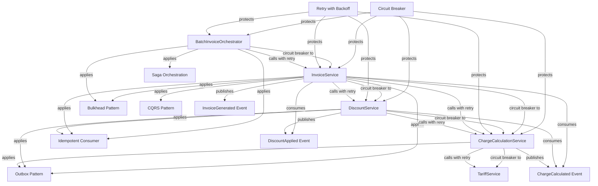

### Service Data Ownership (flowchart)

```mermaid
flowchart TD
    TariffService["TariffService"]
    Tariff["Tariff"]
    DistanceBand["Distance Band"]
    WagonType["Wagon Type"]

    ChargeCalculationService["ChargeCalculationService"]
    Charge["Charge"]
    BaseAmount["Base Amount"]
    Surcharge["Surcharge"]
    ChargeComponent["Charge Component"]
    Shipment["Shipment"]

    DiscountService["DiscountService"]
    Discount["Discount"]
    DiscountReason["Discount Reason"]
    CustomerTier["Customer Tier"]
    Region["Region"]

    InvoiceService["InvoiceService"]
    Invoice["Invoice"]
    GrossAmount["Gross Amount"]
    NetAmount["Net Amount"]

    BatchInvoiceOrchestrator["BatchInvoiceOrchestrator"]
    InvoiceBatch["Invoice Batch"]
    ActiveCustomer["Active Customer"]
    BatchInvoiceGeneration["Batch Invoice Generation"]

    TariffService -->|owns| Tariff
    TariffService -->|owns| DistanceBand
    TariffService -->|owns| WagonType

    ChargeCalculationService -->|owns| Charge
    ChargeCalculationService -->|owns| BaseAmount
    ChargeCalculationService -->|owns| Surcharge
    ChargeCalculationService -->|owns| ChargeComponent
    ChargeCalculationService -->|owns| Shipment
    ChargeCalculationService -->|uses API| TariffService
    ChargeCalculationService -->|publishes| ChargeCalculated["ChargeCalculated Event"]

    DiscountService -->|owns| Discount
    DiscountService -->|owns| DiscountReason
    DiscountService -->|owns| CustomerTier
    DiscountService -->|owns| Region

    InvoiceService -->|owns| Invoice
    InvoiceService -->|owns| GrossAmount
    InvoiceService -->|owns| NetAmount
    InvoiceService -->|aggregates| Charge
    InvoiceService -->|applies| Discount

    BatchInvoiceOrchestrator -->|owns| InvoiceBatch
    BatchInvoiceOrchestrator -->|owns| ActiveCustomer
    BatchInvoiceOrchestrator -->|owns| BatchInvoiceGeneration
    BatchInvoiceOrchestrator -->|orchestrates| InvoiceService
    BatchInvoiceOrchestrator -->|publishes| BatchLifecycleEvents["Batch Lifecycle Events"]
```

### Service API Contracts (flowchart)

```mermaid
flowchart TD
    Domain["Rail Freight Billing Domain"]

    TariffService["TariffService"]
    ChargeService["ChargeCalculationService"]
    DiscountService["DiscountService"]
    InvoiceService["InvoiceService"]
    BatchService["BatchInvoiceOrchestrator"]

    Domain --> TariffService
    Domain --> ChargeService
    Domain --> DiscountService
    Domain --> InvoiceService
    Domain --> BatchService

    TariffLookup["GET /lookup - Lookup Tariff"]
    TariffCreate["POST / - Create Tariff"]
    TariffGet["GET /{tariffId} - Get Tariff"]
    TariffUpdate["PUT /{tariffId} - Update Tariff"]
    TariffDelete["DELETE /{tariffId} - Delete Tariff"]

    TariffService --> TariffLookup
    TariffService --> TariffCreate
    TariffService --> TariffGet
    TariffService --> TariffUpdate
    TariffService --> TariffDelete

    ChargeCalc["POST /calculate - Calculate Charge"]
    ChargeGet["GET /{chargeId} - Get Charge"]
    ChargeList["GET / - List Charges"]
    ChargeComponents["GET /{chargeId}/components - Get Components"]

    ChargeService --> ChargeCalc
    ChargeService --> ChargeGet
    ChargeService --> ChargeList
    ChargeService --> ChargeComponents

    DiscountApply["POST /apply - Apply Discount"]
    DiscountPolicy["GET /policy - Get Discount Policy"]
    DiscountGet["GET /{discountId} - Get Discount"]

    DiscountService --> DiscountApply
    DiscountService --> DiscountPolicy
    DiscountService --> DiscountGet

    InvoiceGenerate["POST /generate - Generate Invoice"]
    InvoiceGet["GET /{invoiceId} - Get Invoice"]
    InvoiceList["GET / - List Invoices"]
    InvoiceCharges["GET /{invoiceId}/charges - Get Invoice Charges"]

    InvoiceService --> InvoiceGenerate
    InvoiceService --> InvoiceGet
    InvoiceService --> InvoiceList
    InvoiceService --> InvoiceCharges

    BatchStart["POST /start - Start Batch"]

    BatchService --> BatchStart

    Tariff["Tariff Record"]
    Charge["Charge Record"]
    Discount["Discount Record"]
    Invoice["Invoice Record"]
    Shipment["Shipment"]
    Customer["Customer"]

    TariffLookup --> Tariff
    TariffCreate --> Tariff
    TariffGet --> Tariff
    TariffUpdate --> Tariff
    TariffDelete --> Tariff

    ChargeCalc --> Charge
    ChargeCalc --> Tariff
    ChargeCalc --> Shipment
    ChargeGet --> Charge
    ChargeList --> Charge
    ChargeComponents --> Charge

    DiscountApply --> Charge
    DiscountApply --> Discount
    DiscountApply --> Customer
    DiscountPolicy --> Customer
    DiscountGet --> Discount

    InvoiceGenerate --> Invoice
    InvoiceGenerate --> Charge
    InvoiceGenerate --> Customer
    InvoiceGet --> Invoice
    InvoiceList --> Invoice
    InvoiceCharges --> Invoice
    InvoiceCharges --> Charge

    BatchStart --> InvoiceService
    GET_batchId["GET /{batchId}<br/>Retrieve batch invoice generation status and summary"]
    GET_batchId_path_batchId["Path Param: batchId<br/>type: string<br/>required: true"]
    GET_batchId_200["200 Response<br/>batchId, status, billingDate, startedAt, completedAt, totalCustomers, successCount, failureCount"]
    GET_batchId_404["404 Response<br/>BATCH_NOT_FOUND"]
    GET_batchId_auth["Auth: api-key"]
    GET_batchId_idempotent["Idempotent: true"]

    GET_batchId --> GET_batchId_path_batchId
    GET_batchId --> GET_batchId_200
    GET_batchId --> GET_batchId_404
    GET_batchId --> GET_batchId_auth
    GET_batchId --> GET_batchId_idempotent

    GET_batchId_results["GET /{batchId}/results<br/>Retrieve detailed results for batch invoice generation"]
    GET_batchId_results_path_batchId["Path Param: batchId<br/>type: string<br/>required: true"]
    GET_batchId_results_200["200 Response<br/>batchId, results array with customerId, status, invoiceId, netAmount, errorMessage"]
    GET_batchId_results_404["404 Response<br/>BATCH_NOT_FOUND"]
    GET_batchId_results_auth["Auth: api-key"]
    GET_batchId_results_idempotent["Idempotent: true"]

    GET_batchId_results --> GET_batchId_results_path_batchId
    GET_batchId_results --> GET_batchId_results_200
    GET_batchId_results --> GET_batchId_results_404
    GET_batchId_results --> GET_batchId_results_auth
    GET_batchId_results --> GET_batchId_results_idempotent

    POST_batchId_resume["POST /{batchId}/resume<br/>Resume a failed or incomplete batch invoice generation"]
    POST_batchId_resume_path_batchId["Path Param: batchId<br/>type: string<br/>required: true"]
    POST_batchId_resume_202["202 Response<br/>batchId, status, resumedAt"]
    POST_batchId_resume_400["400 Response<br/>INVALID_STATE"]
    POST_batchId_resume_404["404 Response<br/>BATCH_NOT_FOUND"]
    POST_batchId_resume_auth["Auth: oauth2"]
    POST_batchId_resume_idempotent["Idempotent: true"]

    POST_batchId_resume --> POST_batchId_resume_path_batchId
    POST_batchId_resume --> POST_batchId_resume_202
    POST_batchId_resume --> POST_batchId_resume_400
    POST_batchId_resume --> POST_batchId_resume_404
    POST_batchId_resume --> POST_batchId_resume_auth
    POST_batchId_resume --> POST_batchId_resume_idempotent
```

### Ubiquitous Language (flowchart)

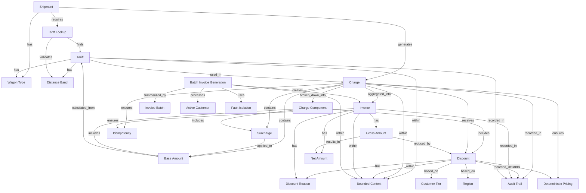

### Raina Input (AVC/FSS/PSS) (flowchart)

```mermaid
flowchart TD
    BA["BillingAnalyst"]
    TA["TariffAdmin"]
    OU["OperationsUser"]
    FS["FinanceSystem"]

    G1["G1: Calculate freight charges using validated tariffs"]
    G2["G2: Apply customer tier and regional discounts consistently"]
    G3["G3: Generate invoices that aggregate charges"]
    G4["G4: Run batch invoice generation for ACTIVE customers"]
    G5["G5: Persist charge components for transparency"]

    CCS["ChargeCalculationService"]
    DS["DiscountService"]
    IS["InvoiceService"]
    BIS["BatchInvoiceService"]

    Shipment["Shipment (origin, destination, wagon type, distance)"]
    Tariff["Tariff (baseRate, DIST-MIN, DIST-MAX, currency)"]
    Customer["Customer (tier, region, status)"]
    Charge["Charge (gross, currency, tariffId, discount, reason)"]
    Invoice["Invoice (invoiceId, gross, discount, net, currency INR)"]

    RFB101["RFB-101: Calculate Rail Freight Charges with Tariff Lookup"]
    RFB102["RFB-102: Apply Customer Discounts to Charges"]
    RFB103["RFB-103: Generate Individual Customer Invoice"]
    RFB104["RFB-104: Process Batch Invoice Generation for Active Customers"]

    P1["Problem: Inconsistent pricing outcomes"]
    P2["Problem: Incomplete tariff distance bands"]
    P3["Problem: Fragile batch invoicing"]

    V1["Vision: Modular, scalable billing architecture"]
    V2["Vision: Transparent, explainable billing"]
    V3["Vision: High-throughput billing cycles"]

    NFR_Perf["Performance: Charge calc <200ms p95, Invoice gen <2s p95"]
    NFR_Scale["Scalability: Horizontal scaling, thousands of customers"]
    NFR_Rel["Reliability: Idempotent operations, per-customer fault isolation"]
    NFR_Cons["Consistency: Deterministic pricing with stored references"]
    NFR_Sec["Security: Encryption, access control, audit logging"]
    NFR_Obs["Observability: Distributed tracing, metrics, structured logs"]

    C1["Constraint: Exact tariff match on origin/destination/wagon"]
    C2["Constraint: 5% surcharge on base amount"]
    C3["Constraint: Tier A=10%, Tier B=5%, Region WST=+2%"]
    C4["Constraint: Currency INR for invoices"]
    C5["Constraint: Batch continues on individual failures"]

    KPI1["KPI: >=99.9% charge accuracy"]
    KPI2["KPI: >=99.9% discount accuracy"]
    KPI3["KPI: >=99.5% invoice success rate"]
    KPI4["KPI: >=98% batch success ratio"]
    KPI5["KPI: 100% audit completeness"]

    BA -->|requests| RFB101
    BA -->|requests| RFB102
    BA -->|requests| RFB103
    BA -->|requests| RFB104

    RFB101 -->|implements| G1
    RFB102 -->|implements| G2
    RFB103 -->|implements| G3
    RFB104 -->|implements| G4
    G5 -->|supports| RFB101
    G5 -->|supports| RFB102

    RFB101 -->|performs| CCS
    RFB102 -->|performs| DS
    RFB103 -->|performs| IS
    RFB104 -->|performs| BIS

    CCS -->|queries| Tariff
    CCS -->|reads| Shipment
    CCS -->|creates| Charge
    CCS -->|applies| C1
    CCS -->|applies| C2

    DS -->|reads| Customer
    DS -->|updates| Charge
    DS -->|applies| C3

    IS -->|aggregates| Charge
    IS -->|reads| Customer
    IS -->|creates| Invoice
    IS -->|applies| C4

    BIS -->|queries| Customer
    BIS -->|invokes| IS
    BIS -->|applies| C5

    P1 -->|addressed by| V1
    P2 -->|addressed by| V2
    P3 -->|addressed by| V3

    V1 -->|enables| G1
    V1 -->|enables| G3
    V2 -->|enables| G2
    V2 -->|enables| G5
    V3 -->|enables| G4

    G1 -->|measured by| KPI1
    G2 -->|measured by| KPI2
    G3 -->|measured by| KPI3
    G4 -->|measured by| KPI4
    G5 -->|measured by| KPI5

    NFR_Perf -->|constrains| CCS
    NFR_Perf -->|constrains| IS
    NFR_Scale -->|constrains| BIS
    NFR_Rel -->|constrains| CCS
    NFR_Rel -->|constrains| IS
    NFR_Rel -->|constrains| BIS
    NFR_Cons -->|constrains| CCS
    NFR_Cons -->|constrains| DS
    NFR_Sec -->|constrains| CCS
    NFR_Sec -->|constrains| IS
    NFR_Obs -->|constrains| CCS
    NFR_Obs -->|constrains| IS
    NFR_Obs -->|constrains| BIS
    BA[Billing Analyst]

    BA -->|initiates| BatchInvoiceProcess[Batch Invoice Process]
    BA -->|reviews| InvoiceLineItems[Invoice Line Items with Charge Breakdown]
    BA -->|validates| TariffData[Tariff Data and Distance Ranges]

    BatchInvoiceProcess -->|reads| ActiveCustomers[(Active Customers DB)]
    BatchInvoiceProcess -->|calls| InvoiceGenService[Invoice Generation Service]
    BatchInvoiceProcess -->|captures| InvoiceResults[Invoice Results: Number, Customer ID, Amount]
    BatchInvoiceProcess -->|creates| InvoiceBatchEntity[InvoiceBatch Entity with Metadata]
    BatchInvoiceProcess -->|logs| ErrorLog[Error Log for Failed Customers]

    InvoiceGenService -->|generates| Invoice[Invoice]

    ChargeCalc[Charge Calculation Service] -->|creates| ChargeComponents[Charge Components]
    ChargeComponents -->|includes| BaseComponent[BASE Component]
    ChargeComponents -->|includes| SurchargeComponent[SURCHARGE Component]
    ChargeComponents -->|includes| DiscountComponent[DISCOUNT Component with Negative Amount]
    ChargeComponents -->|references| ParentCharge[Parent Charge via ChargeId]

    TariffValidation[Tariff Validation Service] -->|matches| RouteCriteria[Origin, Destination, Wagon Type]
    TariffValidation -->|validates| DistanceRange[Distance within DIST-MIN and DIST-MAX]
    TariffValidation -->|rejects| IncompleteTariff[Tariffs Missing Required Fields]
    TariffValidation -->|returns| ValidationError[Validation Error with Details]
    TariffValidation -->|selects| ValidTariff[Valid Tariff with Base Rate]

    ValidTariff -->|used by| ChargeCalc

    APIGateway[API Gateway: Kong/NGINX] -->|routes| Microservices[Microservices: FastAPI/Spring Boot/.NET]

    Microservices -->|includes| TariffService[Tariff Service]
    Microservices -->|includes| ChargeService[Charge Service]
    Microservices -->|includes| DiscountService[Discount/Policy Service]
    Microservices -->|includes| InvoiceService[Invoice Service]
    Microservices -->|includes| BatchOrchestration[Batch Orchestration Service]

    TariffService -->|owns| TariffDB[(Tariff DB: PostgreSQL)]
    ChargeService -->|owns| ChargeDB[(Charge DB: PostgreSQL/MongoDB)]
    DiscountService -->|owns| DiscountDB[(Discount DB: PostgreSQL/MongoDB)]
    InvoiceService -->|owns| InvoiceDB[(Invoice DB: PostgreSQL)]
    BatchOrchestration -->|owns| BatchDB[(Batch DB: PostgreSQL)]

    Microservices -->|publishes| MessageBroker[Message Broker: RabbitMQ/Kafka]
    MessageBroker -->|events| ChargeCalculatedEvent[Charge Calculated Event]
    MessageBroker -->|events| InvoiceGeneratedEvent[Invoice Generated Event]

    Microservices -->|traced by| OpenTelemetry[OpenTelemetry Tracing]
    Microservices -->|logs to| CentralizedLogs[Centralized Logs]
    Microservices -->|metrics to| PrometheusGrafana[Prometheus/Grafana]

    Microservices -->|retrieves config| ConfigMgmt[Config & Secrets: Vault/AWS SSM/Azure Key Vault]

    Microservices -->|deployed via| Docker[Docker Containers]
    Docker -->|orchestrated by| Kubernetes[Kubernetes]

    Microservices -->|implements| ResiliencePatterns[Resilience: Retries, Circuit Breakers, Outbox/Inbox]

    BatchOrchestration -->|runs| ParallelWorkers[Parallel Workers with Fault Isolation]
    ParallelWorkers -->|processes| CustomerBatch[Customer Batch]
    ParallelWorkers -->|supports| ResumableRuns[Resumable Runs]
```

### Microservices Migration / Rollout Plan (flowchart)

```mermaid
flowchart TD
    Domain["Rail Freight Billing"]

    Phase1["Phase 1: Foundation - Tariff Service & Infrastructure"]
    Phase2["Phase 2: Core Billing - Charge Calculation & Discount Services"]
    Phase3["Phase 3: Invoice Generation - Individual & CQRS Read Model"]
    Phase4["Phase 4: Batch Orchestration - Fault-Isolated Batch Invoice Generation"]

    Domain --> Phase1
    Domain --> Phase2
    Domain --> Phase3
    Domain --> Phase4

    K8s["Kubernetes cluster with Istio service mesh (3 AZs)"]
    PostgreSQL_Tariff["PostgreSQL multi-AZ for TariffService"]
    Redis["Redis cluster for tariff caching"]
    Vault["HashiCorp Vault for secrets management"]
    RabbitMQ["RabbitMQ cluster with quorum queues"]
    Observability["Observability: Prometheus, Grafana, Jaeger, OpenTelemetry"]
    TariffService["TariffService (FastAPI): CRUD, distance validation, cache-aside"]
    APIGateway["API Gateway (Kong/NGINX) with OAuth2"]
    OutboxPattern["Outbox pattern for TariffUpdated events"]
    GitLabCI_Tariff["GitLab CI/CD with Helm for TariffService"]
    mTLS["mTLS via Istio for east-west traffic"]
    DistributedTracing["Distributed tracing with W3C Trace Context"]

    Phase1 --> K8s
    Phase1 --> PostgreSQL_Tariff
    Phase1 --> Redis
    Phase1 --> Vault
    Phase1 --> RabbitMQ
    Phase1 --> Observability
    Phase1 --> TariffService
    Phase1 --> APIGateway
    Phase1 --> OutboxPattern
    Phase1 --> GitLabCI_Tariff
    Phase1 --> mTLS
    Phase1 --> DistributedTracing

    K8s --> TariffService
    PostgreSQL_Tariff --> TariffService
    Redis --> TariffService
    Vault --> PostgreSQL_Tariff
    RabbitMQ --> OutboxPattern
    TariffService --> OutboxPattern
    APIGateway --> TariffService
    Observability --> TariffService

    PostgreSQL_Charge["PostgreSQL for ChargeCalculationService & DiscountService"]
    ChargeCalculationService["ChargeCalculationService (FastAPI): tariff lookup, base rate × distance, 5% surcharge"]
    IdempotencyRedis["Idempotency key handling with Redis distributed locks"]
    ChargeEntity["Charge entity: tariff ref, gross, currency (INR), BASE/SURCHARGE"]
    DiscountService["DiscountService (FastAPI): tier (A=10%, B=5%), regional (WST=2%)"]
    DiscountStorage["Store discount amount and reason codes on Charge"]
    EventPublishing["ChargeCalculated & DiscountApplied events via outbox"]
    CircuitBreaker["Circuit breaker for TariffService calls (50% error, 30s open)"]
    AutoScaling_Phase2["Auto-scaling: ChargeCalculationService (5-20), DiscountService (3-10)"]
    CacheInvalidation["Cache invalidation via TariffUpdated events with Redis pub/sub"]
    GitLabCI_Phase2["GitLab CI/CD for ChargeCalculationService & DiscountService"]
    GrafanaDashboards_Phase2["Grafana dashboards: cache hit rate, duration, collision rate"]

    Phase2 --> PostgreSQL_Charge
    Phase2 --> ChargeCalculationService
    Phase2 --> IdempotencyRedis
    Phase2 --> ChargeEntity
    Phase2 --> DiscountService
    Phase2 --> DiscountStorage
    Phase2 --> EventPublishing
    Phase2 --> CircuitBreaker
    Phase2 --> AutoScaling_Phase2
    Phase2 --> CacheInvalidation
    Phase2 --> GitLabCI_Phase2
    Phase2 --> GrafanaDashboards_Phase2

    TariffService --> ChargeCalculationService
    Redis --> IdempotencyRedis
    RabbitMQ --> EventPublishing
    ChargeCalculationService --> ChargeEntity
    ChargeCalculationService --> CircuitBreaker
    DiscountService --> DiscountStorage
    ChargeEntity --> DiscountStorage
    OutboxPattern --> CacheInvalidation
    Observability --> GrafanaDashboards_Phase2

    Phase1 --> Phase2

    PostgreSQL_Invoice["PostgreSQL for InvoiceService with multi-AZ"]
    InvoiceService["InvoiceService (FastAPI): charge aggregation, gross/discount/net calc"]
    InvoiceID["Generate unique invoice IDs (customer ID + timestamp)"]
    InvoiceStorage["Store invoices: INR, gross, discount, net, reason"]
    IdempotencyInvoice["Idempotency for invoice generation with Redis locks"]
    CQRS["CQRS: separate write model & read model"]
    ReadModel["Populate read model via InvoiceGenerated events"]
    InvoiceGeneratedEvent["InvoiceGenerated event publishing via outbox"]
    InvoiceAPIs["Invoice retrieval APIs: GET /invoices/{id}, GET /invoices?customerId&billingDate"]
    AutoScaling_Phase3["Auto-scaling: InvoiceService (5-25 replicas)"]
    GitLabCI_Phase3["GitLab CI/CD for InvoiceService with canary deployment"]
    GrafanaDashboards_Phase3["Grafana dashboards: duration, success rate, read model lag"]

    Phase3 --> PostgreSQL_Invoice
    Phase3 --> InvoiceService
    Phase3 --> InvoiceID
    Phase3 --> InvoiceStorage
    Phase3 --> IdempotencyInvoice
    Phase3 --> CQRS
    Phase3 --> ReadModel
    Phase3 --> InvoiceGeneratedEvent
    Phase3 --> InvoiceAPIs
    Phase3 --> AutoScaling_Phase3
    Phase3 --> GitLabCI_Phase3
    Phase3 --> GrafanaDashboards_Phase3

    ChargeCalculationService --> InvoiceService
    DiscountService --> InvoiceService
    RabbitMQ --> InvoiceGeneratedEvent
    InvoiceService --> InvoiceID
    InvoiceService --> InvoiceStorage
    Redis --> IdempotencyInvoice
    InvoiceService --> CQRS
    InvoiceGeneratedEvent --> ReadModel
    CQRS --> ReadModel
    CQRS --> InvoiceAPIs
    Observability --> GrafanaDashboards_Phase3

    Phase2 --> Phase3

    PostgreSQL_Batch["PostgreSQL for BatchInvoiceOrchestrator with batch state"]
    BatchOrchestrator["BatchInvoiceOrchestrator (FastAPI): saga orchestration"]
    CustomerQuery["Query ACTIVE customers, generate invoices (50 concurrent workers)"]
    FaultIsolation["Per-customer fault isolation: CustomerInvoiceFailed events"]
    InvoiceBatch["InvoiceBatch entity: batchId, times, status, counts"]
    Bulkhead["Bulkhead pattern: isolate batch from real-time processing"]
    ResumableBatch["Resumable batch runs: POST /batch/invoices/{batchId}/resume"]

    Phase4 --> PostgreSQL_Batch
    Phase4 --> BatchOrchestrator
    Phase4 --> CustomerQuery
    Phase4 --> FaultIsolation
    Phase4 --> InvoiceBatch
    Phase4 --> Bulkhead
    Phase4 --> ResumableBatch

    BatchOrchestrator --> CustomerQuery
    BatchOrchestrator --> InvoiceBatch
    CustomerQuery --> FaultIsolation
    BatchOrchestrator --> Bulkhead
    InvoiceService --> BatchOrchestrator

    Phase3 --> Phase4
P4_BatchInvoiceOrchestrator -->|depends on| P3_InvoiceService[Phase 3: InvoiceService operational]
P4_BatchInvoiceOrchestrator -->|depends on| P2_ChargeCalc_Scaled[Phase 2: ChargeCalculationService and DiscountService scaled]
P4_BatchInvoiceOrchestrator -->|depends on| P1_RabbitMQ_DLQ[Phase 1: RabbitMQ cluster with dead-letter queues]

P4_Risk_BatchSLO[Risk: Batch exceeding 30-min SLO]
P4_Risk_ConnPool[Risk: DB connection pool exhaustion]
P4_Risk_TariffCascade[Risk: TariffService downtime blocking batch]
P4_Risk_EventGaps[Risk: Event delivery failures causing audit gaps]

P4_Exit_BatchTime[Exit: Batch completes 10k customers in <30min]
P4_Exit_SuccessRatio[Exit: Batch success ratio >=98%]
P4_Exit_FaultIsolation[Exit: Per-customer fault isolation verified]
P4_Exit_Resumable[Exit: Resumable batch runs tested]
P4_Exit_AutoScale[Exit: Auto-scaling triggers correctly]
P4_Exit_Bulkhead[Exit: Bulkhead pattern verified]
P4_Exit_DLQ[Exit: Dead-letter queue processing tested]
P4_Exit_Throughput[Exit: Throughput >=5 customers/second]

P5_AuditCompliance[Phase 5: Audit & Compliance - Complete Observability & Security Hardening]
P5_AuditCompliance -->|depends on| P4_BatchInvoiceOrchestrator
P5_AuditCompliance -->|depends on| P1_Vault[Phase 1: Vault and observability stack]
P5_AuditCompliance -->|depends on| P1_Istio[Phase 1: Istio service mesh with mTLS]

P5_AuditLogging[Implement structured audit logging for pricing operations]
P5_S3_ObjectLock[Store audit logs in S3 with object lock, 7-year retention]
P5_PII_Redaction[Implement PII redaction via OpenTelemetry processors]
P5_RLS[Configure PostgreSQL row-level security policies]
P5_Encryption[Implement AES-256 at rest, TLS 1.3 in transit]
P5_Vault_EaaS[Deploy Vault encryption-as-a-service for PII redaction]
P5_Retention[Implement data retention policies with automated deletion]
P5_Quarterly_Audit[Set up quarterly audit trail completeness reviews]
P5_Security_Alerts[Configure Prometheus alerts for security events]
P5_Chaos[Implement chaos engineering tests]
P5_PenTest[Conduct penetration testing]
P5_Compliance_Dashboard[Create compliance dashboard in Grafana]

P5_Risk_Compliance[Risk: Regulatory compliance violations]
P5_Risk_Storage[Risk: Audit log storage costs exceeding budget]
P5_Risk_PII_FalseNeg[Risk: PII redaction false negatives]
P5_Risk_Chaos_Outage[Risk: Chaos tests causing production outages]

P5_Exit_AuditComplete[Exit: Audit log completeness 100%]
P5_Exit_PII_Tested[Exit: PII redaction tested with zero false negatives]
P5_Exit_RLS_Enforced[Exit: Row-level security policies enforced]
P5_Exit_Encryption_Verified[Exit: Encryption verified]
P5_Exit_Chaos_Passed[Exit: Chaos engineering tests passed]
P5_Exit_PenTest_Complete[Exit: Penetration testing completed]
P5_Exit_Compliance_Dashboard[Exit: Compliance dashboard operational]
P5_Exit_Quarterly_Review[Exit: First quarterly review completed]

P6_Cutover[Phase 6: Cutover & Decommission - Legacy System Retirement]
P6_Cutover -->|depends on| P5_AuditCompliance
P6_Cutover -->|depends on| P4_BatchInvoiceOrchestrator
P6_Cutover -->|depends on| P3_InvoiceService
P6_Cutover -->|depends on| P2_ChargeCalc_Scaled

P6_ParallelRun[Run parallel systems for 2 billing cycles]
P6_Reconciliation[Compare charge accuracy, discount correctness, invoice totals]
P6_TrafficShift[Implement traffic shifting: 10% -> 50% -> 100%]
P6_DataMigration[Migrate historical data from legacy to microservices]
P6_Downstream_Update[Update downstream integrations to microservices APIs]
P6_Decommission_Batch[Decommission legacy batch invoice job]
P6_Archive[Archive legacy system data with 7-year retention]
P6_Redirect_Routes[Redirect API Gateway routes to microservices]
P6_PostCutover[Conduct post-cutover validation for 30 days]
P6_Lessons[Document lessons learned and update runbooks]
P6_Training[Train operations team on microservices]

P6_Risk_DataMigration[Risk: Data migration errors causing discrepancies]
P6_Risk_Integration[Risk: Downstream integration failures]
P6_Risk_Performance[Risk: Performance degradation under full load]
P6_Risk_Audit[Risk: Regulatory audit during cutover]

P6_Exit_ParallelComplete[Exit: Parallel run 100% reconciliation for 2 cycles]
P6_Exit_TrafficComplete[Exit: 100% traffic to microservices, error rate <0.1%]
P6_Exit_MigrationVerified[Exit: Historical data migration verified]
P6_Exit_IntegrationsUpdated[Exit: Downstream integrations updated]
P6_Exit_SLOs_Met[Exit: SLOs met for 30 days post-cutover]
P6_Exit_SuccessRates[Exit: Success rates validated]
P6_Exit_LegacyDecom[Exit: Legacy system decommissioned]
P6_Exit_TeamTrained[Exit: Operations team trained]

Cutover_Strategy[Strangler fig pattern with parallel run validation]
Testing_Strategy[Contract testing with Pact for service-to-service APIs]
    Deployment["Deployment Strategy"]
    Canary["Canary Deployments"]
    CanaryTraffic["10% traffic to new versions"]
    AutoRollback["Automatic rollback on error rate >1%"]
    ShadowTest["Shadow Traffic Testing (Phase 2-3)"]
    DuplicateReq["Duplicate production requests to new services"]
    CompareOutputs["Compare outputs with legacy system"]
    NoImpact["No impact on production"]
    LoadTest["Load Testing"]
    LoadTestCriteria["2x peak load (20,000 customers batch)"]
    LoadTestStaging["Run in staging before each phase exit"]
    ChaosEng["Chaos Engineering (Phase 5)"]
    PodDeletion["Pod deletion"]
    NetworkPartition["Network partition"]
    AZFailure["AZ failure"]
    ValidateResilience["Validate resilience"]
    E2ETests["End-to-End Integration Tests"]
    ChargeCalc["Full charge calculation flow"]
    InvoiceGen["Invoice generation flow"]
    CriticalPath["100% critical path coverage"]

    Deployment --> Canary
    Canary --> …
```