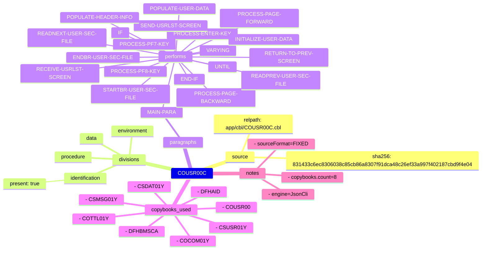
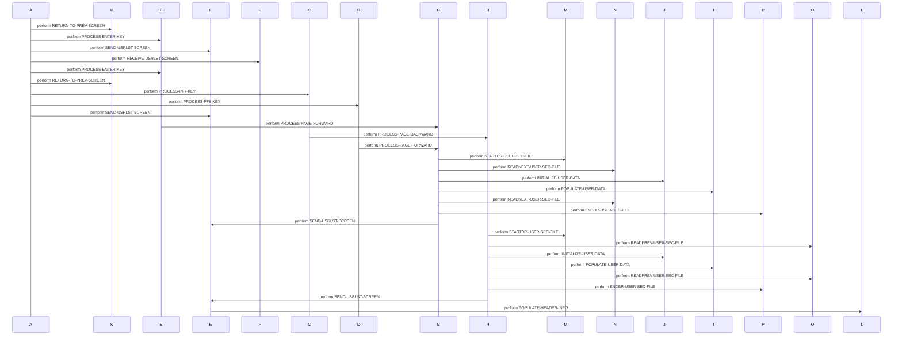
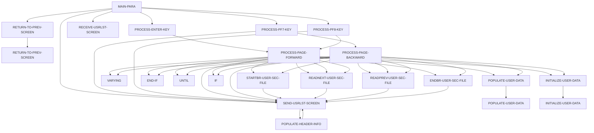
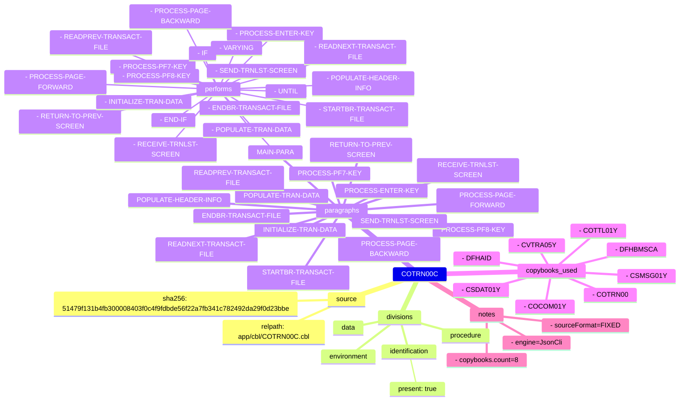
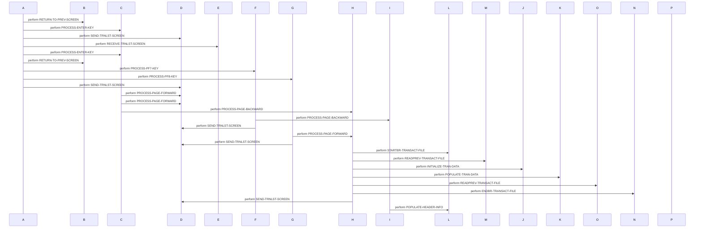
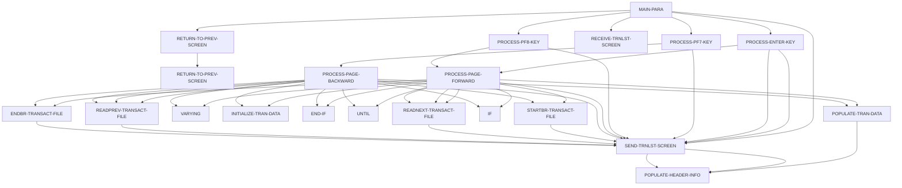

# Overview
This document summarizes COBOL artifacts extracted from the workspace, including programs and copybooks. A total of 10 COBOL artifacts were found.

## COUSR00C
This artifact is a COBOL program (`cam.cobol.program`) with source file `app/cbl/COUSR00C.cbl`.
It includes Identification, Environment, Data, and Procedure divisions.

### Paragraphs
- **MAIN-PARA** performs `RETURN-TO-PREV-SCREEN`, `PROCESS-ENTER-KEY`, `SEND-USRLST-SCREEN`, and `RECEIVE-USRLST-SCREEN`.
- **PROCESS-ENTER-KEY** performs `PROCESS-PAGE-FORWARD`.
- **PROCESS-PF7-KEY** performs `PROCESS-PAGE-BACKWARD` and `SEND-USRLST-SCREEN`.
- **PROCESS-PF8-KEY** performs `PROCESS-PAGE-FORWARD` and `SEND-USRLST-SCREEN`.
- **PROCESS-PAGE-FORWARD** performs multiple operations including `STARTBR-USER-SEC-FILE` and `READNEXT-USER-SEC-FILE`.
- **PROCESS-PAGE-BACKWARD** performs similar operations as above but for previous records.
- **SEND-USRLST-SCREEN** performs `POPULATE-HEADER-INFO`.

### Copybooks Used
COCOM01Y, COUSR00, COTTL01Y, CSDAT01Y, CSMSG01Y, CSUSR01Y, DFHAID, DFHBMSCA.

### Notes
- sourceFormat=FIXED
- engine=JsonCli
- copybooks.count=8

### Diagram(s)
*Mindmap View*


*Sequence View*


*Flowchart View*


## COTRN00C
This artifact is a COBOL program (`cam.cobol.program`) with source file `app/cbl/COTRN00C.cbl`.
It includes Identification, Environment, Data, and Procedure divisions.

### Paragraphs
- **MAIN-PARA** performs `RETURN-TO-PREV-SCREEN`, `PROCESS-ENTER-KEY`, `SEND-TRNLST-SCREEN`, and `RECEIVE-TRNLST-SCREEN`.
- **PROCESS-ENTER-KEY** performs `SEND-TRNLST-SCREEN` and `PROCESS-PAGE-FORWARD`.
- **PROCESS-PF7-KEY** performs `PROCESS-PAGE-BACKWARD` and `SEND-TRNLST-SCREEN`.
- **PROCESS-PF8-KEY** performs `PROCESS-PAGE-FORWARD` and `SEND-TRNLST-SCREEN`.
- **PROCESS-PAGE-FORWARD** performs multiple operations including `STARTBR-TRANSACT-FILE` and `READNEXT-TRANSACT-FILE`.
- **PROCESS-PAGE-BACKWARD** performs similar operations as above but for previous records.
- **SEND-TRNLST-SCREEN** performs `POPULATE-HEADER-INFO`.

### Copybooks Used
COCOM01Y, COTRN00, COTTL01Y, CSDAT01Y, CSMSG01Y, CVTRA05Y, DFHAID, DFHBMSCA.

### Notes
- sourceFormat=FIXED
- engine=JsonCli
- copybooks.count=8

### Diagram(s)
*Mindmap View*


*Sequence View*


*Flowchart View*


## COSGN00C
This artifact is a COBOL program (`cam.cobol.program`) with source file `app/cbl/COSGN00C.cbl`.
It includes Identification, Environment, Data, and Procedure divisions.

### Paragraphs
- **MAIN-PARA** performs `SEND-SIGNON-SCREEN`, `PROCESS-ENTER-KEY`, `SEND-PLAIN-TEXT`, and `SEND-SIGNON-SCREEN`.
- **PROCESS-ENTER-KEY** performs `SEND-SIGNON-SCREEN`, `SEND-SIGNON-SCREEN`, and `READ-USER-SEC-FILE`.
- **SEND-SIGNON-SCREEN** performs `POPULATE-HEADER-INFO`.
- **READ-USER-SEC-FILE** performs multiple `SEND-SIGNON-SCREEN` operations and includes an I/O READ operation on dataset `DATASET`.

### Copybooks Used
COCOM01Y, COSGN00, COTTL01Y, CSDAT01Y, CSMSG01Y, CSUSR01Y, DFHAID, DFHBMSCA.

### Notes
- sourceFormat=FIXED
- engine=JsonCli
- copybooks.count=8

### Diagram(s)
*Mindmap View*
```mermaid
mindmap
  COSGN00C
    source
      relpath: app/cbl/COSGN00C.cbl
      sha256: 4f901ae6b113eebae60ae1d94b30f8cb9906d031a4